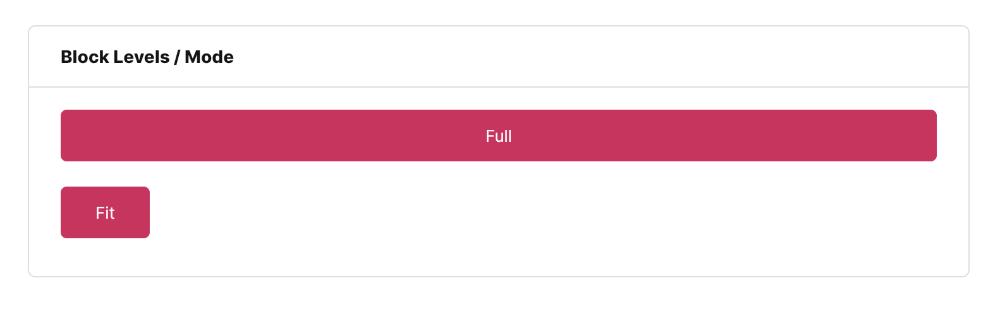
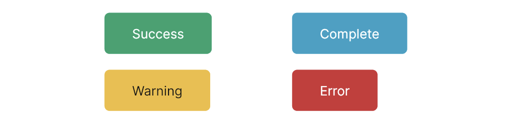

# FUIButtonBlockTextIcon

<figure><figcaption></figcaption></figure>

The `FUIButtonBlockTextIcon` widget is arguably the most frequently utilized widget within this UI Kit. Envision this as a variant of Flutter’s `ElevatedButton`, excluding the ripple effects. This enhancement imbues it with a more “_Bootstrap_” aesthetic.

As its name implies, it is a fully colored “block” styled button that incorporates text and an icon as its label.

### Widget Class Location

The `FUIButtonBlockTextIcon` widget classes could be found in:

```
lib/focus_ui_kit/components/button/fui_button_block_text_icon.dart
```

The `FUIButtonTheme` class serves as the repository for default theme variables and values.

#### Accessing the theme

To access the theme class object, do the following:

```dart
@override
Widget build(BuildContext context) {
    FUIButtonTheme buttonTheme = context.theme.fuiButton;
    
    // ...
}
```

### Usage

The `FUIButtonBlockTextIcon` widget is user-friendly and requires minimal configuration. It accepts the label text (and an optional icon) and an `onPressed` callback. The usage is straightforward:

```dart
FUIButtonBlockTextIcon(
    text: Text('Click/Tap Me'),
    icon: Icon(CupertinoIcons.arrow_right), // Optional
    onPressed: () {
        print('Button pressed.');
    },
);
```

#### Block level

The `FUIButtonBlockTextIcon` component offers two block modes:

1. Full: The button is stretched to occupy the available width of its parent containing widget.
2. Fit: The button’s width is adjusted to match the width of its label text.

<figure><figcaption></figcaption></figure>

This can be accomplished by configuring the `fuiButtonBlockLevel` parameter, which accepts values from the`FUIButtonBlockLevel` enum.

```dart
FUIButtonBlockTextIcon(
    text: Text('Full'),
    fuiButtonBlockLevel: FUIButtonBlockLevel.full,
    onPressed: () {},
);

FUIButtonBlockTextIcon(
    text: Text('Fit'),
    fuiButtonBlockLevel: FUIButtonBlockLevel.fit,
    onPressed: () {},
);
```

#### Changing the size

Different sizes could be configured for the `FUIButtonBlockTextIcon`, namely:

1. Large
2. Medium (default)
3. Small

This can be accomplished by configuring the `fuiButtonSize` parameter, which accepts values from the `FUIButtonSize`\
enum.

```dart
/// Large
FUIButtonBlockTextIcon(
    text: Text('Large'),
    fuiButtonSize: FUIButtonSize.large,
    onPressed: () {},
);

/// Medium (default)
FUIButtonBlockTextIcon(
    text: Text('Medium'),
    fuiButtonSize: FUIButtonSize.medium,
    onPressed: () {},
);

/// Small
FUIButtonBlockTextIcon(
    text: Text('Small'),
    fuiButtonSize: FUIButtonSize.small,
    onPressed: () {},
);
```

#### Changing the shape

<figure><figcaption></figcaption></figure>

The `FUIButtonBlockTextIcon` comes with 2 different shapes, namely:

1. Square (default)
2. Rounded - with rounded sides.

This can be accomplished by configuring the `fuiButtonShape` parameter, which accepts values from the `FUIButtonShape`\
enum.

```dart
/// Square (default)
FUIButtonBlockTextIcon(
    text: Text('Square'),
    fuiButtonShape: FUIButtonShape.square,
    onPressed: () {},
);

/// Rounded
FUIButtonBlockTextIcon(
    text: Text('Rounded'),
    fuiButtonShape: FUIButtonShape.rounded,
    onPressed: () {},
),
```

#### Positioning Text and Icon

<figure><figcaption></figcaption></figure>

The position of the text and icon of the button label can be swapped. The icon of the left or right side can be placed on top of the text, or vice versa.

This can be accomplished by configuring the `fuiButtonTextIconPosition` parameter, which accepts values from the`FUIButtonTextIconPosition` enum.

```dart
/// Icon Right Text Left
FUIButtonBlockTextIcon(
    text: Text('Icon Right Text Left'),
    icon: Icon(CupertinoIcons.arrow_right),
    fuiButtonTextIconPosition: FUIButtonTextIconPosition.iconRightTextLeft,
    onPressed: () {},
);

/// Icon Left Text Right
FUIButtonBlockTextIcon(
    text: Text('Icon Left Text Right'),
    icon: Icon(CupertinoIcons.arrow_right),
    fuiButtonTextIconPosition: FUIButtonTextIconPosition.iconLeftTextRight,
    onPressed: () {},
);
```

#### Changing the color scheme

<figure><figcaption></figcaption></figure>

The `FUIButtonBlockTextIcon` can be customized with a different color scheme by configuring the `fuiColorScheme`parameter. This parameter accepts values from the `FUIColorScheme` enum, allowing for flexibility in color selection.

```dart
FUIButtonBlockTextIcon(
    fuiColorScheme: FUIColorScheme.success,
    text: Text('Success'),
    onPressed: () {},
);
```

#### Enabling / Disabling with Controller

<figure><figcaption></figcaption></figure>

The `FUIButtonBlockTextIcon` enables the control of button functionality through a controller.

This functionality can be implemented using the `FUIButtonController` controller.

```dart
/// Define the controller (usually in the initState function)
FUIButtonController btnCtrl = FUIButtonController();

/// Attached it with a FUIButtonBlockTextIcon widget.
FUIButtonBlockTextIcon(
    fuiButtonController: btnCtrl,
    text: Text('Look at me!'),
    onPressed: () {},
);

/// Toggle enable
btnCtrl.trigger(FUIButtonEvent(
    enable: true,
));

/// Toggle disable
btnCtrl.trigger(FUIButtonEvent(
    enable: false,
));

/// Close the controller (do this in the dispose function)
btnCtrl.close();
```

### Major Parameters

| Parameters                                          | Description                                               |
| --------------------------------------------------- | --------------------------------------------------------- |
| Text text                                           | The label text of the button.                             |
| Icon? icon                                          | The icon for the button (if any).                         |
| FUIButtonTextIconPosition fuiButtonTextIconPosition | The position of the label text and icon in the button.    |
| FUIColorScheme fuiColorScheme                       | The desired color scheme of the button.                   |
| FUIButtonSize fuiButtonSize                         | The desired pre-configured size of the button             |
| FUIButtonShape fuiButtonShape                       | The desired pre-configured shape of the button.           |
| FUIButtonBlockLevel fuiButtonBlockLevel             | Stretch the button to the fullest width or fit mode.      |
| FUIButtonController? fuiButtonController            | The controller to toggle enable / disable for the button. |
| Color? backgroundColor                              | A custom background color for the button.                 |

### Other parameters

The other parameters corresponds to the ones available in `ElevatedButton`.
