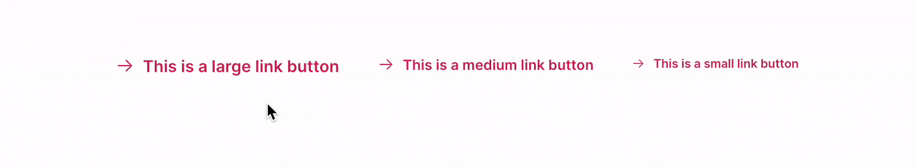

# FUIButtonLinkTextIcon

<figure><figcaption></figcaption></figure>

The `FUIButtonLinkTextIcon` is comparable to the HTML `<a href=“#”>Click Me<a>` tag. It enables a text label with an optional side icon, and will be underlined when the mouse cursor is hovering over it.

### Widget Class Location

The `FUIButtonLinkTextIcon` widget classes could be found in:

```
lib/focus_ui_kit/components/button/fui_button_link_text_icon.dart
```

The `FUIButtonTheme` class is the theme class holds the default theme variables/values.

#### Accessing the theme

To access the theme class object, do the following:

```dart
@override
Widget build(BuildContext context) {
    FUIButtonTheme buttonTheme = context.theme.fuiButton;
    
    // ...
}
```

### Usage

The `FUIButtonLinkTextIcon` widget requires the label text (which can optionally include an icon) and the `onPressed`\
callback:

```dart
FUIButtonLinkTextIcon(
    text: Text('Click/Tap Me'),
    icon: Icon(CupertinoIcons.arrow_right), // Optional
    onPressed: () {
        print('Button pressed.');
    },
);
```

#### Changing the size

Different sizes could be configured for the `FUIButtonLinkTextIcon`, namely:

1. Large
2. Medium (default)
3. Small

This can be accomplished by configuring the `fuiButtonSize` parameter, which accepts values from the `FUIButtonSize`enumeration.

```dart
/// Large
FUIButtonLinkTextIcon(
    text: Text('Large'),
    fuiButtonSize: FUIButtonSize.large,
    onPressed: () {},
);

/// Medium (default)
FUIButtonLinkTextIcon(
    text: Text('Medium'),
    fuiButtonSize: FUIButtonSize.medium,
    onPressed: () {},
);

/// Small
FUIButtonLinkTextIcon(
    text: Text('Small'),
    fuiButtonSize: FUIButtonSize.small,
    onPressed: () {},
);
```

#### Enable/Disable Link Underline

To enable/disable underline when mouse is hovering on `FUIButtonLinkTextIcon`:

```dart
FUIButtonLinkTextIcon(
    onHoverUnderline: false,
    text: Text('Click/Tap Me'),
    onPressed: () {},
);
```

#### To change the text/icon while on hover:

<figure><figcaption></figcaption></figure>

```dart
FUIButtonLinkTextIcon(
    icon: Icon(CupertinoIcons.arrow_right),
    text: Text('This is a link button.'),
    onHoverIcon: Icon(CupertinoIcons.check_mark),
    onHoverText: Text('Click me now!'),
    onPressed: () {
        print('Button pressed.');
    },
);
```

#### Enabling / Disabling with Controller

The `FUIButtonLinkTextIcon` enables the control of button functionality through a controller.

This functionality can be accomplished by using the `FUIButtonController` controller.

```dart
/// Define the controller (usually in the initState function)
FUIButtonController btnCtrl = FUIButtonController();

/// Attached it with a FUIButtonOutlinedCircleIcon widget.
FUIButtonLinkTextIcon(
    fuiButtonController: btnCtrl,
    text: Text('This is a link button.'),
    onPressed: () {},
);

/// Toggle enable
btnCtrl.trigger(FUIButtonEvent(
    enable: true,
));

/// Toggle disable
btnCtrl.trigger(FUIButtonEvent(
    enable: false,
));

/// Close the controller (do this in the dispose function)
btnCtrl.close();
```

### Major Parameters

| Parameters                                          | Description                                                               |
| --------------------------------------------------- | ------------------------------------------------------------------------- |
| Text text                                           | The label text of the button.                                             |
| Icon? icon                                          | The icon for the button link (if any).                                    |
| FUIButtonTextIconPosition fuiButtonTextIconPosition | The position of the label text and icon in the button.                    |
| FUIColorScheme fuiColorScheme                       | The desired color scheme of the button.                                   |
| FUIButtonSize fuiButtonSize                         | The desired pre-configured size of the button                             |
| FUIButtonController? fuiButtonController            | The controller to toggle enable / disable for the button.                 |
| Text? onHoverText                                   | The label text of the button link when the mouse cursor is over the link. |
| Icon? onHoverIcon                                   | The icon of the button link when the mouse cursor is over the link.       |

### Other parameters

The other parameters corresponds to the ones available in `TextButton`.
