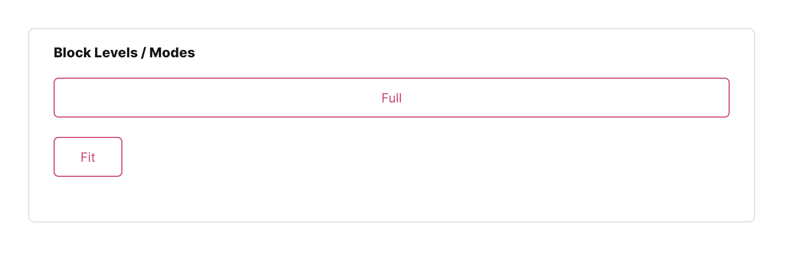

# FUIButtonOutlinedTextIcon

<figure><figcaption></figcaption></figure>

As its name implies, the `FUIButtonOutlinedTextIcon` widget is analogous to the outlined button found in HTML/Javascript Bootstrap framework, utilizing Flutter’s `OutlinedButton` widget.

Instead of a full colored button, the colors are only on the borders and text/icon.

### Widget Class Location

The `FUIButtonOutlinedTextIcon` widget classes could be found in:

```
lib/focus_ui_kit/components/button/fui_button_outlined_text_icon.dart
```

The `FUIButtonTheme` class is the theme class holds the default theme variables/values.

#### Accessing the theme

To access the theme class object, do the following:

```dart
@override
Widget build(BuildContext context) {
    FUIButtonTheme buttonTheme = context.theme.fuiButton;
    
    // ...
}
```

### Usage

The `FUIButtonOutlinedTextIcon` widget is developer-friendly and requires only the label text (with an optional icon)\
and the`onPressed` callback. The usage is straightforward:

```dart
FUIButtonOutlinedTextIcon(
    text: Text('Click/Tap Me'),
    icon: Icon(CupertinoIcons.arrow_right), // Optional
    onPressed: () {
        print('Button pressed.');
    },
);
```

#### Block level

The `FUIButtonOutlinedTextIcon` offers two block modes:

1. Full: The button is stretched to occupy the available width of its parent containing widget.
2. Fit: The button’s width is adjusted to match the width of its label text.

<figure><figcaption></figcaption></figure>

This can be accomplished by configuring the `fuiButtonBlockLevel` parameter, which accepts values from the`FUIButtonBlockLevel` enum.

```dart
FUIButtonOutlinedTextIcon(
    text: Text('Full'),
    fuiButtonBlockLevel: FUIButtonBlockLevel.full,
    onPressed: () {},
);

FUIButtonOutlinedTextIcon(
    text: Text('Fit'),
    fuiButtonBlockLevel: FUIButtonBlockLevel.fit,
    onPressed: () {},
);
```

#### Changing the size

Different sizes could be configured for the `FUIButtonOutlinedTextIcon`, namely:

1. Large
2. Medium (default)
3. Small

This can be accomplished by configuring the `fuiButtonSize` parameter, which accepts values from the `FUIButtonSize`\
enumeration.

```dart
/// Large
FUIButtonOutlinedTextIcon(
    text: Text('Large'),
    fuiButtonSize: FUIButtonSize.large,
    onPressed: () {},
);

/// Medium (default)
FUIButtonOutlinedTextIcon(
    text: Text('Medium'),
    fuiButtonSize: FUIButtonSize.medium,
    onPressed: () {},
);

/// Small
FUIButtonOutlinedTextIcon(
    text: Text('Small'),
    fuiButtonSize: FUIButtonSize.small,
    onPressed: () {},
);
```

#### Changing the shape

<figure><figcaption></figcaption></figure>

The FUIButtonBlockTextIcon has 2 different shapes, namely:

1. Square (default)
2. Rounded - with rounded sides.

This can be accomplished by configuring the `fuiButtonShape` parameter, which accepts values from the `FUIButtonShape`\
enumeration.

```dart
/// Square (default)
FUIButtonOutlinedTextIcon(
    text: Text('Square'),
    fuiButtonShape: FUIButtonShape.square,
    onPressed: () {},
);

/// Rounded
FUIButtonOutlinedTextIcon(
    text: Text('Rounded'),
    fuiButtonShape: FUIButtonShape.rounded,
    onPressed: () {},
),
```

#### Positioning Text and Icon

<figure><figcaption></figcaption></figure>

The position of the text and icon of the button label can be swapped. The icon of the left or right side can be placed on top of the text, or vice versa.

This can be accomplished by configuring the `fuiButtonTextIconPosition` parameter, which accepts values from the`FUIButtonTextIconPosition` enum.

```dart
/// Icon Right Text Left
FUIButtonOutlinedTextIcon(
    text: Text('Icon Right Text Left'),
    icon: Icon(CupertinoIcons.arrow_right),
    fuiButtonTextIconPosition: FUIButtonTextIconPosition.iconRightTextLeft,
    onPressed: () {},
);

/// Icon Left Text Right
FUIButtonOutlinedTextIcon(
    text: Text('Icon Left Text Right'),
    icon: Icon(CupertinoIcons.arrow_right),
    fuiButtonTextIconPosition: FUIButtonTextIconPosition.iconLeftTextRight,
    onPressed: () {},
);
```

#### Changing the color scheme

<figure><figcaption></figcaption></figure>

The `FUIButtonOutlinedTextIcon` can be customized with a different color scheme by configuring the `fuiColorScheme`\
parameter. This parameter accepts values from the `FUIColorScheme` enum, allowing for flexibility in color selection.

```dart
FUIButtonOutlinedTextIcon(
    fuiColorScheme: FUIColorScheme.success,
    text: Text('Success'),
    onPressed: () {},
);
```

#### Enabling / Disabling with Controller

The `FUIButtonOutlinedTextIcon` enables or disables the button through a controller.

This functionality can be accomplished using the `FUIButtonController` controller.

```dart
/// Define the controller (usually in the initState function)
FUIButtonController btnCtrl = FUIButtonController();

/// Attached it with a FUIButtonOutlinedTextIcon widget.
FUIButtonOutlinedTextIcon(
    fuiButtonController: btnCtrl,
    text: Text('Look at me!'),
    onPressed: () {},
);

/// Toggle enable
btnCtrl.trigger(FUIButtonEvent(
    enable: true,
));

/// Toggle disable
btnCtrl.trigger(FUIButtonEvent(
    enable: false,
));

/// Close the controller (do this in the dispose function)
btnCtrl.close();
```

### Major Parameters

| Parameters                                          | Description                                               |
| --------------------------------------------------- | --------------------------------------------------------- |
| Text text                                           | The label text of the button.                             |
| Icon? icon                                          | The icon for the button (if any).                         |
| FUIButtonTextIconPosition fuiButtonTextIconPosition | The position of the label text and icon in the button.    |
| FUIColorScheme fuiColorScheme                       | The desired color scheme of the button.                   |
| FUIButtonSize fuiButtonSize                         | The desired pre-configured size of the button             |
| FUIButtonShape fuiButtonShape                       | The desired pre-configured shape of the button.           |
| FUIButtonBlockLevel fuiButtonBlockLevel             | Stretch the button to the fullest width or fit mode.      |
| FUIButtonController? fuiButtonController            | The controller to toggle enable / disable for the button. |
| Color? borderColor                                  | Overrides the border color.                               |

### Other parameters

The other parameters corresponds to the ones available in `OutlinedButton`.
