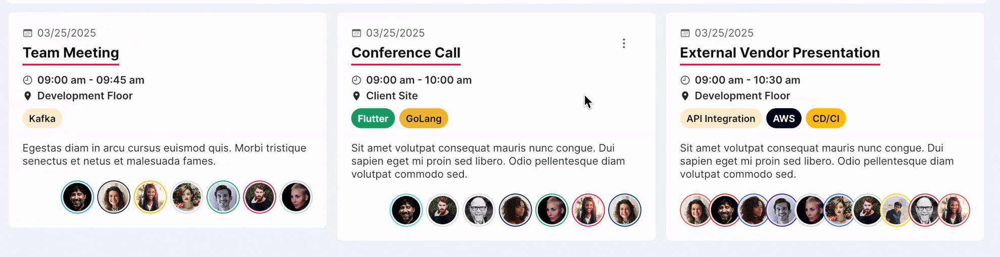
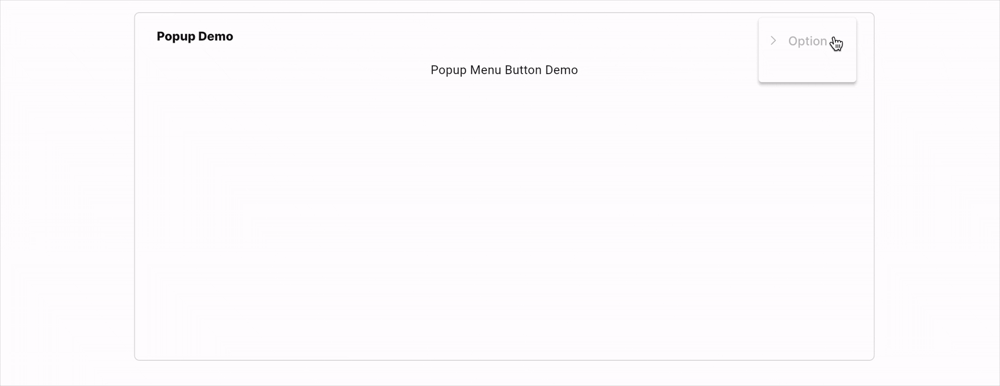

# FUIPopupMenuIconButton

<figure><figcaption></figcaption></figure>

The `FUIPopupMenuIconButton` is a button that, upon tap/clicking, displays a list of clickable options.

It is most effective when placed at the top corner of `FUIPane`, `FUIPanel`, or any widgets that necessitate a list of popup options.

### Widget Class Location

The `FUIPopupMenuIconButton` widget classes could be found in the directory of:

```
lib/focus_ui_kit/components/popupmenu/
```

#### Class Details

| Class Name               | Dart File           | Description                                |
| ------------------------ | ------------------- | ------------------------------------------ |
| `FUIPopupMenuIconButton` | fui\_popupmenu.dart | The widget class of the popup icon button. |
| `FUIPopupMenuItem`       | fui\_popupmenu.dart | The widget class for the menu item.        |

### Widget Theme Location

The `FUIPopupMenuTheme` class is the theme class holds the default theme variables/values.

#### Accessing the theme

To access the theme class object, do the following:

```dart
@override
Widget build(BuildContext context) {
    FUIPopupMenuTheme popupMenuTheme = context.theme.fuiPopupMenu;
    
    // ...
}
```

### Usage

<figure><figcaption></figcaption></figure>

This comprehensive example demonstrates the seamless integration of both the `FUIPopupMenuIconButton` and`FUIPopupMenuItem` components.

Consider a `FUIPanel` that incorporates the `FUIPopupMenuIconButton` as a header button.

```dart
FUIPanel(
  header: Text('Popup Demo'),
  headerIconButtons: [
    FUIPopupMenuIconButton(
      icon: Icon(CupertinoIcons.ellipsis_vertical),
      fuiPopupMenuItemList: [
        FUIPopupMenuItem(
          icon: Icon(CupertinoIcons.chevron_right),
          label: Text('Option 1'),
          onTap: () {
            print('Option 1 Tap/Clicked');
          }
        ),
        FUIPopupMenuItem(
          icon: Icon(CupertinoIcons.chevron_right),
          label: Text('Option 2'),
            onTap: () {
              print('Option 2 Tap/Clicked');
            }
        ),
      ],
    ),
  ],
  content: Center(
    child: Text('Popup Menu Button Demo'),
  ),
);
```

### FUIPopupMenuItem Parameters

| Parameters                                | Description                                                           |
| ----------------------------------------- | --------------------------------------------------------------------- |
| Icon? icon;                               | The icon for the menu item.                                           |
| FUIPopupMenuItemIconPosition iconPosition | The position of the menu item icon (either on the left or the right). |
| Widget label                              | The menu item label.                                                  |
| EdgeInsets? padding                       | The padding for the menu item.                                        |
| VoidCallback? onTap                       | Callback method (if any).                                             |
| bool enabled                              | Toggle if the menu item is enabled or disabled.                       |

### FUIPopupMenuIconButton Parameters

| Parameters                                   | Description                                |
| -------------------------------------------- | ------------------------------------------ |
| Icon icon                                    | The icon for the popup menu button.        |
| List\<FUIPopupMenuItem> fuiPopupMenuItemList | The list of menu items (FUIPopupMenuItem). |
