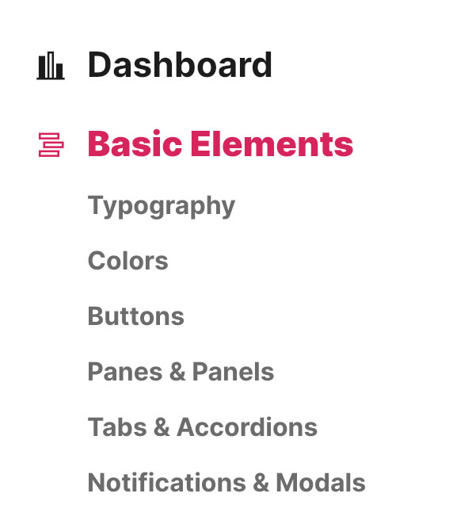

# Expandable Menu

<figure><figcaption></figcaption></figure>

The menu system employed in the Focus UI kit is an expendable menu. This functionality is achieved through widget classes such as `FUIExpMenu` and `FUIMenuItem`. The menu can be controlled via the `FUIExpMenuController`.

### Widget Class Location

The necessary menu widget classes could be found in the directory of:

```
lib/focus_ui_kit/components/menu/
```

### Widget Theme Location

The `FUIMenuTheme` class is the theme class holds the default theme variables/values for the expendable menu and the menu items.

#### Accessing the theme

To access the theme class object, do the following:

```dart
@override
Widget build(BuildContext context) {
    FUIMenuTheme fuiMenuTheme = context.theme.fuiMenu;
    
    // ...
}
```

### Usage

A general way to use the `FUIExpMenu` is as follows:

> It is advisable to assign key values to menu items and sub-menu items, enabling programmatic control via the controller.

```dart
var menuItemKey1 = ValueKey('menuItemKey1');
var menuItemKey2 = ValueKey('menuItemKey2');
var submMenuItemKey1 = ValueKey('submMenuItemKey1');
var submMenuItemKey2 = ValueKey('submMenuItemKey2');

FUIExpMenu(
    fuiMenuItems: [
        FUIMenuItem(
            key: menuItemKey1,
            label: const Text('Item Without Sub-Items'),
            icon: const Icon(LineAwesome.chart_bar),
            selected: true,
            onPressed: () { // Do something... },
        ),
        FUIMenuItem(
            key: menuItemKey2,
            label: const Text('Item With Sub-Items'),
            icon: const Icon(LineAwesome.chart_bar),
            onPressed: () { // Do something... },
            fuiSubMenuItems: [
                FUISubMenuItem(
                    key: submMenuItemKey1,
                    label: const Text('Sub Item 1'),
                    onPressed: () { // Do something... },
                ),
                FUISubMenuItem(
                    key: submMenuItemKey2,
                    label: const Text('Sub Item 2'),
                    onPressed: () { // Do something... },
                ),
            ],
        ),
    ],
);
```

#### With a controller (initialization)

To implement a controller that programmatically controls the expansion and collapse of the menu, please ensure that the controller is disposed of when it is no longer in use.

```dart
// Do this in a Stateful Widget...

late FUIExpMenuController menuCtrl;

@override
void initState() {
    super.initState();
    menuCtrl = FUIExpMenuController();
}

@override
dispose() {
    menuCtrl.close();
    
    super.dispose();
}

@override
Widget build(BuildContext context) {
    // ...
    
    var menu = FUIExpMenu(
        fuiMenuController: menuCtrl,
        fuiMenuItems: [
            // The rest of the menu items...
        ]
    );
    
    // ...
}
```

#### To select a menu item via controller

```dart
menuCtrl.trigger(
    FUIExpMenuEvent(
        selectedMenuKey: menuItemKey2,
    ),
);
```

#### To select a sub-menu item

```dart
menuCtrl.trigger(
    FUIExpMenuEvent(
        selectedSubMenuKey: submMenuItemKey2,
    ),
);
```

#### To select a manu & a sub-menu item simultaneously

```dart
menuCtrl.trigger(
    FUIExpMenuEvent(
        selectedMenuKey: menuItemKey2,
        selectedSubMenuKey: submMenuItemKey2,
    ),
);
```
