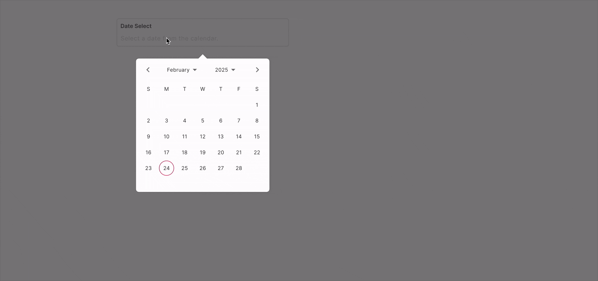

# Date Input - FUIInputDate

<figure><figcaption></figcaption></figure>

This input field is designed to accept dates. When the user taps or clicks on the field, a date picker will be displayed to facilitate the selection of a date.

> The `FUIInputDate` leverages the `calendar_date_picker2` package\
> from [https://pub.dev/packages/calendar\_date\_picker2](https://pub.dev/packages/calendar_date_picker2). Please refer to\
> this for more info.

### Widget Class Location

The `FUIInputDate` widget classes could be found in:

```
lib/focus_ui_kit/components/input/fui_input_date.dart
```

### Widget Theme Location

The `FUIInputTheme` class is the theme class holds the default theme variables/values.

#### Accessing the theme

To access the theme class object, do the following:

```dart
@override
Widget build(BuildContext context) {
    FUIInputTheme fuiInputTheme = context.theme.fuiInput;
    
    // ...
}
```

### Usage

Here's how to have the `FUIInputDate` widget declared.

```dart
FUIInputDate(
    label: 'Date Select',
    hint: 'Select a date from the calendar.',
    dateFormat: 'dd MMM yyyy',
);
```

#### Date Format

An alternative date format can be assigned using the `dateFormat` property. The format syntax is documented in:[DateFormat](https://pub.dev/documentation/intl/latest/intl/DateFormat-class.html).

A quick example:

```dart
FUIInputDate(
    label: 'Date Select',
    hint: 'Select a date from the calendar.',
    dateFormat: 'yy/MM/dd',     // Specify the format...
    onChanged: (dateStr) {
    
        // When selecting 2025 Feb 24 - the dateStr value will be '25/02/24'
        print('dateStr: ${dateStr}');
        
    },
);
```

#### Displaying the date picker

There are two distinct modes of calendar selection panel display:

* popover
* dialog

The display mode can be configured via the `fuiPickerDisplayMode`, which accepts values from the `FUIPickerDisplayMode`\
enum.

```dart
/// Popover display mode (the picker displays just right over the input box)
FUIInputDate(
    fuiPickerDisplayMode: FUIPickerDisplayMode.popover,
    label: 'Date Select',
    hint: 'Select a date from the calendar.',
);

/// Dialog display mode (the picker displays as a dialog/modal)
FUIInputDate(
    fuiPickerDisplayMode: FUIPickerDisplayMode.dialog,
    label: 'Date Select',
    hint: 'Select a date from the calendar.',
);
```

#### Date Range

<figure><figcaption></figcaption></figure>

The `FUIInputDate` also allow the selection of a date range rather than a single date. To configure the `FUIInputDate`\
for\
range selection, utilize the `calendarDatePicker2Type` parameter, which accepts values from the`CalendarDatePicker2Type` enum.

```dart
FUIInputDate(
    label: 'Date Range Select',
    hint: 'Select a date from the calendar.',
    dateFormat: 'yy/MM/dd',
    calendarDatePicker2Type: CalendarDatePicker2Type.range,
    onChanged: (dateRangeStr) {
    
        // If range is selected from 15 Feb 2025 to 18 Feb 2025,
        // the dateRangeStr value is 25/02/15 - 25/02/15 (according to the dateFormat). 
        print('dateRangeStr: ${dateRangeStr}');
        
    },
);
```

**Date Range Delimiter**

By default, the delimiter or separator for date ranges is the hyphen (-). To use a custom delimiter, configure it via\
the `dateRangeDelimiter` parameter, as follows:

```dart
FUIInputDate(
    calendarDatePicker2Type: CalendarDatePicker2Type.range,
    dateRangeDelimiter: ' to ',
);
```

#### Multiple Dates

<figure><figcaption></figcaption></figure>

The `FUIInputDate` can be configured to select multiple isolated dates, as demonstrated below:

```dart
FUIInputDate(
    label: 'Multi Date',
    hint: 'Select as many as you want',
    calendarDatePicker2Type: CalendarDatePicker2Type.multi,
    dateRangeDelimiter: ', ',
);
```

#### Doing things with Controller - FUIInputFieldController

The use of `FUIInputFieldController` is similar to the `FUIInputText` widget. Please refer to the section on [Text Input - FUIInputText](text-input-fuiinputtext.md).

### Parameters

| Parameters                                        | Description                                                                          |
| ------------------------------------------------- | ------------------------------------------------------------------------------------ |
| CalendarDatePicker2Type calendarDatePicker2Type   | The mode of selection. Either single, range or multi (from calendar\_date\_picker2). |
| String dateFormat                                 | The desire resulting date format (according to DateFormat class).                    |
| String dateRangeDelimiter                         | For the delimiter / separator for range selection.                                   |
| FUIPickerDisplayMode fuiPickerDisplayMode         | Select either popover or dialog for the picker display.                              |
| FUIInputFieldController? fuiInputFieldController  | The controller for the input field.                                                  |
| String? label                                     | The input field label within the box.                                                |
| String? hint                                      | The subtle hint text on the input field.                                             |
| bool mandatory                                    | Toggle the display of mandatory indicator.                                           |
| Widget? mandatoryIndicator                        | A custom mandatory indicator (if needed).                                            |
| bool showTopLabelBar                              | Toggle the display of the top label.                                                 |
| String? initialValue                              | The initial value (or assign it via textEditingController).                          |
| FUIInputSize fuiInputSize                         | The size of the input box, accepts values from `FUIInputSize` enum.                  |
| FUIInputStatusType fuiInputStatusType             | The status type of the input box.                                                    |
| String? fuiInputStatusText                        | The status type text (if any).                                                       |
| Widget? sideIcon                                  | The decorative side icon (if any).                                                   |
| FUIInputSideIconPosition fuiInputSideIconPosition | The position of the side icon.                                                       |
| Color? sideIconBackgroundColor                    | The background color of the side icon portion.                                       |

### Other parameters

The other parameters corresponds to the ones available in `TextFormField`.
