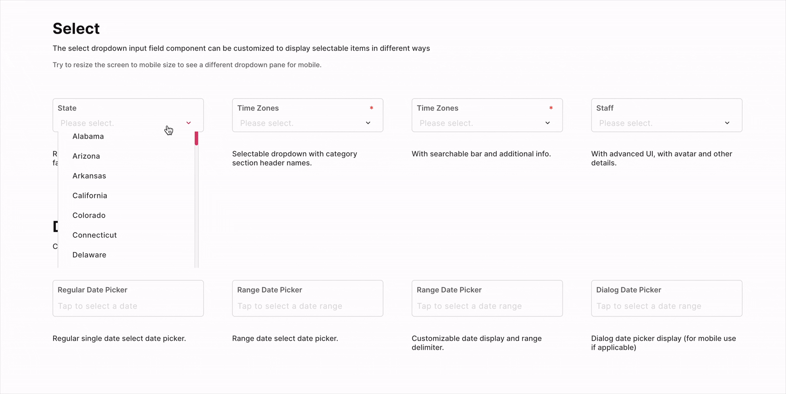

# Drop-Down Select - FUIInputSelect

<figure><figcaption></figcaption></figure>

The `FUIInputSelect` is a versatile drop-down select input box that offers a range of functionalities. It can be customized to provide a basic drop-down select box or an enhanced display for selectable items.

> The `FUIInputSelect` leverages the `select2dot1` package\
> from [https://pub.dev/packages/select2dot1](https://pub.dev/packages/select2dot1). Please refer to\
> this for more info.

### Widget Class Location

The `FUIInputSelect` widget classes could be found in:

```
lib/focus_ui_kit/components/input/fui_input_select.dart
```

### Widget Theme Location

The `FUIInputSelect` class is the theme class holds the default theme variables/values.

#### Accessing the theme

To access the theme class object, do the following:

```dart
@override
Widget build(BuildContext context) {
    FUIInputTheme fuiInputTheme = context.theme.fuiInput;
    
    // ...
}
```

### Usage

<figure><figcaption></figcaption></figure>

To populate the `dataList` with `SingleCategoryModel` and `SingleItemCategoryModel`, we need to create a list of items for the select box.

> Please note that for optimal performance, it is recommended to store the `SingleItemCategoryModel`’s value as a String\
> data type.

```dart
FUIInputSelect(
    label: 'Select Field',
    hint: 'Select something',
    selectedDataList: [
        SingleItemCategoryModel(value: 'B', nameSingleItem: 'Item 2'),
    ],
    dataList: [
        SingleCategoryModel(
          singleItemCategoryList: [
            // Please have the value data type as 'String'
            SingleItemCategoryModel(value: 'A', nameSingleItem: 'Item 1'),
            SingleItemCategoryModel(value: 'B', nameSingleItem: 'Item 2'),
            SingleItemCategoryModel(value: 'C', nameSingleItem: 'Item 3'),
          ],
        ),
    ],
    onChanged: (selectedValStr) {
    
        // If the selected items is 'Item 1' the selectedValStr will be 'A'. 
        print('selectedValStr: $selectedValStr');
    },
);
```

The `selectedDataList` parameter is the pre-selected `SingleItemCategoryModel`. This `SingleItemCategoryModel` with the same value must already be present in the `dataList`.

#### With / without search

The search/filter box is enabled by default when the drop-down list appears.

To toggle the availability of search/filter bar:

```dart
// Enable search/filter bar
FUIInputSelect(
    label: 'Select Field',
    hint: 'Select something',
    isSearchable: true, 
    ...
);

// Disable search/filter bar
FUIInputSelect(
    label: 'Select Field',
    hint: 'Select something',
    isSearchable: false, 
    ...
);
```

#### Categorized item list

<figure><figcaption></figcaption></figure>

To group selectable items into categories, do the following:

```dart
FUIInputSelect(
  label: 'Select Field',
  hint: 'Select something',
  selectedDataList: [
    SingleItemCategoryModel(value: 'B', nameSingleItem: 'Item 2'),
  ],
  dataList: [
    SingleCategoryModel(
      nameCategory: 'Catagoty 1',
      singleItemCategoryList: [
        SingleItemCategoryModel(value: 'A', nameSingleItem: 'Item 1'),
        SingleItemCategoryModel(value: 'B', nameSingleItem: 'Item 2'),
        SingleItemCategoryModel(value: 'C', nameSingleItem: 'Item 3'),
      ],
    ),
    SingleCategoryModel(
      nameCategory: 'Catagoty 2',
      singleItemCategoryList: [
        SingleItemCategoryModel(value: 'D', nameSingleItem: 'Item 4'),
        SingleItemCategoryModel(value: 'E', nameSingleItem: 'Item 5'),
        SingleItemCategoryModel(value: 'F', nameSingleItem: 'Item 6'),
      ],
    )
  ],
  onChanged: (selectedValStr) {
    print('selectedValStr: $selectedValStr');
  },
);
```

#### Extra info on item

<figure><figcaption></figcaption></figure>

To display additional information in the `SingleItemCategoryModel`, the `extraInfoInDropdown` parameter must be set to`true`. Subsequently, a string description value must be assigned to the `extraInfoSingleItem` field within the`SingleItemCategoryModel`.

```dart
FUIInputSelect(
  label: 'Select Field',
  hint: 'Select something',
  extraInfoInDropdown: true,    // Must enable this !!!
  selectedDataList: [
    SingleItemCategoryModel(
      value: 'B',
      nameSingleItem: 'Item 2',
      extraInfoSingleItem: 'Extra Info for Item 2', // Extra info
    ),
  ],
  dataList: [
    SingleCategoryModel(
      singleItemCategoryList: [
        SingleItemCategoryModel(
          value: 'A',
          nameSingleItem: 'Item 1',
          extraInfoSingleItem: 'Extra Info for Item 1', // Extra info
        ),
        SingleItemCategoryModel(
          value: 'B',
          nameSingleItem: 'Item 2',
          extraInfoSingleItem: 'Extra Info for Item 2',
        ),
        SingleItemCategoryModel(
          value: 'C',
          nameSingleItem: 'Item 3',
          extraInfoSingleItem: 'Extra Info for Item 3',
        ),
      ],
    ),
  ],
  onChanged: (selectedValStr) {
    print('selectedValStr: $selectedValStr');
  },
);
```

#### With avatar

<figure><figcaption></figcaption></figure>

The avatar (or any other side item widget) could be included as part of the selectable item or the selected item.

Please assign the `avatarSingleItem` parameter with an `FUIAvatar` widget (or any other widget) in the`SingleItemCategoryModel`.

If the `avatarInSingleSelect` parameter is set to `true`, the avatar will be displayed alongside the selected item. Conversely, if `avatarInSingleSelect` is set to `false`, only the value specified in `nameSingleItem` will be displayed.

```dart
FUIInputSelect(
  label: 'Select Field',
  hint: 'Select something',
  avatarInSingleSelect: true,   // Set this to true is the avatar is to be displayed as part of the selected item.
  extraInfoInDropdown: true,
  selectedDataList: [
    SingleItemCategoryModel(
      avatarSingleItem: FUIAvatar(
        avatar: AssetImage('demo-avatar/avatar-man-05.jpg'),
      ),
      nameSingleItem: 'Mckinley Davis',
      extraInfoSingleItem: 'Seattle Branch',
    ),
  ],
  dataList: [
    SingleCategoryModel(
      singleItemCategoryList: [
        SingleItemCategoryModel(
          avatarSingleItem: FUIAvatar(
            avatar: AssetImage('demo-avatar/avatar-man-05.jpg'),
          ),
          nameSingleItem: 'Mckinley Davis',
          extraInfoSingleItem: 'Seattle Branch',
        ),
        SingleItemCategoryModel(
          avatarSingleItem: FUIAvatar(
            avatar: AssetImage('demo-avatar/avatar-woman-06.jpg'),
          ),
          nameSingleItem: 'Tanner Bray',
          extraInfoSingleItem: 'Seattle Branch',
        ),
        SingleItemCategoryModel(
          avatarSingleItem: FUIAvatar(
            avatar: AssetImage('demo-avatar/avatar-man-11.jpg'),
          ),
          nameSingleItem: 'Mannas Khan',
          extraInfoSingleItem: 'New York Branch',
        ),
        SingleItemCategoryModel(
            avatar: AssetImage('demo-avatar/avatar-woman-03.jpg'),
          ),
          nameSingleItem: 'Savanna Donovan',
          extraInfoSingleItem: 'New York Branch',
        ),
      ],
    ),
  ],
  onChanged: (selectedValStr) {
    print('selectedValStr: $selectedValStr');
  },
);
```

#### Doing things with Controller - FUIInputFieldSelectController

The `FUIInputFieldSelectController` is largely similar to `FUIInputFieldController`, with some additional parameters to\
facilitate the programmatic selection operation.

The `FUIInputFieldSelectEvent` is the event class for the `trigger` method in `FUIInputFieldSelectController`.

**Initializing the `FUIInputFieldSelectController`**

> Do this in a Stateful Widget.

```dart
late FUIInputFieldSelectController fuiInputFieldSelCtrl;

@override
void initState() {
    super.initState();
    fuiInputFieldSelCtrl = FUIInputFieldSelectController();
}

@override
void dispose() {
    fuiInputFieldSelCtrl.close();
    super.dispose();
}

@override
Widget build(BuildContext context) {
    
    // ...
    
    var w = FUIInputSelect(
      fuiInputFieldSelectController: fuiInputFieldSelCtrl,
      label: 'Field Label',
      hint: 'Type something',
    );
    
    // ...
}
```

**Programmatic Population of Data List**

Both the `dataList` and the `selectedDataList` could be re-populated as the following:

```dart
List<SingleCategoryModel> someDataList = [...];
List<SingleItemCategoryModel> someSelectedDataList = [...];

fuiInputFieldSelCtrl.trigger(FUIInputFieldSelectEvent(
  dataList: someDataList,
  selectedDataList: someSelectedDataList,
));
```

The other functionalities are similar to `FUIInputText`, as documented\
in [Text Input - FUIInputText](text-input-fuiinputtext.md).

### Parameters

| Parameters                                        | Description                                                                                 |
| ------------------------------------------------- | ------------------------------------------------------------------------------------------- |
| List\<SingleCategoryModel> dataList               | The selectable data item list - `SingleCategoryModel` and `SingleItemCategoryModel` within. |
| List\<SingleItemCategoryModel>? selectedDataList  | The selected item list (should only be one item for now).                                   |
| bool isSearchable                                 | Toggle search filter box.                                                                   |
| bool avatarInSingleSelect                         | Toggle avatar for single selected item.                                                     |
| bool extraInfoInDropdown                          | Toggle extra info for item.                                                                 |
| FUIInputFieldController? fuiInputFieldController  | The controller for the input field.                                                         |
| String? label                                     | The input field label within the box.                                                       |
| String? hint                                      | The subtle hint text on the input field.                                                    |
| bool mandatory                                    | Toggle the display of mandatory indicator.                                                  |
| Widget? mandatoryIndicator                        | A custom mandatory indicator (if needed).                                                   |
| bool showTopLabelBar                              | Toggle the display of the top label.                                                        |
| String? initialValue                              | The initial value (or assign it via textEditingController).                                 |
| FUIInputSize fuiInputSize                         | The size of the input box, accepts values from `FUIInputSize` enum.                         |
| FUIInputStatusType fuiInputStatusType             | The status type of the input box.                                                           |
| String? fuiInputStatusText                        | The status type text (if any).                                                              |
| Widget? sideIcon                                  | The decorative side icon (if any).                                                          |
| FUIInputSideIconPosition fuiInputSideIconPosition | The position of the side icon.                                                              |
| Color? sideIconBackgroundColor                    | The background color of the side icon portion.                                              |

### Other parameters

The other parameters corresponds to the ones available in `FUIInputText`.
