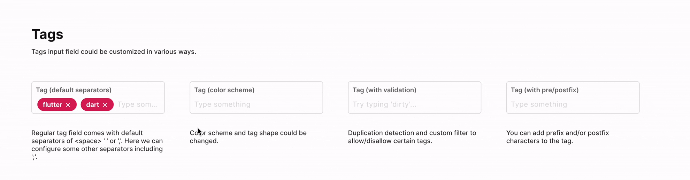

# Tag Input - FUIInputTags

<figure><figcaption></figcaption></figure>

The `FUIInputTags` is an input box that transforms text values into bubble-like or square-like tags upon detecting a delimiter character.

> The `FUIInputTags` leverages the `textfield_tags` package\
> from [https://pub.dev/packages/textfield\_tags](https://pub.dev/packages/textfield_tags). Please refer to\
> this for more info.

### Widget Class Location

The `FUIInputTags` widget classes could be found in:

```
lib/focus_ui_kit/components/input/fui_input_tags.dart
```

### Widget Theme Location

The `FUIInputTags` class is the theme class holds the default theme variables/values.

#### Accessing the theme

To access the theme class object, do the following:

```dart
@override
Widget build(BuildContext context) {
    FUIInputTheme fuiInputTheme = context.theme.fuiInput;
    
    // ...
}
```

### Usage

A typical usage of the `FUIInputTags` would be as follows:

```dart
FUIInputTags(
  label: 'Tag Input',
  hint: 'Type something follow by \',\'',
  initialTags: [
    'First',
    'Second',
  ],
  onChanged: (val) {
    // The val is the current string value that has entered
    // including the delimiter (not the tag values).
    print('value: $val');
  },
);
```

> Delimiter: by default, the delimiter/separator is either ' ' (space) or ',' (comma)

#### Changing the delimiter/separator

To modify the delimiter or separator, specify a desired list of characters that will serve as delimiters by utilizing the `tagSeparators` parameter.

```dart
FUIInputTags(
  label: 'Tag Input',
  hint: 'Type something follow by \',\'',
  tagSeparators: [';' '.'], // Having ';' and '.' as delimiter.
);
```

#### Changing the shape of the tag

To alter the shape of the tag bubble, the `fuiInputTagShape` parameter can be utilized. This parameter accepts an`FUIInputTagShape` enum value.

```dart
// Square tag shape
FUIInputTags(
  label: 'Tag Input',
  hint: 'Type something follow by \',\'',
  fuiInputTagShape: FUIInputTagShape.square,
);

// Rounded tag shape
FUIInputTags(
  label: 'Tag Input',
  hint: 'Type something follow by \',\'',
  fuiInputTagShape: FUIInputTagShape.rounded,
);
```

#### Prefix and Postfix string for tag

If a prefix or a postfix string is desired to be displayed as part of the tag value, this can be accomplished by\
configuring the `tagPrefixString` and `tagPostfixString` parameters.

```dart
FUIInputTags(
  label: 'Tag Input',
  hint: 'Type something follow by \',\'',
  tagPrefixString: '#',     // Having '#' character at the front of the tag value
  tagPostfixString: ';',    // Having ';' character at the back of the tag value
);
```

#### Obtaining the tag values

The `onChanged` method property will only return the current text in the input box, including the delimiter. To obtain the tag values in a list, the `StringTagController` must be utilized.

> Recommended to do this in a Stateful Widget

```dart
// Define the StringTagController
StringTagController strTagCtrl = StringTagController();

// Assign the strTagCtrl to the FUIInputTags widget
FUIInputTags(
  stringTagController: strTagCtrl,
  label: 'Tag Input',
  hint: 'Type something follow by \',\'',
);

// To get the values of the tags
if (strTagCtrl.getTags != null && strTagCtrl.getTags!.isNotEmpty) {

    for (var tag in strTagCtrl.getTags!) {
      // Do something...
    }
}
```

> For other usage of `StringTagController`, please refer to the documentation\
> in [https://pub.dev/packages/textfield\_tags](https://pub.dev/packages/textfield_tags)

#### Validation

A pre-validation of tag value can be achieved by implementing the `tagStringValidator` function.

For instance, the tag value should _NOT_ contain any numbers.

```dart
FUIInputTags(
  label: 'No Numbers',
  hint: 'Type something follow by \',\'',
  tagStringValidator: (val) {
    final numbersRegExp = RegExp(r'^[0-9]*$');

    // If detected, return a message.
    return (numbersRegExp.hasMatch(val)) ? 'No numbers allowed' : null;
  },
);
```

### Parameters

| Parameters                                        | Description                                                                                                                      |
| ------------------------------------------------- | -------------------------------------------------------------------------------------------------------------------------------- |
| StringTagController? stringTagController          | The controller for the currently available tags.                                                                                 |
| Validator\<String>? tagStringValidator            | To validate is a give text value should be added as a legit tag. The return data - Null: all good. A string text message: error. |
| List\<String>? initialTags                        | The list of initial tags.                                                                                                        |
| List\<String> tagSeparators                       | The list of tag separators / delimiters.                                                                                         |
| String? tagPrefixString                           | The prefix string to be included to the tag value.                                                                               |
| String? tagPostfixString                          | The postfix string to be included to the tag value.                                                                              |
| TextStyle? tagTextStyle                           | Overrides the text style for the tag display text.                                                                               |
| Color? tagBackgroundColor                         | The background color for the tag box/bubble.                                                                                     |
| FUIInputTagShape fuiInputTagShape                 | The shape of the tag - square or rounded.                                                                                        |
| FUIColorScheme fuiColorScheme                     | The color scheme for the `FUIInputTags`.                                                                                         |
| FUIInputFieldController? fuiInputFieldController  | The controller for the input field.                                                                                              |
| String? label                                     | The input field label within the box.                                                                                            |
| String? hint                                      | The subtle hint text on the input field.                                                                                         |
| bool mandatory                                    | Toggle the display of mandatory indicator.                                                                                       |
| Widget? mandatoryIndicator                        | A custom mandatory indicator (if needed).                                                                                        |
| bool showTopLabelBar                              | Toggle the display of the top label.                                                                                             |
| String? initialValue                              | The initial value (or assign it via textEditingController).                                                                      |
| FUIInputSize fuiInputSize                         | The size of the input box, accepts values from `FUIInputSize` enum.                                                              |
| FUIInputStatusType fuiInputStatusType             | The status type of the input box.                                                                                                |
| String? fuiInputStatusText                        | The status type text (if any).                                                                                                   |
| Widget? sideIcon                                  | The decorative side icon (if any).                                                                                               |
| FUIInputSideIconPosition fuiInputSideIconPosition | The position of the side icon.                                                                                                   |
| Color? sideIconBackgroundColor                    | The background color of the side icon portion.                                                                                   |
