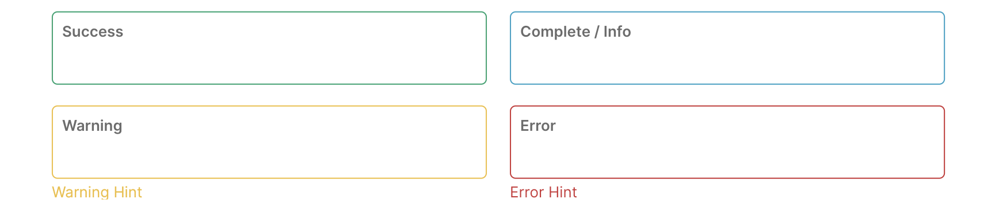

# Text Input - FUIInputText

The `FUIInputText` is likely the most frequently utilized text input widget within the UI kit, facilitating the input of textual data.

`FUIInputText` offers a comprehensive set of configurable options, including the modification of status borders and the concealment of input values.

> The `FUIInputText` leverages Flutter's `TextFormField`.

### Widget Class Location

The `FUIInputText` widget classes could be found in:

```
lib/focus_ui_kit/components/input/fui_input_text.dart
```

### Widget Theme Location

The `FUIInputTheme` class is the theme class holds the default theme variables/values.

#### Accessing the theme

To access the theme class object, do the following:

```dart
@override
Widget build(BuildContext context) {
    FUIInputTheme fuiInputTheme = context.theme.fuiInput;
    
    // ...
}
```

### Anatomy

<figure><figcaption></figcaption></figure>

A typical UI structure for the `FUIInputText` component consists of a expandable/shrinkable label that shrinks when the text field is in focus or when the text value was entered in the field. The component also includes a border, an optional side icon, a status border with text and indicator, and a mandatory indicator.

### Usage

Here is how to declare the `FUIInputText` widget:

```dart
FUIInputText(
    label: 'Label name',
    hint: 'Type something',
);
```

#### With label or without label

<figure><figcaption></figcaption></figure>

If you prefer not to have the animated label displayed within the input box, you may toggle the visibility of the label.

```dart
FUIColumn(
    children: [
        FieldLabel(Text('Field 1')),
        FUIInputText(
          showTopLabelBar: false,
          hint: 'Type something',
        ),
    ],
);
```

#### Changing the size

Like many other Focus UI Kit widgets, the size of the `FUIInputText` can be adjusted using the `fuiInputSize` parameter,\
namely:

* Large
* Medium (default)
* Small

```dart
/// Large
FUIInputText(
  fuiInputSize: FUIInputSize.large,
  label: 'Field Label',
  hint: 'Type something',
);

/// Medium (default)
FUIInputText(
  fuiInputSize: FUIInputSize.medium,
  label: 'Field Label',
  hint: 'Type something',
);

/// Small
FUIInputText(
  fuiInputSize: FUIInputSize.small,
  label: 'Field Label',
  hint: 'Type something',
);
```

#### Side icon

<figure><figcaption></figcaption></figure>

A side icon can be included for the `FUIInputText` widget, as follows:

```dart
FUIInputText(
    label: 'Search',
    hint: 'Type something',
    sideIcon: Icon(CupertinoIcons.search),
);
```

#### Changing the position of the side icon

```dart
FUIInputText(
    label: 'Search',
    hint: 'Type something',
    sideIcon: Icon(CupertinoIcons.search),
    fuiInputSideIconPosition: FUIInputSideIconPosition.left,
);
```

#### Showing the Mandatory indicator

The mandatory indicator serves solely as a decorative element positioned at the top corner of the input box.

> The default mandatory indicator is an '\*' symbol.

```dart
FUIInputText(
    label: 'Search',
    hint: 'Type something',
    mandatory: true,
);
```

#### Changing the Mandatory indicator

To modify the mandatory indicator, simply include an indicator widget of any kind via the `mandatoryIndicator`\
parameter.

```dart
FUIInputText(
    label: 'Search',
    hint: 'Type something',
    mandatory: true,
    mandatoryIndicator: Text('!', style: TextStyle(color: Colors.red)),
);
```

#### Doing things with Controller - FUIInputFieldController

The `FUIInputFieldController` class is responsible for controlling specific aspects of the `FUIInputText`\
programmatically.

**Initializing the `FUIInputFieldController`**

> Do this in a Stateful Widget.

```dart
late FUIInputFieldController fuiInputFieldCtrl;

@override
void initState() {
    super.initState();
    fuiInputFieldCtrl = FUIInputFieldController();
}

@override
void dispose() {
    fuiInputFieldCtrl.close();
    super.dispose();
}

@override
Widget build(BuildContext context) {
    
    // ...
    
    var w = FUIInputText(
      fuiInputFieldController: fuiInputFieldCtrl,
      label: 'Field Label',
      hint: 'Type something',
    );
    
    // ...
}
```

**Enabling / Disabling the Input Field**

```dart
// Enable
fuiInputFieldCtrl.trigger(FUIInputFieldEvent(
  enabled: true,
));

// Disable
fuiInputFieldCtrl.trigger(FUIInputFieldEvent(
  enabled: false,
));
```

**Changing status type and text**

<figure><figcaption></figcaption></figure>

In certain scenarios, there may be a need to prompt for specific status messages or input value highlights, primarilyafter validating input fields.

The border color of the input box could be changed to indicate the status type. To achieve this, utilize the controller and assign the `fuiInputStatusType` property. This property accepts a value from the `FUIInputStatusType` enum. Additionally, assign the `fuiInputStatusText` property for displaying the status message.

```dart
/// Change to error
fuiInputFieldCtrl.trigger(FUIInputFieldEvent(
  fuiInputStatusType: FUIInputStatusType.error,
  fuiInputStatusText: 'Invalid field detected. Please amend',
));

/// Change to normal
fuiInputFieldCtrl.trigger(FUIInputFieldEvent(
  fuiInputStatusType: FUIInputStatusType.normal,
  fuiInputStatusText: '',
));
```

**Making the input field READ ONLY**

To render the input field as read-only (non-editable), simply execute the following code:

```dart
fuiInputFieldCtrl.trigger(FUIInputFieldEvent(
  readOnly: true,
));
```

> readOnly will NOT blur the input field. Enabling/Disabling it would.

### Parameters

| Parameters                                        | Description                                                         |
| ------------------------------------------------- | ------------------------------------------------------------------- |
| FUIInputFieldController? fuiInputFieldController  | The controller for the input field.                                 |
| String? label                                     | The input field label within the box.                               |
| String? hint                                      | The subtle hint text on the input field.                            |
| bool mandatory                                    | Toggle the display of mandatory indicator.                          |
| Widget? mandatoryIndicator                        | A custom mandatory indicator (if needed).                           |
| bool showTopLabelBar                              | Toggle the display of the top label.                                |
| String? initialValue                              | The initial value (or assign it via textEditingController).         |
| FUIInputSize fuiInputSize                         | The size of the input box, accepts values from `FUIInputSize` enum. |
| FUIInputStatusType fuiInputStatusType             | The status type of the input box.                                   |
| String? fuiInputStatusText                        | The status type text (if any).                                      |
| Widget? sideIcon                                  | The decorative side icon (if any).                                  |
| FUIInputSideIconPosition fuiInputSideIconPosition | The position of the side icon.                                      |
| Color? sideIconBackgroundColor                    | The background color of the side icon portion.                      |

### Other parameters

The other parameters corresponds to the ones available in `TextFormField`.
