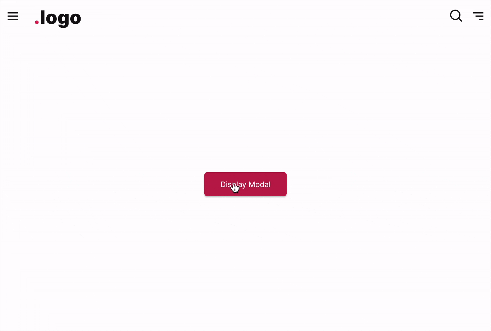

# Modal - FUIModal

<figure><figcaption></figcaption></figure>

The `FUIModal`, a modal component inspired by the popular HTML/Javascript Bootstrap library. This modal component features a header, body, and footer section, similar to the `FUIPanel`. Additionally, it incorporates pace bar and spinner functionality.

> FUIModal leverages on a very good public library[https://pub.dev/packages/modals](https://pub.dev/packages/modals).

### Widget Class Location

The `FUIModal` widget and other related classes could be found in the directory of:

```
lib/focus_ui_kit/components/modal/
```

#### Class Details

| Class Name                | Dart File               | Description                                                                                                 |
| ------------------------- | ----------------------- | ----------------------------------------------------------------------------------------------------------- |
| `FUIModal`                | fui\_modal.dart         | The major widget class of the modal.                                                                        |
| `FUIModalController`      | fui\_modal\_events.dart | The controller for the FUIModal (using Flutter Bloc)                                                        |
| `FUIModalControlEvent`    | fui\_modal\_events.dart | The controller event class, used by FUIModalController. Any parameter that is `null` will NOT be processed. |
| `FUIModalPaceBarPosition` | fui\_modal\_params.dart | The enum for certain settings in the modal, namely pace bar position.                                       |

### Widget Theme Location

The `FUIModalTheme` class is the theme class holds the default theme variables/values.

#### Accessing the theme

To access the theme class object, do the following:

```dart
@override
Widget build(BuildContext context) {
    FUIModalTheme modalTheme = context.theme.fuiModal;
    
    // ...
}
```

### Usage

Below is a typical example of how to set up and display a modal.

_A Stateful widget is highly recommended for initializing and using the modal controller._

```dart
class DemoPage extends StatefulWidget {
  const DemoPage({super.key});

  @override
  State<DemoPage> createState() => _DemoPageState();
}

class _DemoPageState extends State<DemoPage> {
  /// Declare the modal controller
  late FUIModalController modalCtrl;

  @override
  void initState() {
    super.initState();

    /// Initialize the modal controller
    modalCtrl = FUIModalController();
  }

  @override
  void dispose() {
    /// Close the modal controller
    modalCtrl.close();

    super.dispose();
  }

  @override
  Widget build(BuildContext context) {
    FUIModalTheme modalTheme = context.theme.fuiModal;

    return Center(
      child: FUIButtonBlockTextIcon(
        text: Text('Show Me'),
        onPressed: () {
          FUIModalController.showFUIModal(
            context,
            modal: _buildModal(),
          );
        },
      ),
    );
  }

  _buildModal() {
    /// Create an object of FUIModal
    return FUIModal(
      fuiModalController: modalCtrl,
      header: Text('Modal Header'),
      content: FUIColumn(
        children: [
          Regular(Text('This is the modal body')),
        ],
      ),
      footerShow: true,
      footerSeparator: true,
      footerButtons: [
        FUIButtonBlockTextIcon(
          text: Text('Close'),
          onPressed: () {
            modalCtrl.trigger(FUIModalControlEvent(close: true));
          },
        ),
      ],
    );
  }
}
```

#### To display a Modal

The `FUIModalController` provides a static method named `showFUIModal`. This method accepts a `BuildContext` object and an instance of the modal to be displayed. To utilize this method, simply pass the required objects to it.

```dart
FUIModalController.showFUIModal(
    context,
    modal: FUIModal(...),
);
```

#### To close a Modal

To close a modal programmatically, always define and attach a modal controller for this purpose.

```
/// Common setup
FUIModalController modalCtrl = FUIModalController();

FUIModalController.showFUIModal(
    context,
    modal: FUIModal(
        fuiModalController: modalCtrl,
        ...
    ),
);

/// Closing the modal
modalCtrl.trigger(FUIModalControlEvent(close: true));
```

#### Changing the popup animation

The default animation for modal display is a `fadeInDown` animation. The `animationType` parameter can be used to change the display animation type.

```dart
FUIModal(
    animationType: FUIAnimationType.fadeInLeft,
    ...
);
```

> The `FUIAnimationType` enum, which consists of pre-defined animation types could be found in`lib/focus_ui_kit/animation/fui_animator_helper.dart`

#### Callback function after closing animation

Upon the modal’s closure (after the animation has been completed), a callback method can be assigned.

```dart
FUIModal(
    onModalDismissedAfterAnimation: () {
        print('The modal had been closed');
    },
    ...
);
```

#### Header

<figure><figcaption></figcaption></figure>

The header consists of two distinct sections. The left side accommodates the header title, while the right side is reserved for the placement of an icon button, if applicable.

**Showing / Hiding**

The header’s visibility can be controlled using the `headerShow` property, while the header separator’s visibility can be controlled using the `headerSeparator` property.

#### Footer

<figure><figcaption></figcaption></figure>

The footer is the section located below the content of the `FUIModal`. It typically contains action buttons or links. The footer buttons can be configured to be displayed on the side or with a custom widget that occupies the entire space (block mode).

> Note: The footer is enabled/visible BY DEFAULT. You may toggle the visibility by modifying the `footerShow` attribute.

**Footer buttons on the side**

```dart
FUIModal(
    // ...
    footerShow: true,
    footerSeparator: true,
    footerButtons: [
        FUIButtonBlockTextIcon(
          text: Text('Proceed'),
          onPressed: () {},
        ),
        FUIButtonBlockTextIcon(
          fuiColorScheme: FUIColorScheme.lightGrey,
          text: Text('Close'),
          onPressed: () {
            modalCtrl.trigger(FUIModalControlEvent(close: true));
          },
        ),
      ],
)
```

**Footer with a custom widget**

<figure><figcaption></figcaption></figure>

Instead of assigning the button widgets to the `footerButtons`, assign the `footerWidget` instead.

```dart
FUIModal(
        // ...
        footerShow: true,
        footerSeparator: true,
        footer: FUIButtonBlockTextIcon(
        fuiButtonBlockLevel: FUIButtonBlockLevel.full,
        text: Text('OK'),
        onPressed: () {
            modalCtrl.trigger(FUIModalControlEvent(close: true));
        },
    ),
);
```

#### With controller

The `FUIModal`’s PaceBar and Spinner can be programmatically controlled, similar to `FUIPane` or `FUIPanel`.

#### The PaceBar

**To Enable / Disable PaceBar**

```dart
FUIModal(
    paceBarEnable: true,    // or set to 'false' to disable.
    fuiModalController: modalCtrl,  // Be sure to assign the controller for external programmatic control.
    content: ...,
);
```

If the `paceBarEnable` is disabled, displaying the `PaceBar` through the controller event will not have any effect.

**Repeating PaceBar**

The PaceBar on the `FUIModal` can be utilized to display task progress or serve as a decorative element. The `PaceBar` within the `FUIModal` comprises two modes: repeating and finite value (non-repeating).

Here is how to toggle a repeating `PaceBar` using a controller:

<figure><figcaption></figcaption></figure>

```dart
/// Define the panel...
FUIModal(
  paceBarEnable: true,
  paceBarRepeating: true,
  fuiModalController: modalCtrl,
  // ...
);

/// Some where else...trigger an event via the controller
modalCtrl.trigger(FUIModalControlEvent(
    paceBarShow: true,
));
```

**Definite Value (Non-Repeating) PaceBar**

If you prefer manually setting the PaceBar’s value, it can be adjusted from 0 to 100 (maximum).

<figure><figcaption></figcaption></figure>

Example:

```dart
FUIModal(
  paceBarEnable: true,
  paceBarRepeating: false,
  fuiModalController: modalCtrl,
  // ...,
);

/// Some where else...trigger an event via the controller
modalCtrl.trigger(FUIModalControlEvent(
    paceBarShow: true,
    paceBarValue: 5,    // Set the value to 5
));

modalCtrl.trigger(FUIModalControlEvent(
    paceBarShow: true,
    paceBarValue: 20,    // Set the value to 20
));

modalCtrl.trigger(FUIModalControlEvent(
    paceBarShow: true,
    paceBarValue: 60,    // Set the value to 60
));
```

**PaceBar Location**

The `PaceBar` can be positioned at either the top or bottom of the panel. This configuration is controlled by the`paceBarPosition` parameter.

```dart
FUIModal(
  paceBarPosition: FUIModalPaceBarPosition.bottom,
  content: ...
);
```

#### The Spinner

The spinner is an animated widget that serves as an indicator of the status of a task, such as waiting, loading, or processing.

<figure><figcaption></figcaption></figure>

**Show / Hide Spinner**

The spinner could be displayed or hidden using the controller.

```dart
/// Define the modal
FUIModal(
  spinnerEnable: true,
  fuiModalController: modalCtrl,
  content: ...,
);

/// Some where else, trigger the events via the controller
/// To show the spinner, disable the modal (no gestures allowed), and blur the contents:
modalCtrl.trigger(FUIModalControlEvent(
  spinnerShow: true,
  enable: false,
  blur: true,
));

/// To hide the spinner, re-enabled the panel (allowing gestures), and unblur the contents:
modalCtrl.trigger(FUIModalControlEvent(
  spinnerShow: false,
  enable: true,
  blur: false,
));
```

#### To override settings of Modal - ModalEntry

For more control on modal display and the position on screen, do the following:

```dart
FUIModalController.showFUIModalByModalEntry (
    ModalEntry.positioned(
      context,
      tag: 'myModal',
      child: FUIModal(
        fuiModalController: modalCtrl,
        content: ...,
      ),
      // Other settings available in ModalEntry...
    )
);
```

For more advanced and customized settings for Modal, please refer to the documentation\
at [https://pub.dev/packages/modals](https://pub.dev/packages/modals), particularly the usage of `ModalEntry`.

> Note: `FUIModal`s are displayed in the center of the screen. Triggering the `close` action for a modal will remove all\
> modals. For more precise control, please refer to [https://pub.dev/packages/modals](https://pub.dev/packages/modals).

### Parameters

| Parameters                                   | Description                                                                                                                                   |
| -------------------------------------------- | --------------------------------------------------------------------------------------------------------------------------------------------- |
| FUIColorScheme fuiColorScheme                | The color scheme for the side pace bar & spinner. The default is `FUIColorScheme.primary`.                                                    |
| FUIModalController? fuiModalController       | <p>The controller to control the elements of the modal externally.<br>Please remember to 'close' the controller when cleaning up.</p>         |
| double? width                                | Define a custom width for the modal.                                                                                                          |
| double? height                               | Define a custom height of the modal.                                                                                                          |
| Color? backgroundColor                       | The background color of the modal.                                                                                                            |
| double? borderThickness                      | The border thickness of the modal.                                                                                                            |
| Color? borderColor                           | The border color of the modal.                                                                                                                |
| BorderRadius? boxBorderRadius                | The border corner radius of the modal.                                                                                                        |
| FUIAnimationType animationType               | Define the animation type when the modal is displayed. Default is `FUIAnimationType.fadeInDown`.                                              |
| Duration animationDuration                   | The duration of the modal display animation.                                                                                                  |
| VoidCallback? onModalDisplayedAfterAnimation | The callback function after the animation is done when the modal is displayed.                                                                |
| VoidCallback? onModalDismissedAfterAnimation | The callback function after the animation is done when the modal is dismissed.                                                                |
| bool animationOnClose                        | Enable/disable animation upon dismiss.                                                                                                        |
| bool animationOnClose                        | Enable/disable animation upon dismiss.                                                                                                        |
| bool headerShow                              | Toggle modal header.                                                                                                                          |
| Widget? header                               | The header of the modal.                                                                                                                      |
| Widget? headerModalCloseIcon                 | Custom the header close icon button.                                                                                                          |
| bool headerSeparator                         | Toggle header separator.                                                                                                                      |
| double? headerSeparatorThickness             | The thickness of the header separator line.                                                                                                   |
| Color? headerSeparatorColor                  | Set this to override the header separator color.                                                                                              |
| bool footerShow                              | Toggle footer at the bottom of the panel.                                                                                                     |
| List\<Widget>? footerButtons                 | The footer buttons on the right side.                                                                                                         |
| Widget? footer                               | Set this if you want the widget to occupied the entire footer space (do not set the footerButtons if you are using this).                     |
| EdgeInsets? footerPadding                    | The padding for the footer.                                                                                                                   |
| bool footerSeparator                         | Toggle footer separator.                                                                                                                      |
| double? footerSeparatorThickness             | The thickness of the footer separator line.                                                                                                   |
| Color? footerSeparatorColor                  | Overrides the color of the footer separator.                                                                                                  |
| double? opacityDuringDisabled                | The opacity value when the panel is disabled. The value should be between 0 to 1.                                                             |
| Duration? opacityAniDuration                 | The animation duration when blurring on enable / disable.                                                                                     |
| bool paceBarEnable                           | Set to `true` to enable pace bar.                                                                                                             |
| bool paceBarShow                             | To show the pace bar initially when the `FUIModal` widget is rendered.                                                                        |
| bool paceBarRepeating                        | Set to `true` if you want the pace bar to be in `repeating` mode, or `false` if you want to manually set the pace bar value.                  |
| FUIModalPaceBarPosition paceBarPosition      | The position of the `PaceBar`, either at the top, or at the bottom (via enum `FUIModalPaceBarPosition`)                                       |
| Color? paceBarColor                          | Overrides the PaceBar color.                                                                                                                  |
| double paceBarCurrentValue                   | Defines the current value of the PaceBar (if it is not in repeating mode).                                                                    |
| double paceBarMaxValue                       | Defines the maximum value of the PaceBar (if it is not in repeating mode). Defaults to 100.                                                   |
| Curve? paceBarAniCurve                       | Defines animation curve for the PaceBar animation during value change.                                                                        |
| Duration? paceBarAniDuration                 | Defines animation duration for the PaceBar animation during value change.                                                                     |
| bool spinnerEnable                           | To enable / disable the spinner.                                                                                                              |
| Alignment spinnerPosition                    | Defines the position of the spinner. Defaults to `Alignment.center`.                                                                          |
| Widget? spinnerWidget                        | Overrides the spinner widget. You may use some other icons or Lottie widget for the spinner.                                                  |
| bool spinnerRotationEnable                   | <p>Enable / disable the rotation of the spinner.<br>If you have an external animated widget, you may set this to <code>false</code> this.</p> |
| Duration? spinnerRotationAniDuration         | This animation duration of the rotation of the spinner.                                                                                       |
| Curve? spinnerRotationAniCurve               | This animation curve of the rotation of the spinner.                                                                                          |
