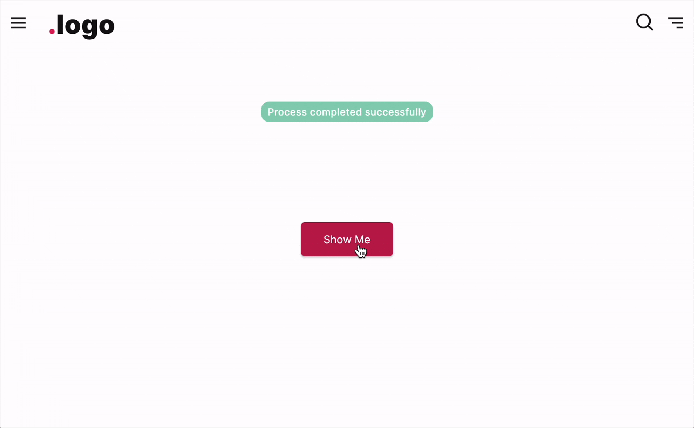

# FUIToast1

<figure><figcaption></figcaption></figure>

The `FUIToast1` is a compact, bubble-like popup message that can be programmatically triggered and displayed.

### Widget Class Location

The `FUIToast1` widget classes could be found in:

```
lib/focus_ui_kit/components/notification/fui_toast1.dart
```

### Widget Theme Location

The `FUIToastTheme` class is the theme class holds the default theme variables/values.

#### Accessing the theme

To access the theme class object, do the following:

```dart
@override
Widget build(BuildContext context) {
    FUIToastTheme fuiToastTheme = context.theme.fuiToast;
    
    // ...
}
```

### Usage

To show a toast message, just do following:

> Take note: FUIToast1 requires the BuildContext as a parameter for the constructor.

```dart
@override
Widget build(BuildContext context) {

    FUIToast1 toast1 = FUIToast1(context);
    
    return Center(
      child: FUIButtonBlockTextIcon(
        text: Text('Show Me'),
        onPressed: () {
          toast1.show(
            msg: 'Process completed successfully',
            fuiColorScheme: FUIColorScheme.success,
          );
        },
      ),
    );
}
```

Utilize the `show` function within the `FUIToast1` object to manifest the message following the initialization of the object.

#### Show message in different positions

To display the message in various positions on the screen, you can set value in the `fuiToastPosition`, which accepts values from the `FUIToastPosition` enum.

```dart
toast1.show(
    // Display message on the top right
    fuiToastPosition: FUIToastPosition.topRight,
    msg: 'Process completed successfully',
    fuiColorScheme: FUIColorScheme.success,
);
```

#### Changing the color scheme

To display toast in a different color scheme, simply modify the value of `fuiColorScheme`.

```dart
toast1.show(
    msg: 'Process bumped into an error',
    fuiColorScheme: FUIColorScheme.error,
);
```

#### Setting the display duration

Set the display duration value accordingly:

```dart
toast1.show(
    msg: 'Process completed successfully',
    duration: Duration(seconds: 2),
);
```

### Parameters

The `show` method accepts the following parameters.

| Parameters                         | Description                                                                                                                 |
| ---------------------------------- | --------------------------------------------------------------------------------------------------------------------------- |
| String msg                         | The text message to be displayed.                                                                                           |
| FUIColorScheme? fuiColorScheme     | The desired color scheme. Values could be found in `FUIColorScheme`.                                                        |
| FUIToastPosition? fuiToastPosition | The position for the toast message on the screen (within the context) to be shown. Default is `FUIToastPosition.topCenter`. |
| TextStyle? textStyle               | The text style (overrides the default text style) for the text message.                                                     |
| Color? backgroundColor             | To change the toast bubble background color (overrides color scheme).                                                       |
| Duration? duration                 | The duration for the message to be shown before being dismissed.                                                            |
| Duration? animationDuration        | The animation duration of the toast.                                                                                        |
| double? radius                     | The border radius of the toast bubble.                                                                                      |
| VoidCallback? onDismiss            | The function which is to be called when the toast dismisses.                                                                |
