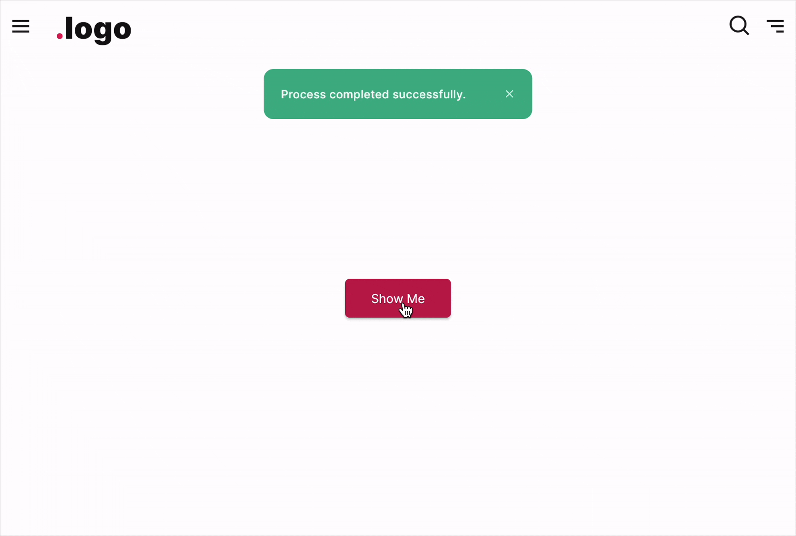

# FUIToast2

<figure><figcaption></figcaption></figure>

The `FUIToast2` offers a more robust toast message compared to `FUIToast1`. It incorporates a close button and allows\
customization by incorporating additional side clickable or tappable icons.

### Widget Class Location

The `FUIToast2` widget classes could be found in:

```
lib/focus_ui_kit/components/notification/fui_toast2.dart
```

### Widget Theme Location

The `FUIToastTheme` class is the theme class holds the default theme variables/values.

#### Accessing the theme

To access the theme class object, do the following:

```dart
@override
Widget build(BuildContext context) {

    FUIToastTheme fuiToastTheme = context.theme.fuiToast;
    
    // ...
}
```

### Usage

To show a toast message, just do following:

```dart
@override
Widget build(BuildContext context) {

    FUIToast2 toast2 = FUIToast2(context);
    
    return Center(
      child: FUIButtonBlockTextIcon(
        text: Text('Show Me'),
        onPressed: () {
          toast2.show(
            fuiColorScheme: FUIColorScheme.success,
            msg: 'Process completed successfully.',
            onTap: () {
              print('Tapped');
            },
          );
        },
      ),
    );
}
```

By default, the close button will be positioned on the right side of the toast bubble. Clicking or tapping on this\
button will dismiss the toast message.

#### To include a side icon

You may include a side icon like so:

```dart
toast2.show(
    fuiColorScheme: FUIColorScheme.warning,
    msg: 'WARNING!!! Your account is about to reach its limit.',
    sideIcon: LineAwesome.exclamation_circle_solid,
);
```

#### To adjust the size of the side icon

```dart
toast2.show(
    fuiColorScheme: FUIColorScheme.warning,
    msg: 'WARNING!!! Your account is about to reach its limit.',
    sideIcon: LineAwesome.exclamation_circle_solid,
    sideIconSize: 20,
);
```

#### To enable/disable the close button

```dart
toast2.show(
    fuiColorScheme: FUIColorScheme.warning,
    msg: 'WARNING!!! Your account is about to reach its limit.',
    showCloseButton: false,
);
```

### Parameters

The `show` method accepts the following parameters.

| Parameters                                 | Description                                                                                                                 |
| ------------------------------------------ | --------------------------------------------------------------------------------------------------------------------------- |
| String msg                                 | The text message to be displayed.                                                                                           |
| FUIColorScheme? fuiColorScheme             | The desired color scheme. Values could be found in `FUIColorScheme`.                                                        |
| FUIToastPosition? fuiToastPosition         | The position for the toast message on the screen (within the context) to be shown. Default is `FUIToastPosition.topCenter`. |
| TextStyle? textStyle                       | The text style (overrides the default text style) for the text message.                                                     |
| EdgeInsets textPadding                     | Customize the message text padding.                                                                                         |
| IconData? sideIcon                         | If a side icon is to be included.                                                                                           |
| double sideIconSize                        | Adjust the size of the side icon.                                                                                           |
| FUIToastIconPosition? fuiToastIconPosition | The position of the side icon (either the left or the right).                                                               |
| EdgeInsets sideIconPadding                 | The padding of the side icon.                                                                                               |
| IconData closeIcon                         | The icon for the close/dismiss icon button.                                                                                 |
| EdgeInsets closeIconPadding                | The padding of the close/dismiss icon.                                                                                      |
| Color? backgroundColor                     | To change the toast bubble background color (overrides color scheme).                                                       |
| Duration? duration                         | The duration for the message to be shown before being dismissed.                                                            |
| Duration? animationDuration                | The animation duration of the toast.                                                                                        |
| double? radius                             | The border radius of the toast bubble.                                                                                      |
| VoidCallback? onTap                        | The function which is to be called when the toast is tapped/clicked.                                                        |
| VoidCallback? onDismiss                    | The function which is to be called when the toast dismisses.                                                                |
| bool showCloseButton                       | Toggle if the close button is to be shown.                                                                                  |
