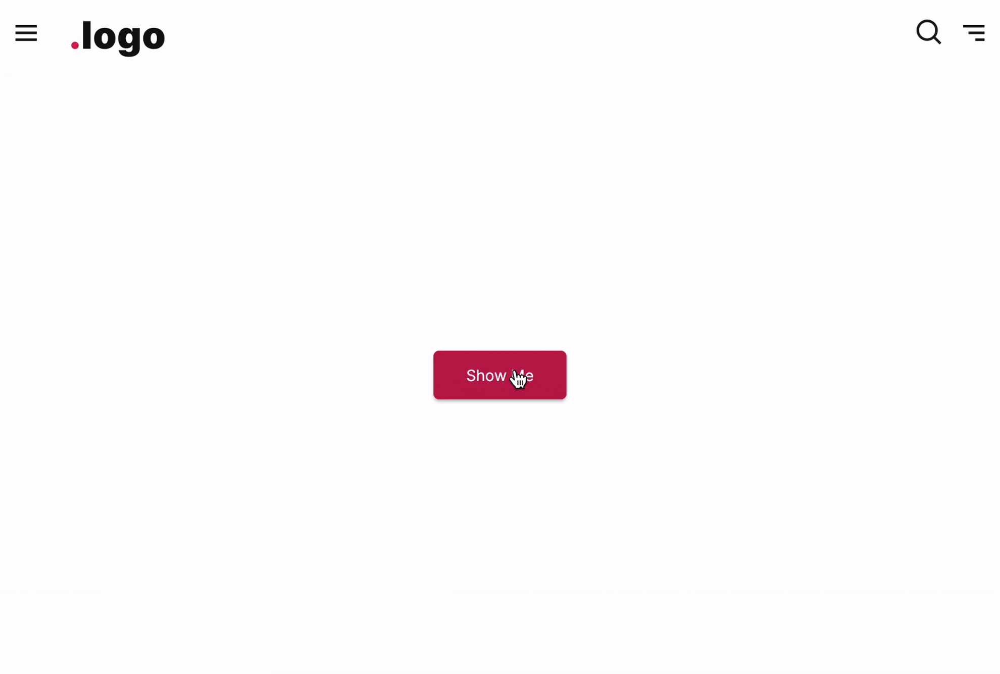

# FUIToast3

<figure><figcaption></figcaption></figure>

The `FUIToast3` is a distinct type of toast message display. It comprises a title and a description body, complemented by a decorative sidebar. This design is intended for more sophisticated message and notification presentation.

### Widget Class Location

The `FUIToast3` widget classes could be found in:

```
lib/focus_ui_kit/components/notification/fui_toast3.dart
```

### Widget Theme Location

The `FUIToastTheme` class is the theme class holds the default theme variables/values.

#### Accessing the theme

To access the theme class object, do the following:

```dart
@override
Widget build(BuildContext context) {

    FUIToastTheme fuiToastTheme = context.theme.fuiToast;
    
    // ...
}
```

### Usage

To show a toast message, just do following:

```dart
@override
Widget build(BuildContext context) {

    FUIToast3 toast3 = FUIToast3(context);
    
    return Center(
      child: FUIButtonBlockTextIcon(
        text: Text('Show Me'),
        onPressed: () {
          toast3.show(
            fuiColorScheme: FUIColorScheme.success,
            title: 'Success',
            description: 'Process was completed.',
          );
        },
      ),
    );
}
```

The default position of the displayed toast message will be at the top left.

#### With side icon

```dart
toast3.show(
    fuiColorScheme: FUIColorScheme.error,
    title: 'Error',
    description: 'Invalid field detected',
    sideIcon: LineAwesome.exclamation_triangle_solid,
);
```

#### Changing the deco bar position

```dart
toast3.show(
    fuiColorScheme: FUIColorScheme.error,
    title: 'Error',
    description: 'Invalid field detected',
    sideIcon: LineAwesome.exclamation_triangle_solid,
    fuiToastDecoBarPosition: FUIToastDecoBarPosition.top,
);
```

#### Customizable Side Widget

In addition to text, you may display images or other widgets as a side widget alongside the text (this will override the\
sideIcon).

```dart
toast3.show(
    title: 'User Activity',
    description: 'Carl had updated the ledgers',
    sideWidget: FUIAvatar(
      avatar: AssetImage('demo-avatar/avatar-man-05.jpg'),
    ),
    sideWidgetPosition: FUIToastIconPosition.right,
);
```

### Parameters

The `show` method accepts the following parameters.

| Parameters                                       | Description                                                                                                                                           |
| ------------------------------------------------ | ----------------------------------------------------------------------------------------------------------------------------------------------------- |
| String title                                     | The title of the toast notification.                                                                                                                  |
| String description                               | The text/description to be shown as body.                                                                                                             |
| FUIColorScheme? fuiColorScheme                   | The desired color scheme. Values could be found in `FUIColorScheme`.                                                                                  |
| FUIToastPosition? fuiToastPosition               | The position for the toast message on the screen (within the context) to be shown. Default is `FUIToastPosition.topRight`.                            |
| FUIToastDecoBarPosition? fuiToastDecoBarPosition | The position of the deco bar. It accepts values from `FUIToastDecoBarPosition` enum (setting FUIToastDecoBarPosition.none) will disable the deco bar. |
| IconData? sideIcon                               | If a side icon is to be included.                                                                                                                     |
| Widget? sideWidget                               | If a side widget should be included (overrides the side icon).                                                                                        |
| FUIToastIconPosition? sideWidgetPosition         | The position of the side widget. Accepts values from `FUIToastIconPosition` enum.                                                                     |
| Duration? duration                               | The duration for the message to be shown before being dismissed.                                                                                      |
| Duration? animationDuration                      | The animation duration of the toast.                                                                                                                  |
| double? radius                                   | The border radius of the toast bubble.                                                                                                                |
| VoidCallback? onTap                              | The function which is to be called when the toast is tapped/clicked.                                                                                  |
| VoidCallback? onDismiss                          | The function which is to be called when the toast dismisses.                                                                                          |
