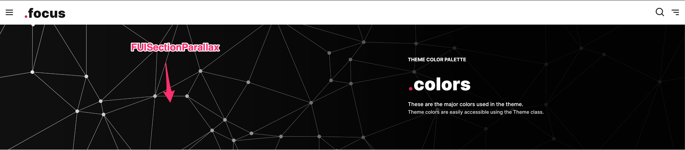

# FUISecionParallax

This section features a background image with a parallax scrolling effect. You may commonly encounter this effect in action on the top banners of the demo application.

<figure><figcaption></figcaption></figure>

`FUISectionParallax` should be considered to be of the same type as `FUISectionPlain`. You may have multiple`FUISectionContainer` elements within `FUISectionParallax`.

### Widget Class Location

The `FUISectionParallax` widget class could be found in:

```
focus_ui_kit/components/section/fui_section_parallax.dart
```

### Widget Theme Location

The `FUISectionTheme` class serves as the theme class for `FUISectionParallax`, equivalent to `FUISectionPlain`. Kindly explore this theme class to examine various settings applicable to `FUISectionParallax`.

#### Accessing the theme

To access the theme class object, do the following:

```dart
@override
Widget build(BuildContext context) {
    FUISectionTheme fuiSectionTheme = context.theme.fuiSection;
    
    // ...
}
```

### Usage

```dart
@override
Widget build(BuildContext context) {
FUIThemeCommonColors fuiColors = context.theme.fuiColors;

return FUISingleChildScrollView(
  child: FUIColumn(
    children: [
      /// Parallax
      FUISectionParallax(
        height: 400,
        imgProvider: AssetImage('assets/demo-background/bg-dot.jpg'),
        // or NetworkImage('https://www.someurl.com/img.jpg'); if the image source is via network.

        /// BlurHash could be generated via https://blurha.sh
        blurHash:
            '|03R{]t7Rjj[WBWBM{fQofofayayj[j[ayofofWBWBj[ayoft7ayRjt7ofj[t7ofj[t7ayayj[ofRjfQofoft7WBt7WBRjxuWBWBWBRjj[ofofWBRjofayRjt7juofayfQt7oft7offQayRjM{WBofWBayofRjWBfQWBj[',
        child: Center(child: Text('This widget is within the FUISectionParallax', style: TextStyle(color: fuiColors.shade0))),
      ),

      // And the rest of the contents...
      SizedBox(
        height: 1800,
        child: SizedBox.shrink(),
      )
    ],
  ),
);
}
```

### Major Parameters

| Parameters                      | Description                                                                                                                                                                                                                                                                                                   |
| ------------------------------- | ------------------------------------------------------------------------------------------------------------------------------------------------------------------------------------------------------------------------------------------------------------------------------------------------------------- |
| FUISectionImageSource imgSource | <p>Select the source of background image. It can be from asset, or via network.<br><br>The default is <code>FUISectionImageSource.network</code></p>                                                                                                                                                          |
| ImageProvider imgProvider       | The source of the background image. It can be either `AssetImage` or `NetworkImage` or any other instance of `ImgProvider`.                                                                                                                                                                                   |
| String? blurHash                | <p>BlurHash is optional. But if you think this helps to make a smooth transition feel while loading the image, you may generate the blurhash programmatically or through <a href="https://blurha.sh">https://blurha.sh</a>.<br><br>Please read more in <a href="https://blurha.sh">https://blurha.sh</a>.</p> |
| BoxFit imgFit                   | <p>The choice of how the background image should be fitted within the parallax container.<br><br>The default is <code>BoxFit.cover</code>.</p>                                                                                                                                                                |
| double? width                   | <p>The width of <code>FUISectionParallax</code>.<br><br>The default is the maximum width of the screen.</p>                                                                                                                                                                                                   |
| double? height                  | <p>The height of <code>FUISectionParallax</code>.<br><br>The default is found in <code>FUISectionTheme.parallaxHeight</code>, which is 400.<br><br><em><strong>Never have the height to be infinite</strong></em>.</p>                                                                                        |

### Other Parameters

All other parameters correspond to Flutter’s `Container` widget.
