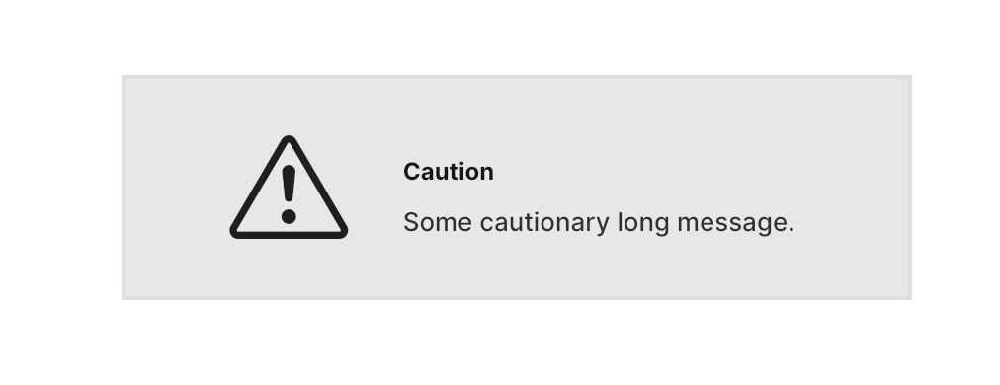

# FUISectionHighlightBox

The `FUISectionHighlightBox` is a diminutive container that necessitates the user’s undivided attention. It is typically employed to display cautionary or warning messages.

<figure><figcaption></figcaption></figure>

The `FUISectionHighlightBox` is a color box with a distinctive border color. While it can serve as a general container widget, it is more appropriate to use it within the `FUISectionContainer` for its intended purpose.

### Widget Class Location

The `FUISectionHighlightBox` widget class could be found in:

```
focus_ui_kit/components/section/fui_section_highlight_box.dart
```

### Widget Theme Location

The `FUISectionTheme` class serves as the theme class for `FUISectionHighlightBox`, which is equivalent to`FUISectionPlain`. Kindly explore this theme class to examine various settings applicable to `FUISectionHighlightBox`.

#### Accessing the theme

To access the theme class object, do the following:

```dart
@override
Widget build(BuildContext context) {
    FUISectionTheme fuiSectionTheme = context.theme.fuiSection;
    
    // ...
}
```

### Usage

```dart
FUISectionHighlightBox(
  fuiColorScheme: FUIColorScheme.lightGrey,
  child: ResponsiveGridRow(
    children: [
      ResponsiveGridCol(
        xs: 4,
        child: Center(
          child: Icon(Bootstrap.exclamation_triangle),
        ),
      ),
      ResponsiveGridCol(
        xs: 8,
        child: Column(
          mainAxisAlignment: MainAxisAlignment.start,
          crossAxisAlignment: CrossAxisAlignment.start,
          children: [
            PreH(Text('Caution')),
            Regular(Text('Some cautionary long message.')),
          ],
        ),
      ),
    ],
  ),
);
```

### Major Parameters

| Parameters                    | Description                                                                                                                                                                                                                        |
| ----------------------------- | ---------------------------------------------------------------------------------------------------------------------------------------------------------------------------------------------------------------------------------- |
| FUIColorScheme fuiColorScheme | You may choose the color scheme for the `FUISectionHighlightBox` via the `FUIColorScheme` enum. The default is `FUIColorScheme.lightGrey`.                                                                                         |
| BoxDecoration? decoration     | If you would like to change the highlight box's background color, border color or the rest of border ettings, you may do so by having a `decoration` value. This parameter corresponds to with Container's `decoration` parameter. |
| double? width                 | <p>The width of <code>FUISectionHighlightBox</code>.<br>The default is the maximum width of the screen.</p>                                                                                                                        |
| double? height                | The height of `FUISectionHighlightBox`.                                                                                                                                                                                            |

### Other Parameters

All other parameters correspond to Flutter’s `Container` widget.
