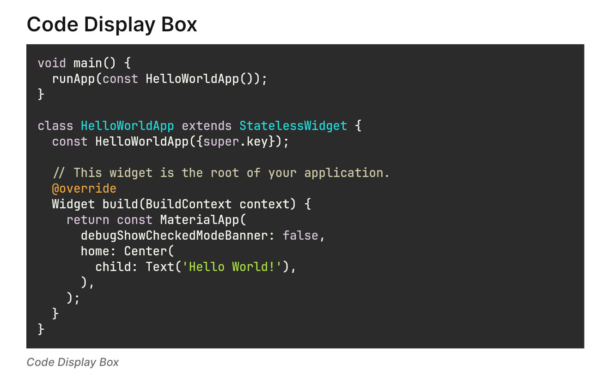

# Code Display Box

<figure><figcaption></figcaption></figure>

The code display box is an enhanced version of the [flutter\_highlight](https://pub.dev/packages/flutter_highlight)\
widget.

### Widget Class Location

The `FUICodeDisplayBox` widget class could be found in:

```
focus_ui_kit/components/typography/fui_code_display_box.dart
```

### Widget Theme Location

The `FUICodeDisplayBoxTheme` class serves as the theme class for the `FUICodeDisplayBox`. Kindly explore this theme\
class to ascertain various settings applicable to the `FUICodeDisplayBox`.

#### Accessing the theme

To access the theme class object, do the following:

```dart
@override
Widget build(BuildContext context) {
    FUICodeDisplayBoxTheme fuiCDBTheme = context.theme.fuiCodeDisplayBox;
    
    // ...
}
```

### Usage

#### Common Usage

```dart
@override
Widget build(BuildContext context) {
    /// ...
    
    const String srcCode = '''void main() {
      runApp(const HelloWorldApp());
    }
    
    class HelloWorldApp extends StatelessWidget {
      const HelloWorldApp({super.key});
    
      // This widget is the root of your application.
      @override
      Widget build(BuildContext context) {
        return const MaterialApp(
          debugShowCheckedModeBanner: false,
          home: Center(
            child: Text('Hello World!'),
          ),
        );
      }
    }''';
    
    return FUICodeDisplayBox(text: srcCode, lang: 'dart');
    
    /// ...
}
```

#### To have a different theme

```dart
/// Refer to: https://github.com/git-touch/highlight.dart/tree/master/flutter_highlight/lib/themes
/// E.g. monokai-sublime.dart -> theme = monokaiSublimeTheme; (It's a map value).

FUICodeDisplayBox(text: srcCode, lang: 'dart', theme: monokaiSublimeTheme);
```

The `FUICodeDisplayBox` accepts two primary parameters: `text`, which represents the source code in string format, and`lang`, which specifies the desired language for the syntax parser.

> For more options on `lang`, do check\
> out: [https://github.com/git-touch/highlight.dart/tree/master/highlight/lib/languages](https://github.com/git-touch/highlight.dart/tree/master/highlight/lib/languages)

### Parameters

| Parameters                    | Description                                                                                                                                                                                                                                                                        |
| ----------------------------- | ---------------------------------------------------------------------------------------------------------------------------------------------------------------------------------------------------------------------------------------------------------------------------------- |
| String text                   | The source code or just text data to be parsed and highlighted according to the syntax defined in `lang`.                                                                                                                                                                          |
| TextStyle? textStyle          | The text style of the text data. Use this to override the default style (e.g. fontSize, fontWeight, etc.).                                                                                                                                                                         |
| String lang                   | The language code name for the highlighter. Please refer to [https://github.com/git-touch/highlight.dart/tree/master/highlight/lib/languages](https://github.com/git-touch/highlight.dart/tree/master/highlight/lib/languages) for the available language parser / highlighter.    |
| Map\<String, TextStyle> theme | This field only takes in the available map value from [https://github.com/git-touch/highlight.dart/tree/master/flutter\_highlight/lib/themes](https://github.com/git-touch/highlight.dart/tree/master/flutter_highlight/lib/themes). Please refer to the list of themes available. |
| double? width                 | <p>The desired width of the display box.<br><br>Default - takes up the max width available.</p>                                                                                                                                                                                    |
| double? height                | <p>The desired height of the display box.<br><br>Default - as high as the codes are displayed.</p>                                                                                                                                                                                 |
