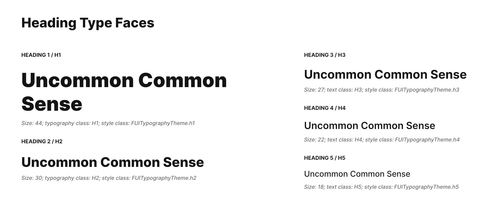

# Headers & Texts

<figure><figcaption></figcaption></figure>

The Focus UI Kit includes pre-configured, visually appealing widgets for displaying text, similar to the HTML elements \<h1>, \<h2>, and so on. We can adopt a similar HTML convention and approach to this in the UI kit.

### Demo

To observe the typography widgets in action, kindly navigate to "Elements -> Typography" within the demo application.

### Widget Classes Location

The dart file which contains all classes for typography is located in:

```
focus_ui_kit/components/typography/fui_typography.dart
```

### Widget Theme Location

The `FUITypographyTheme` class serves as the primary theme class for all typography-related widgets. For further comprehension, kindly refer to this theme class.

#### Accessing the theme

To access the theme class object, do the following:

```dart
@override
Widget build(BuildContext context) {
    FUITypographyTheme fuiTypoTheme = context.theme.fuiTypography;
    
    // ...
}
```

### Typography and Widget Classes

| Typography             | Widget Class                                                                                                                                                                                                                                                                          |
| ---------------------- | ------------------------------------------------------------------------------------------------------------------------------------------------------------------------------------------------------------------------------------------------------------------------------------- |
| Pre-Header             | The widget for Pre-Header, which is `PreH`, for italic, you could use `PreHI`                                                                                                                                                                                                         |
| Header 1               | Correspond to the HTML's \<h1>, the widget class is `H2`; for italic, you could use `PreHI`.                                                                                                                                                                                          |
| Header 2               | Correspond to the HTML's \<h2>, the widget class is `H2`; for italic, you could use `H2I`.                                                                                                                                                                                            |
| Header 3               | Correspond to the HTML's \<h3>, the widget class is `H3`; for italic, you could use `H3I`.                                                                                                                                                                                            |
| Header 4               | Correspond to the HTML's \<h4>, the widget class is `H4`; for italic, you could use `H4I`.                                                                                                                                                                                            |
| Header 5               | Correspond to the HTML's \<h5>, the widget class is `H5`; for italic, you could use `H5I`.                                                                                                                                                                                            |
| Normal/Regular Text    | <p>The widget class is <code>Regular</code>. This is the most used widget for text display.<br>To have bold effect, use <code>RegularB</code><br>To have italic effect, use <code>RegularI</code>.<br>To have both bold and italic, use <code>RegularBI</code>.</p>                   |
| Small / Hint Text      | <p>The widget class is <code>SmallText</code>. This is to display text with smaller fonts than Regular.<br>To have bold effect, use <code>SmallTextB</code><br>To have italic effect, use <code>SmallTextI</code>.<br>To have both bold and italic, use <code>SmallTextBI</code>.</p> |
| Input Field Label Text | The widget class is `FieldLabel`. This is usually used for labelling input fields.                                                                                                                                                                                                    |

### Usage

These typography widget classes typically share common parameters. Their usage is generally similar across.

#### To display H1 (only text)

```dart
H1(Text('This is H1'));
```

#### To display H1 (text and icon)

```dart
H1(
  Row(
    mainAxisAlignment: MainAxisAlignment.start,
    children: [
      Padding(
        padding: const EdgeInsets.only(right: 20),
        child: Icon(FontAwesome.triangle_exclamation_solid),
      ),
      Text('This is H1 with Icon'),
    ],
  ),
);
```

#### To override the color

```dart
H1(Text('This is H1', style: TextStyle(color: Colors.red)));
```

> Notice that the `H1` class in the preceding example (and other typography widgets) accepts the text parameter of a widget rather than a `String`. This design principle facilitates flexibility, enabling widgets that contain text or icons to adopt the same intended font size and weight.
