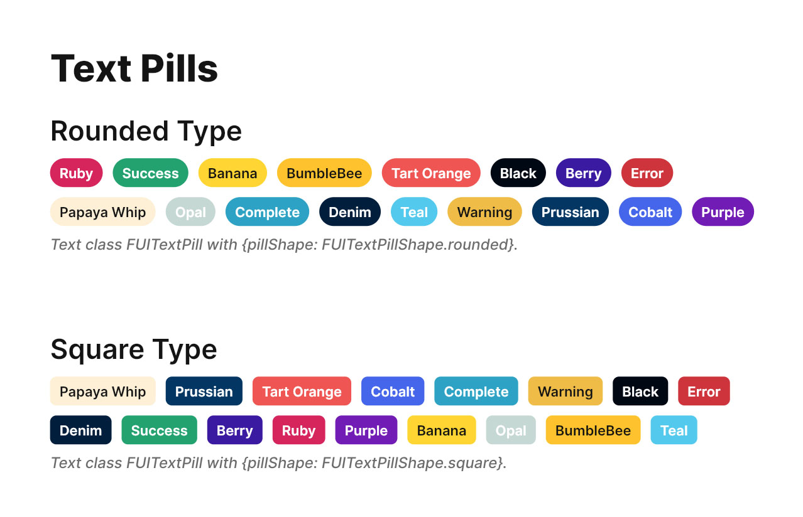

# Text Pill

<figure><figcaption></figcaption></figure>

For those familiar with the widely-used HTML/Javascript Bootstrap framework, the Focus UI Kit’s text pill, denoted as`FUITextPill`, bears a resemblance to the `badge` element within the Bootstrap framework. This element is commonly employed to denote labels or tags on specific artifacts.

The `FUITextPill` is available in two distinct shapes: a rounded-cornered version and a rectangular one.

### Widget Classes Location

The dart file which contains all classes for text pill is located in:

```
focus_ui_kit/components/typography/fui_text_pill.dart
```

### Widget Theme Location

The `FUITextPillTheme` class serves as the theme class for the `FUITextPill` component. Kindly explore this theme class to examine the various settings available for `FUITextPill`.

#### Accessing the theme

To access the theme class object, it can be done through:

```dart
@override
Widget build(BuildContext context) {
    FUITextPillTheme fuiTextPillTheme =  context.theme.fuiTextPill;
    
    // ...
}
```

### Usage

#### To display a simple text pill (with default color scheme and size)

```dart
FUITextPill(text: 'Tag 1');
```

#### Text pill with different sizes

```dart
FUITextPill(text: 'Tag 1', pillSize: FUITextPillSize.large);
```

#### Text pill with different color scheme

```dart
FUITextPill(text: 'Tag 1', fuiColorScheme: FUIColorScheme.cobalt);
```

#### Text pill with in rectangle shape

```dart
FUITextPill(text: 'Tag 1', pillShape: FUITextPillShape.square);
```

### Parameters

| Parameters                    | Description                                                                                                                                                                                                            |
| ----------------------------- | ---------------------------------------------------------------------------------------------------------------------------------------------------------------------------------------------------------------------- |
| Text text                     | The Text widget for displaying the text. If you have a custom style, do fill in the `style` parameter as well. If not, the text pill will go by the default style.                                                     |
| FUIColorScheme fuiColorScheme | The color scheme for the text pill. The default is `FUIColorScheme.primary`.                                                                                                                                           |
| FUITextPillShape pillShape    | The shape of the text pill. The default is `FUITextPillShape.rounded`.                                                                                                                                                 |
| FUITextPillSize pillSize      | The size of the text pill (small, medium or large). The default is `FUITextPillSize.medium`.                                                                                                                           |
| Color? backgroundColor        | <p>If you prefer a different background color, set this parameter and it will override the default color scheme.<br>For different font color, set it in the <code>style</code> parameter of the <code>text</code>.</p> |
