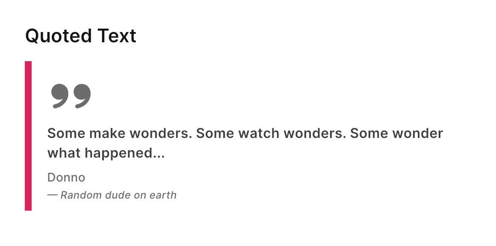

# Text Quote

<figure><figcaption></figcaption></figure>

A TextQuote is a visual representation of a short piece of text that requires the user’s attention. It can be likened to the `<blockquote>` tag in HTML.

_This widget serves as a simple UI element designed to display text in a predetermined and_\
_aesthetically consistent manner._

### Widget Classes Location

The dart file which contains all classes for quote is located in:

```
lib/focus_ui_kit/components/typography/fui_quote.dart
```

### Widget Theme Location

The `FUIQuoteTheme` class serves as the theme class for the `FUIQuoteText` component. Kindly explore this theme class to examine the various settings available for `FUIQuoteTheme`.

#### Accessing the theme

To access the theme class object, do the following:

```dart
@override
Widget build(BuildContext context) {
    FUIQuoteTheme fuiQuoteTheme = context.theme.fuiQuote;
    
    // ...
}
```

### Usage

```dart
FUIQuoteJustText(
    textContent: Text('Some phrase'),
    bottomLine1: Text('By some author'),
    bottomLine2: Text('author credential'),
);
```

### Parameters

| Parameters                    | Description                                                                              |
| ----------------------------- | ---------------------------------------------------------------------------------------- |
| FUIColorScheme fuiColorScheme | The color scheme for the side decoration strip. The default is `FUIColorScheme.primary`. |
| Widget? quoteSymbol           | Override this is you prefer a different double quote symbol / image of your choice.      |
| Widget textContent            | The main text content. Default styling applies.                                          |
| Widget? bottomLine1           | The 1st line of text content after the main content at the bottom.                       |
| Widget? bottomLine2           | The 2nd line of text content after the main content at the bottom.                       |
