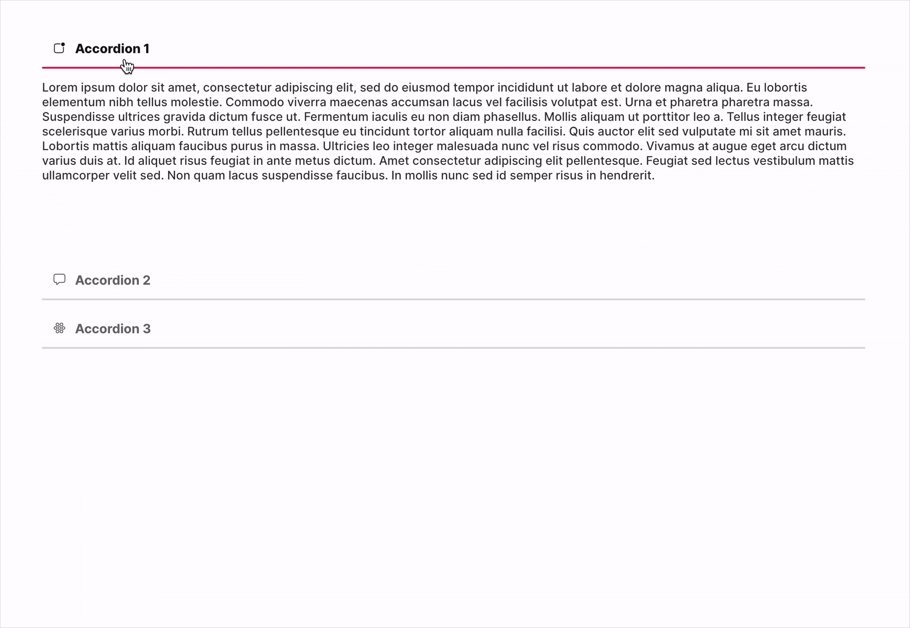

# Accordion - FUIAccordion & FUIAccordionItem

<figure><figcaption></figcaption></figure>

The accordion widget, implemented using `FUIAccordion`, enables the expansion and collapse of headers and containers. It supports both text and icon content and allows customization of each accordion item to include any widget type.

> The default content height for each accordion item is set to 200. Kindly modify this value as per your requirements.

### Widget Class Location

The `FUIAccordion` widget and other related classes could be found in the directory of:

```
focus_ui_kit/components/accordion/
```

#### Class Details

| Class Name               | Dart File                   | Description                                                                                                   |
| ------------------------ | --------------------------- | ------------------------------------------------------------------------------------------------------------- |
| `FUIAccordion`           | fui\_accordion.dart         | The major widget class for the accordion.                                                                     |
| `FUIAccordionController` | fui\_accordion\_events.dart | The controller for the FUIAccordion (using Flutter Bloc)                                                      |
| `FUIAccordionEvent`      | fui\_accordion\_events.dart | The controller event class, used by FUIAccordionController. Any parameter that is null will NOT be processed. |
| `FUIAccordionItem`       | fui\_accordion\_item.dart   | The accordion item widget class.                                                                              |

### Widget Theme Location

The `FUIAccordionTheme` class is the theme class that holds the default theme variables/values.

#### Accessing the theme

To access the theme class object, it can be done by doing this:

```
@override
Widget build(BuildContext context) {
    FUIAccordionTheme accordionTheme = context.theme.fuiAccordion;
    
    // ...
}
```
