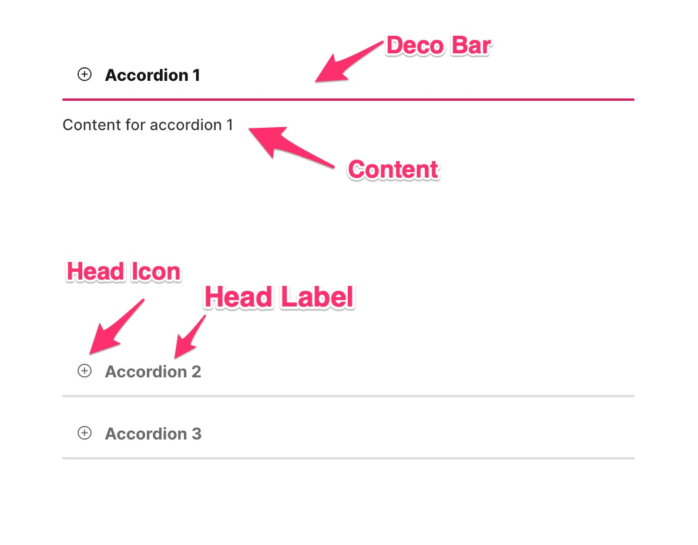
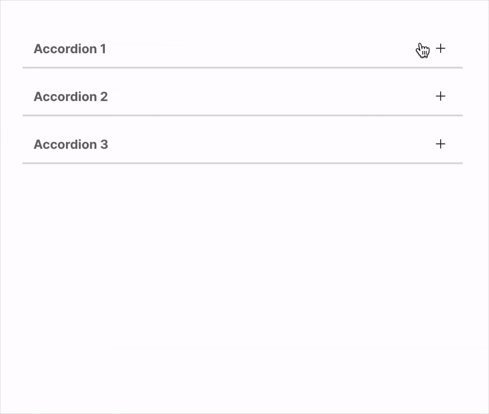

# FUIAccordionItem

The below is a detailed description of the structural components of the `FUIAccordionItem` widget.

<figure><figcaption></figcaption></figure>

> Each `FUIAccordionItem` is assigned a default content height of 200. For content that exceeds this height, it is recommended to utilize a `FUISingleChildScrollView` to accommodate the extended content. Alternatively, the content height can be adjusted to fit the content’s dimensions.

### Usage

The accordion item widget can be configured in numerous configurations.

### Item head with icon

To include an icon along with the head label, do the following:

```dart
FUIAccordionItem(
    headLabel: Text('Accordion 1'),
    headIcon: Icon(CupertinoIcons.plus_circle),
    content: FUIColumn(
      children: [
        Regular(Text('Content for accordion 1')),
      ],
    ),
);
```

### Switch positions of icon and label

```dart
FUIAccordionItem(
    headLabel: Text('Accordion 1'),
    headIcon: Icon(CupertinoIcons.plus_circle),
    fuiAccordionHeadSideIconPosition: FUIAccordionHeadTextIconPosition.iconRightTextLeft,
    content: FUIColumn(
      children: [
        Regular(Text('Content for accordion 1')),
      ],
    ),
);
```

### Very long content, use a scroll view.

```dart
FUIAccordionItem(
    headLabel: Text('Accordion 1'),
    content: FUISingleChildScrollView(
      child: SizedBox(
        height: 1000,
        child: FUIColumn(
          children: [
            Regular(Text('Content for accordion 1')),
          ],
        ),
      ),
    ),
);
```

### Side expansion animation

Enhance the accordion item’s visual appeal with animation. To enable this animation, simply activate the`sideDecoExpAniIconEnable` option. The animation will play during the expansion and collapse of the accordion item.

<figure><figcaption></figcaption></figure>

The widget employs Lottie files to achieve the animation effect.

#### Default side deco expansion animated icon

```dart
FUIAccordionItem(
    headLabel: Text('Accordion 1'),
    sideDecoExpAniIconEnable: true, 
    content: FUIColumn(
      children: [
        Regular(Text('Content for accordion 1')),
      ],
    ),
);
```

#### Changing the animated lottie file

If a different animation is desired, please download a Lottie file and configure it accordingly:

```dart
FUIAccordionItem(
    headLabel: Text('Accordion 1'),
    sideDecoExpAniIconEnable: true,
    sideDecoExpAniIconLottiePath: 'lottie-folder/lottie-file.json', // The path is relative to <root>/assets
    sideDecoExpAniIconSize: 20, // Size of the animation icon 
    content: FUIColumn(
      children: [
        Regular(Text('Content for accordion 1')),
      ],
    ),
);
```

> Please be advised that the Lottie file path should be relative to the assets folder, specifically located at`<project root>/assets`.

### Parameters

| Parameters                                                         | Description                                                                                        |
| ------------------------------------------------------------------ | -------------------------------------------------------------------------------------------------- |
| FUIColorScheme fuiColorScheme                                      | The desired color scheme. Values could be found in the `FUIColorScheme` enum.                      |
| bool initialExpanded                                               | Expand when initially build.                                                                       |
| ValueSetter\<bool>? onAccordionChanged                             | The function to be triggered as and when the accordion item is expanded or collapsed.              |
| Text headLabel                                                     | The item head label.                                                                               |
| Icon? headIcon                                                     | Head label icon (if any).                                                                          |
| FUIAccordionHeadTextIconPosition? fuiAccordionHeadSideIconPosition | The position of both label and icon. Default is FUIAccordionHeadTextIconPosition.iconLeftTextRight |
| double? accordionHeadIconTextHSpace                                | The space between the head label text and icon.                                                    |
| EdgeInsets? accordionHeadLabelPadding                              | The padding for the head label section.                                                            |
| EdgeInsets? accordionHeadPadding                                   | The padding for the head section.                                                                  |
| Color? decoBarActiveColor                                          | The color of the deco bar when item is activated/expanded. Overrides color scheme.                 |
| Color? decoBarInactiveColor                                        | The color of the deco bar when item is deactivated/collapsed. Overrides color scheme.              |
| double? decoBarThickness                                           | The deco bar thickness (height).                                                                   |
| BorderRadius? decoBarBorderRadius                                  | The deco bar's border/side radius.                                                                 |
| Duration? decoBarAniDuration                                       | The animation duration for deco bar when expanded/collapsed.                                       |
| Curve? decoBarAniCurve                                             | The animation curve setting for deco bar when expanded/collapsed.                                  |
| bool sideDecoExpAniIconEnable                                      | Enable/disable the right side animated lottie file animation.                                      |
| String? sideDecoExpAniIconLottiePath                               | The path to the lottie json file (relative to `<project root>/assets`.                             |
| Duration? sideDecoExpAniIconDuration                               | The animation duration for the right side lottie file icon.                                        |
| EdgeInsets? sideDecoExpAniIconPadding                              | The padding for the right side lottie file icon.                                                   |
| double? sideDecoExpAniIconSize                                     | The size of the right side lottie file icon.                                                       |
