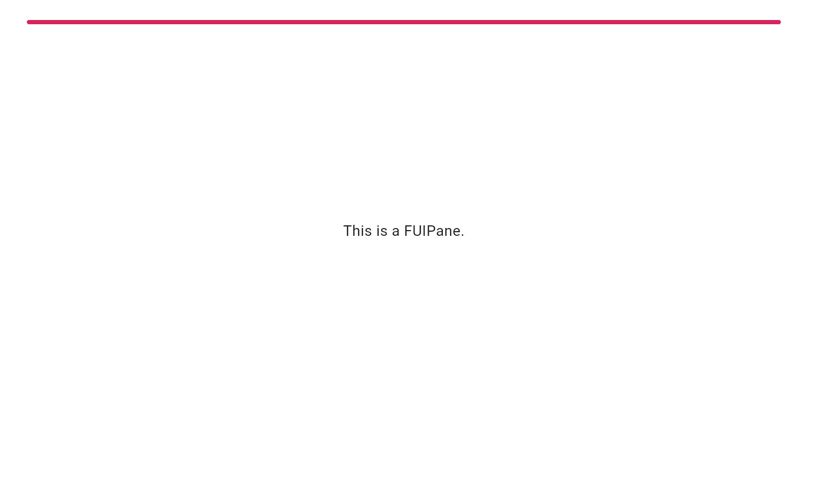
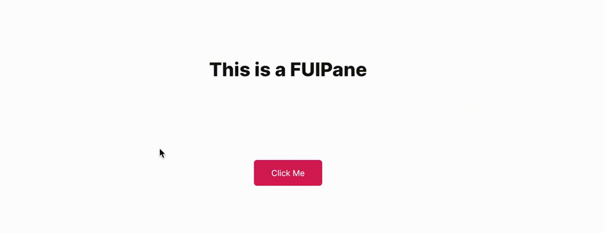

# Pane - FUIPane

<figure><figcaption></figcaption></figure>

`FUIPane` is a container designed to accommodate multiple widgets within a single display area. It is characterized by its borderless design and transparent background by default. Additionally, it includes both `PaceBar` and `Spinner`widgets as default components.

_The above image shows a `FUIPane` with `PaceBar` enabled._

### Widget Class Location

The `FUIPane` widget classes could be found in the directory of:

```
lib/focus_ui_kit/components/pane/
```

#### Class Details

| Class Name               | Dart File              | Description                                                                                                      |
| ------------------------ | ---------------------- | ---------------------------------------------------------------------------------------------------------------- |
| `FUIPane`                | fui\_pane.dart         | The major widget class of the pane.                                                                              |
| `FUIPaneController`      | fui\_pane\_events.dart | The controller for the FUIPane (using Flutter Bloc)                                                              |
| `FUIPaneControlEvent`    | fui\_pane\_events.dart | The controller event class, used by `FUIPaneController`. Any parameter that is null will _**NOT**_ be processed. |
| `FUIPanePaceBarPosition` | fui\_pane\_params.dart | The enum for certain settings in the pane, namely pace bar position.                                             |

### Widget Theme Location

The `FUIPaneTheme` class is the theme class holds the default theme variables/values.

#### Accessing the theme

To access the theme class object, it can be done through:

```dart
@override
Widget build(BuildContext context) {
    FUIPaneTheme fuiPaneTheme = context.theme.fuiPane;
    
    // ...
}
```

### Usage

Here's a typical usage for the `FUIPane`:

```dart
FUIPane(
  paceBarEnable: true,
  paceBarShow: true,
  paceBarRepeating: false,
  paceBarMaxValue: 100,
  paceBarCurrentValue: 100,
  child: FUISingleChildScrollView(
    child: Center(
      child: H2(
        Text('This is a FUIPane'),
        alignment: Alignment.center,
      ),
    ),
  ),
);
```

The `FUIPane` by default has a height of 400 pixels, with a small padding for its child content. You can explore other settings in the `FUIPaneTheme` class.

> Note: Ensure that the height has a finite value. If you set a `null` (or double.infinity) to the height, do enclose it\
> within a confined outer container with a definite height, such as a `SizedBox` or `Container`.

#### With controller

The FUIPane's PaceBar and Spinner could be controlled programmatically.

#### Initialize the `FUIPaneController`

Do this in a Stateful Widget.

```dart
late FUIPaneController paneCtrl;

@override
void initState() {
    super.initState();
    paneCtrl = FUIPaneController();
}

@override
void dispose() {
    paneCtrl.close();
    super.dispose();
}
```

#### The PaceBar

**To Enable / Disable PaceBar**

```dart
FUIPane(
    paceBarEnable: true,    // or set to 'false' to disable.
    child: ...,
);
```

If the `paceBarEnable` is disabled, showing the `PaceBar` through the controller event will not take effect.

**Repeating PaceBar**

The PaceBar on the `FUIPane` can be utilized to display task progress or serve as a decorative element. The `PaceBar`within the `FUIPane` offers two modes: repeating and finite value (non-repeating).

Here's how to toggle a repeating PaceBar (via controller):

<figure><figcaption></figcaption></figure>

```dart
/// Define the pane...
FUIPane(
  paneController: paneCtrl,
  paceBarEnable: true,
  paceBarShow: false,
  paceBarRepeating: true,
  child: FUISingleChildScrollView(
    child: Center(
      child: H2(
        Text('This is a FUIPane'),
        alignment: Alignment.center,
      ),
    ),
  ),
);

/// Some where else...trigger an event via the controller
paneCtrl.trigger(FUIPaneControlEvent(
    paceBarShow: true,
));
```

**Definite Value (Non-Repeating) PaceBar**

If you prefer manually setting the PaceBar’s value, it can be adjusted from 0 to 100 (maximum).

Example:

```dart
/// Define the pane...
FUIPane(
  paneController: paneCtrl,
  paceBarEnable: true,
  paceBarShow: false,
  paceBarRepeating: false,
  paceBarCurrentValue: 0,
  paceBarMaxValue: 100,
  child: FUISingleChildScrollView(
    child: Center(
      child: H2(
        Text('This is a FUIPane'),
        alignment: Alignment.center,
      ),
    ),
  ),
);

/// Somewhere else, trigger the events via the controller
/// Show the pace bar and set it to 5
paneCtrl.trigger(
    FUIPaneControlEvent(
      paceBarShow: true,
      paceBarValue: 5,
    ),
);

/// Show the pace bar and set it to 60
paneCtrl.trigger(
    FUIPaneControlEvent(
      paceBarValue: 60,
    ),
);

/// Show the pace bar and set it to 100
paneCtrl.trigger(
    FUIPaneControlEvent(
      paceBarValue: 100,
    ),
);

/// Hide the pace bar
paneCtrl.trigger(
    FUIPaneControlEvent(
      paceBarShow: false,
    ),
);
```

**PaceBar Location**

The PaceBar’s position can be placed at the top or bottom of the pane. This configuration is controlled by the`paceBarPosition` parameter.

```dart
FUIPane(
  paceBarPosition: FUIPanePaceBarPosition.bottom,
  child: ...
);
```

#### The Spinner

The spinner is an animated widget that serves as an indicator of the status of a task, such as waiting, loading, or\
processing.

**Show / Hide Spinner**

The spinner could be shown and hidden via the controller.

```dart
/// Define the pane
FUIPane(     
  paneController: paneCtrl,
  spinnerEnable: true,
  child: ...,
);

/// Some where else, trigger the events via the controller
/// To show the spinner, disable the pane (no gestures allowed), and blur the contents:
paneCtrl.trigger(
  FUIPaneControlEvent(
    enable: false,
    blur: true,
    spinnerShow: true,
  ),
);

/// To hide the spinner, re-enabled the pane (allowing gestures), and unblur the contents:
paneCtrl.trigger(
  FUIPaneControlEvent(
    enable: true,
    blur: false,
    spinnerShow: false,
  ),
);
```

### Parameters

| Parameters                             | Description                                                                                                                                   |
| -------------------------------------- | --------------------------------------------------------------------------------------------------------------------------------------------- |
| FUIColorScheme fuiColorScheme          | The color scheme for the side pace bar & spinner. The default is `FUIColorScheme.primary`.                                                    |
| FUIPaneController? paneController      | <p>The controller to control the elements of the pane externally.<br>Please remember to 'close' the controller when cleaning up.</p>          |
| double? width                          | Define the width of the pane. The default is maximum width of the outer container.                                                            |
| double? height                         | Define the height of the pane. The default is 400.                                                                                            |
| EdgeInsets? padding                    | Correspond to the `padding` of the container.                                                                                                 |
| BoxDecoration? decoration              | Correspond to the `decoration` of the container.                                                                                              |
| BoxConstraints? constraints            | Correspond to the `constraints` of the container.                                                                                             |
| double? opacityDuringDisabled          | The opacity value when the pane is disabled. The value should be between 0 to 1.                                                              |
| Duration? opacityAniDuration           | The animation duration when blurring on enable / disable.                                                                                     |
| bool paceBarEnable                     | Set to `true` to enable PaceBar.                                                                                                              |
| bool paceBarShow                       | To show the PaceBar initially when the FUIPane widget is rendered.                                                                            |
| bool paceBarRepeating                  | Set to `true` if you want the PaceBar to be in `repeating` mode, or `false` if you want to manually set the PaceBar value.                    |
| FUIPanePaceBarPosition paceBarPosition | The position of the PaceBar, either at the top, or at the bottom (via enum `FUIPanePaceBarPosition`)                                          |
| Color? paceBarColor                    | Overrides the PaceBar color.                                                                                                                  |
| double paceBarCurrentValue             | Defines the current value of the PaceBar (if it is not in repeating mode).                                                                    |
| double paceBarMaxValue                 | Defines the maximum value of the PaceBar (if it is not in repeating mode). Defaults to 100.                                                   |
| Curve? paceBarAniCurve                 | Defines animation curve for the PaceBar animation during value change.                                                                        |
| Duration? paceBarAniDuration           | Defines animation duration for the PaceBar animation during value change.                                                                     |
| bool spinnerEnable                     | To enable / disable the spinner.                                                                                                              |
| Alignment spinnerPosition              | Defines the position of the spinner. Defaults to `Alignment.center`.                                                                          |
| Widget? spinnerWidget                  | Overrides the spinner widget. You may use some other icons or Lottie widget for the spinner.                                                  |
| bool spinnerRotationEnable             | <p>Enable / disable the rotation of the spinner.<br>If you have an external animated widget, you may set this to <code>false</code> this.</p> |
| Duration? spinnerRotationAniDuration   | This animation duration of the rotation of the spinner.                                                                                       |
| Curve? spinnerRotationAniCurve         | This animation curve of the rotation of the spinner.                                                                                          |
