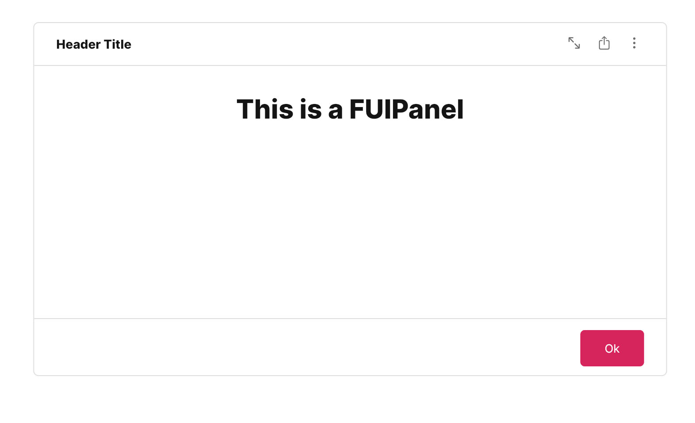
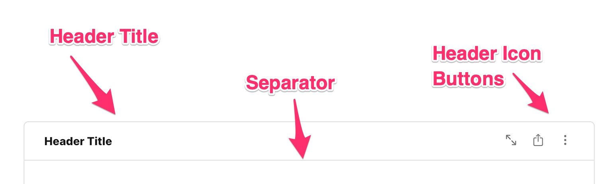
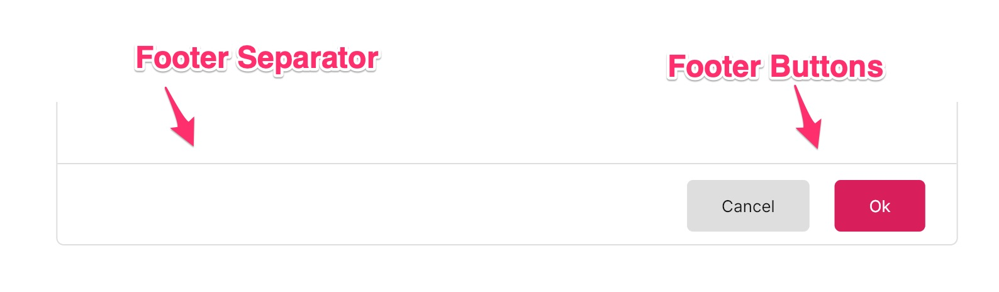
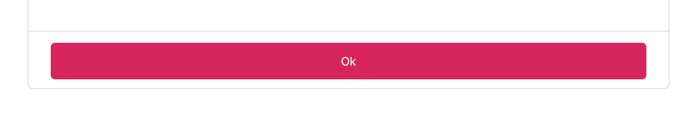
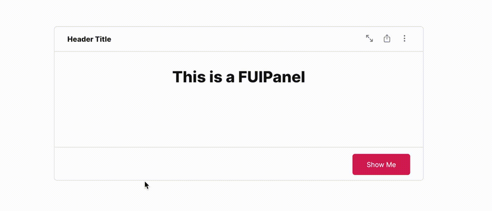
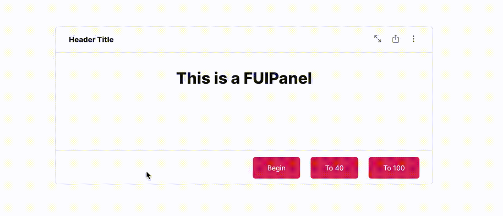
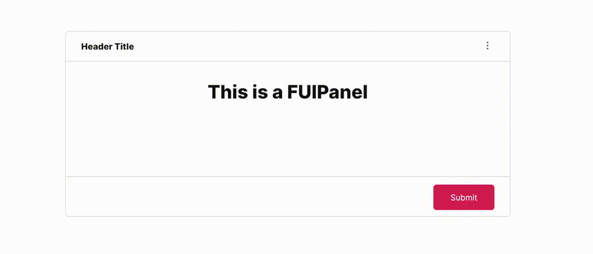

# Panel - FUIPanel

<figure><figcaption></figcaption></figure>

The `FUIPanel` is an advanced `FUIPane`. While `FUIPane` is a suitable container with a pace bar and spinners,`FUIPanel` enables the inclusion of a header title, icons centered content, and a footer within a bordered box.

## Widget Class Location

The `FUIPanel` widget and other related classes could be found in the directory of:

```
lib/focus_ui_kit/components/panel/
```

### Class Details

| Class Name                | Dart File               | Description                                                                                                 |
| ------------------------- | ----------------------- | ----------------------------------------------------------------------------------------------------------- |
| `FUIPanel`                | fui\_panel.dart         | The major widget class of the panel.                                                                        |
| `FUIPanelController`      | fui\_panel\_events.dart | The controller for the FUIPanel (using Flutter Bloc)                                                        |
| `FUIPanelControlEvent`    | fui\_panel\_events.dart | The controller event class, used by `FUIPanelController`. Any parameter that is null will NOT be processed. |
| `FUIPanelPaceBarPosition` | fui\_panel\_params.dart | The enum for certain settings in the panel, namely pace bar position.                                       |

## Widget Theme Location

The `FUIPanelTheme` class is the theme class holds the default theme variables/values.

### Accessing the theme

To access the theme class object, it can be done through:

```dart
@override
Widget build(BuildContext context) {
    FUIPanelTheme fuiPanelTheme = context.theme.fuiPanel;
    
    // ...
}
```

## Usage

Here's a typical usage for the `FUIPanel`:

```dart
FUIPanel(
  headerTitle: Text('Header Title'),
  headerIconButtons: [
    FUIButtonLinkIcon(
        icon: Icon(
          CupertinoIcons.arrow_up_left_arrow_down_right,
          size: FUIPanelTheme.headerIconButtonSize,
          color: panelTheme.headerIconButtonColor,
        ),
        onPressed: () {},
    ),
    FUIButtonLinkIcon(
        icon: Icon(
          CupertinoIcons.share,
          size: FUIPanelTheme.headerIconButtonSize,
          color: panelTheme.headerIconButtonColor,
        ),
        onPressed: () {},
    ),
  ],
  headerSeparator: true,
  paceBarEnable: true,
  paceBarShow: true,
  paceBarRepeating: false,
  paceBarMaxValue: 100,
  paceBarCurrentValue: 100,
  content: FUISingleChildScrollView(
    child: Center(
      child: H2(
        Text('This is a FUIPanel'),
        alignment: Alignment.center,
      ),
    ),
  ),
  footerShow: true,
  footerSeparator: true,
  footerButtons: [
    FUIButtonBlockTextIcon(
      text: Text('Ok'),
      onPressed: () {},
    ),
  ],
);
```

Similar to the `FUIPane`, the `FUIPanel` also has a default height of 400 pixels, with a small padding for content\
displayed. You can explore other settings in the `FUIPanelTheme` class.

> Note: Ensure that the height has a finite value. If you set a `null` (or double.infinity) to the height, do enclose it\
> within a confined outer container with a definite height, such as a `SizedBox` or `Container`.

### Header

<figure><figcaption></figcaption></figure>

The header consists of two distinct sections. The left side accommodates the header title, while the right side is reserved for the placement of an icon button, if applicable.

**Showing / Hiding**

The header’s visibility can be controlled using the `headerShow` property, while the header separator’s visibility can be controlled using the `headerSeparator` property.

### Footer

<figure><figcaption></figcaption></figure>

The footer is the section located below the content of the `FUIPanel`. It typically contains action buttons or links. The footer buttons can be configured to be displayed on the side or with a custom widget that occupies the entire space (block mode).

**Footer buttons on the side**

```dart
FUIPanel(
    // ...
    footerButtons: [
        FUIButtonBlockTextIcon(
          fuiColorScheme: FUIColorScheme.lightGrey,
          text: Text('Cancel'),
          onPressed: () {},
        ),
    
        FUIButtonBlockTextIcon(
          text: Text('Ok'),
          onPressed: () {},
        ),
    ],
);
```

**Footer with a custom widget**

<figure><figcaption></figcaption></figure>

Instead of assigning the button widgets to the `footerButtons`, assign the `footerWidget` instead.

```dart
FUIPanel(
    // ...
    footerWidget: FUIButtonBlockTextIcon(
        fuiButtonBlockLevel: FUIButtonBlockLevel.full,
        text: Text('Ok'),
        onPressed: () {},
    ),
);
```

### With controller

The `FUIPanel`'s PaceBar and Spinner could be controlled programmatically, just like `FUIPane`.

#### Initialize the `FUIPanelController`

Do this in a Stateful Widget.

```dart
late FUIPanelController panelCtrl;

@override
void initState() {
    super.initState();
    panelCtrl = FUIPanelController();
}

@override
void dispose() {
    panelCtrl.close();
    super.dispose();
}
```

### The PaceBar

**To Enable / Disable PaceBar**

```dart
FUIPanel(
    paceBarEnable: true,    // or set to 'false' to disable.
    content: ...,
);
```

If the `paceBarEnable` is disabled, displaying the `PaceBar` through the controller event will not have any effect.

**Repeating PaceBar**

The PaceBar on the `FUIPanel` can be utilized to display task progress or serve as a decorative element. The `PaceBar`within the `FUIPanel` offers two modes: repeating and finite value (non-repeating).

Here's how to toggle a repeating PaceBar (via controller):

<figure><figcaption></figcaption></figure>

```dart
/// Define the panel...
FUIPanel(
  panelController: panelCtrl,
  paceBarEnable: true,
  paceBarShow: false,
  paceBarRepeating: true,
  content: FUISingleChildScrollView(
    child: Center(
      child: H2(
        Text('This is a FUIPane'),
        alignment: Alignment.center,
      ),
    ),
  ),
);

/// Some where else...trigger an event via the controller
panelCtrl.trigger(FUIPanelControlEvent(
    paceBarShow: true,
));
```

**Definite Value (Non-Repeating) PaceBar**

If you prefer manually setting the PaceBar’s value, it can be adjusted from 0 to 100 (maximum).

<figure><figcaption></figcaption></figure>

Example:

```dart
/// Define the pane...
FUIPanel(
  height: 300,
  fuiPanelController: panelCtrl,
  headerTitle: Text('Header Title'),
  headerIconButtons: [
    FUIButtonLinkIcon(
        icon: Icon(
          CupertinoIcons.ellipsis_vertical,
          size: FUIPanelTheme.headerIconButtonSize,
          color: panelTheme.headerIconButtonColor,
        ),
        onPressed: () {}),
  ],
  headerSeparator: true,
  paceBarEnable: true,
  paceBarRepeating: false,
  paceBarCurrentValue: 0,
  paceBarMaxValue: 100,
  content: FUISingleChildScrollView(
    child: Center(
      child: H2(
        Text('This is a FUIPanel'),
        alignment: Alignment.center,
      ),
    ),
  ),
  footerShow: false,
);

/// Somewhere else, trigger the events via the controller
/// Show the pace bar and set it to 5
panelCtrl.trigger(
    FUIPanelControlEvent(
      paceBarShow: true,
      paceBarValue: 5,
    ),
);

/// Show the pace bar and set it to 60
panelCtrl.trigger(
    FUIPanelControlEvent(
      paceBarValue: 60,
    ),
);

/// Show the pace bar and set it to 100
panelCtrl.trigger(
    FUIPanelControlEvent(
      paceBarValue: 100,
    ),
);

/// Hide the pace bar
panelCtrl.trigger(
    FUIPanelControlEvent(
      paceBarShow: false,
    ),
);
```

**PaceBar Location**

The `PaceBar` can be positioned at either the top or bottom of the panel. This configuration is controlled by the`paceBarPosition` parameter.

```dart
FUIPanel(
  paceBarPosition: FUIPanelPaceBarPosition.bottom,
  content: ...
);
```

#### The Spinner

The spinner is an animated widget that serves as an indicator of the status of a task, such as waiting, loading, or processing.

<figure><figcaption></figcaption></figure>

**Show / Hide Spinner**

The spinner could be shown and hidden via the controller.

```dart
/// Define the panel
FUIPanel(     
  panelController: panelCtrl,
  spinnerEnable: true,
  content: ...,
);

/// Some where else, trigger the events via the controller
/// To show the spinner, disable the panel (no gestures allowed), and blur the contents:
panelCtrl.trigger(
  FUIPanelControlEvent(
    enable: false,
    blur: true,
    spinnerShow: true,
  ),
);

/// To hide the spinner, re-enabled the panel (allowing gestures), and unblur the contents:
panelCtrl.trigger(
  FUIPanelControlEvent(
    enable: true,
    blur: false,
    spinnerShow: false,
  ),
);
```

### Parameters

| Parameters                             | Description                                                                                                                                   |
| -------------------------------------- | --------------------------------------------------------------------------------------------------------------------------------------------- |
| FUIColorScheme fuiColorScheme          | The color scheme for the side pace bar & spinner. The default is `FUIColorScheme.primary`.                                                    |
| FUIPanelController? panelController    | <p>The controller to control the elements of the panel externally.<br>Please remember to 'close' the controller when cleaning up.</p>         |
| double? width                          | Define the width of the panel. The default is maximum width of the outer container.                                                           |
| double? height                         | Define the height of the panel. The default is 400.                                                                                           |
| EdgeInsets? padding                    | Correspond to the `padding` of the container.                                                                                                 |
| BoxDecoration? decoration              | Correspond to the `decoration` of the container.                                                                                              |
| BoxConstraints? constraints            | Correspond to the `constraints` of the container.                                                                                             |
| Color? panelBackgroundColor            | The background color of the panel.                                                                                                            |
| double? panelBorderThickness           | The border thickness of the panel.                                                                                                            |
| Color? panelBorderColor                | The border color of the panel.                                                                                                                |
| BorderRadius? panelBoxBorderRadius     | The border corner radius of the panel.                                                                                                        |
| bool headerShow                        | Toggle panel header.                                                                                                                          |
| Widget? header                         | The header (head title) of the panel.                                                                                                         |
| EdgeInsets? headerPadding              | The header padding.                                                                                                                           |
| List\<Widget>? headerIconButtons       | The header side icon buttons.                                                                                                                 |
| bool headerSeparator                   | Toggle header separator.                                                                                                                      |
| double? headerSeparatorThickness       | The thickness of the header separator line.                                                                                                   |
| Color? headerSeparatorColor            | Set this to override the header separator color.                                                                                              |
| bool footerShow                        | Toggle footer at the bottom of the panel.                                                                                                     |
| List\<Widget>? footerButtons           | The footer buttons on the right side.                                                                                                         |
| Widget? footer                         | Set this if you want the widget to occupied the entire footer space (do not set the footerButtons if you are using this).                     |
| EdgeInsets? footerPadding              | The padding for the footer.                                                                                                                   |
| bool footerSeparator                   | Toggle footer separator.                                                                                                                      |
| double? footerSeparatorThickness       | The thickness of the footer separator line.                                                                                                   |
| Color? footerSeparatorColor            | Overrides the color of the footer separator.                                                                                                  |
| double? opacityDuringDisabled          | The opacity value when the panel is disabled. The value should be between 0 to 1.                                                             |
| Duration? opacityAniDuration           | The animation duration when blurring on enable / disable.                                                                                     |
| bool paceBarEnable                     | Set to `true` to enable pace bar.                                                                                                             |
| bool paceBarShow                       | To show the pace bar initially when the `FUIPanel` widget is rendered.                                                                        |
| bool paceBarRepeating                  | Set to `true` if you want the pace bar to be in `repeating` mode, or `false` if you want to manually set the pace bar value.                  |
| FUIPanePaceBarPosition paceBarPosition | The position of the PaceBar, either at the top, or at the bottom (via enum `FUIPanelPaceBarPosition`)                                         |
| Color? paceBarColor                    | Overrides the PaceBar color.                                                                                                                  |
| double paceBarCurrentValue             | Defines the current value of the PaceBar (if it is not in repeating mode).                                                                    |
| double paceBarMaxValue                 | Defines the maximum value of the PaceBar (if it is not in repeating mode). Defaults to 100.                                                   |
| Curve? paceBarAniCurve                 | Defines animation curve for the PaceBar animation during value change.                                                                        |
| Duration? paceBarAniDuration           | Defines animation duration for the PaceBar animation during value change.                                                                     |
| bool spinnerEnable                     | To enable / disable the spinner.                                                                                                              |
| Alignment spinnerPosition              | Defines the position of the spinner. Defaults to `Alignment.center`.                                                                          |
| Widget? spinnerWidget                  | Overrides the spinner widget. You may use some other icons or Lottie widget for the spinner.                                                  |
| bool spinnerRotationEnable             | <p>Enable / disable the rotation of the spinner.<br>If you have an external animated widget, you may set this to <code>false</code> this.</p> |
| Duration? spinnerRotationAniDuration   | This animation duration of the rotation of the spinner.                                                                                       |
| Curve? spinnerRotationAniCurve         | This animation curve of the rotation of the spinner.                                                                                          |
