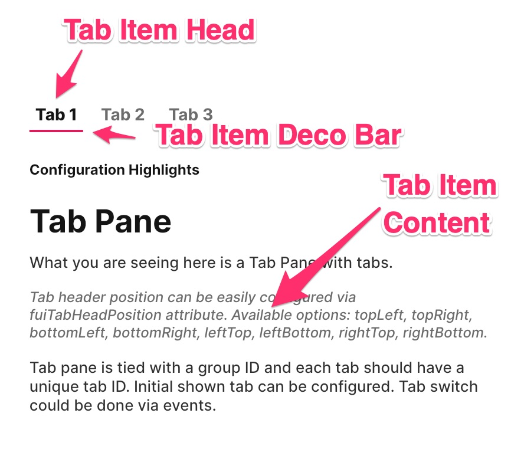

# Tabs - FUITabPane & FUITabItem

<figure><figcaption></figcaption></figure>

To implement tabs functionality, `FUITabPane` is a specialized FUI container widget designed to manage tabs and their\
corresponding items.

The `FUITabPane` can be utilized within a `FUIPane`, `FUIPanel`, or independently.

### Widget Class Location

The `FUITabPane` and other related widget classes could be found in the directory of:

```
lib/focus_ui_kit/components/tab/
```

#### Class Details

| Class Name                                                                      | Dart File             | Description                                                                    |
| ------------------------------------------------------------------------------- | --------------------- | ------------------------------------------------------------------------------ |
| `FUITabPane`                                                                    | fui\_tab\_pane.dart   | The major widget class of the tab pane.                                        |
| `FUITabItem`                                                                    | fui\_tab\_item.dart   | The widget class for the tab item.                                             |
| `FUITabPaneController`                                                          | fui\_tab\_events.dart | The controller for the `FUITabPane` (using Flutter Bloc).                      |
| `FUITabPaneEvent`                                                               | fui\_tab\_events.dart | The controller event class, used by `FUITabPaneController`.                    |
| `FUITabHeadTextIconPosition`, `FUITabHeadPosition` & `FUITabHeadLabelAlignment` | fui\_tab\_params.dart | These are the enums for certain settings of the `FUITabePane` or `FUITabItem`. |

### Widget Theme Location

The `FUITabTheme` class is the theme class holds the default theme variables/values.

#### Accessing the theme

To access the theme class object, it can be done through:

```
@override
Widget build(BuildContext context) {
    FUITabTheme fuiTabTheme = context.theme.fuiTab;
    
    // ...
}
```
