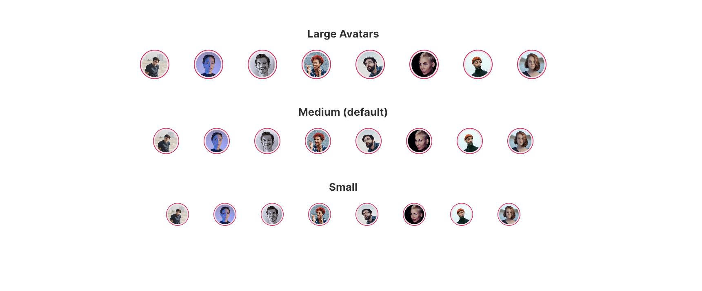

# FUIAvatar

<figure><figcaption></figcaption></figure>

The `FUIAvatar` is a straightforward widget designed to facilitate the display of rounded avatar images.

### Widget Class Location

The `FUIAvatar` widget class could be found in:

```dart
lib/focus_ui_kit/components/avatar/fui_avatar.dart
```

The `FUIAvatarTheme` class is the theme class holds the default theme variables/values.

#### Accessing the theme

To access the theme class object, do the following:

```dart
@override
Widget build(BuildContext context) {
    FUIAvatarTheme avatarTheme = context.theme.fuiAvatar;
    
    // ...
}
```

### Usage

To display a simple avatar:

```dart
/// From asset path
FUIAvatar(
    // Relative to <project-root>/assets/ (for web)
    avatar: AssetImage('avatar-folder/avatar.jpg'),
);

// By URL
FUIAvatar(
    avatar: NetworkImage('https://somedomain/avatar.jpg'),
);
```

#### Changing the color scheme

The border of the avatar is determined by the FUI color scheme. This parameter can be modified via the `fuiColorScheme` parameter.

```dart
FUIAvatar(
  fuiColorScheme: FUIColorScheme.cobalt,
  avatar: AssetImage('avatar-folder/avatar.jpg'),
);
```

#### Changing the size of the avatar

The size of the avatar can be adjusted using the `fuiAvatarSize` parameter. This parameter accepts pre-configured values from the `FUIAvatarSize` enum:

```dart
/// Large
FUIAvatar(
  fuiAvatarSize: FUIAvatarSize.large,
  avatar: AssetImage('avatar-folder/avatar.jpg'),
);

/// Medium (default)
FUIAvatar(
  fuiAvatarSize: FUIAvatarSize.medium,
  avatar: AssetImage('avatar-folder/avatar.jpg'),
);

/// Small (default)
FUIAvatar(
  fuiAvatarSize: FUIAvatarSize.small,
  avatar: AssetImage('avatar-folder/avatar.jpg'),
);
```

#### Other customization

The border color, padding color, and even the border radius can be overridden, as demonstrated below:

```dart
FUIAvatar(
  radius: 30,
  borderColor: Colors.teal,
  paddingColor: Colors.yellowAccent,
  avatar: AssetImage('avatar-folder/avatar.jpg'),
);
```
