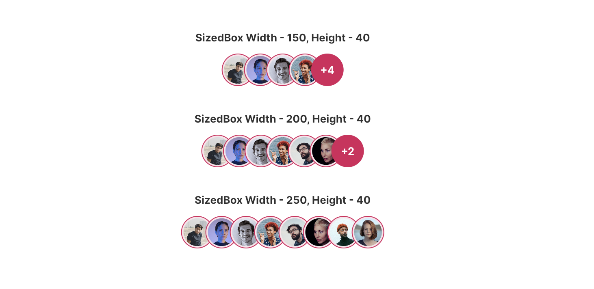

# FUIAvatarStack

<figure><figcaption></figcaption></figure>

The `FUIAvatarStack` serves as a widget that facilitates the arrangement of avatars in a horizontal stacking manner.

> The `FUIAvatarStack` leverages the `avatar_stack` package from [https://pub.dev/packages/avatar\_stack](https://pub.dev/packages/avatar_stack). Please refer to this for more info.

### Widget Class Location

The `FUIAvatarStack` widget class could be found in:

```dart
lib/focus_ui_kit/components/avatar/fui_avatar_stack.dart
```

The `FUIAvatarTheme` class is the theme class holds the default theme variables/values.

#### Accessing the theme

To access the theme class object, do the following:

```dart
@override
Widget build(BuildContext context) {
    FUIAvatarTheme avatarTheme = context.theme.fuiAvatar;
    
    // ...
}
```

### Usage

Here is a simple example of the usage of the `FUIAvatarStack`. Ensure that the `height` is defined as a finite value:

```dart
FUIAvatarStack(
  height: 40,
  avatars: [
    FUIAvatar(
      avatar: AssetImage('folder/avatar01.jpg'),
    ),
    FUIAvatar(
      avatar: AssetImage('folder/avatar02.jpg'),
    ),
    ...
  ],
);
```

#### To confine the FUIAvatarStack to certain width and position:

By default, the `FUIAvatarStack` occupies the entire available width of the parent container and aligns the avatars from left to right. These can be customized.

```dart
FUIAvatarStack(
  width: 200,
  height: 40,
  settings: RestrictedPositions(
    align: StackAlign.right,  // Align to right (instead of left).
    minCoverage: FUIAvatarTheme.minCoverage,
    maxCoverage: FUIAvatarTheme.maxCoverage,
  ),
  avatars: [
    FUIAvatar(
      avatar: AssetImage('folder/avatar01.jpg'),
    ),
    FUIAvatar(
      avatar: AssetImage('folder/avatar02.jpg'),
    ),
    ...
  ],
);
```

For further information regarding the `settings` parameter, please refer to the documentation available at:[https://pub.dev/packages/avatar\_stack](https://pub.dev/packages/avatar_stack).
