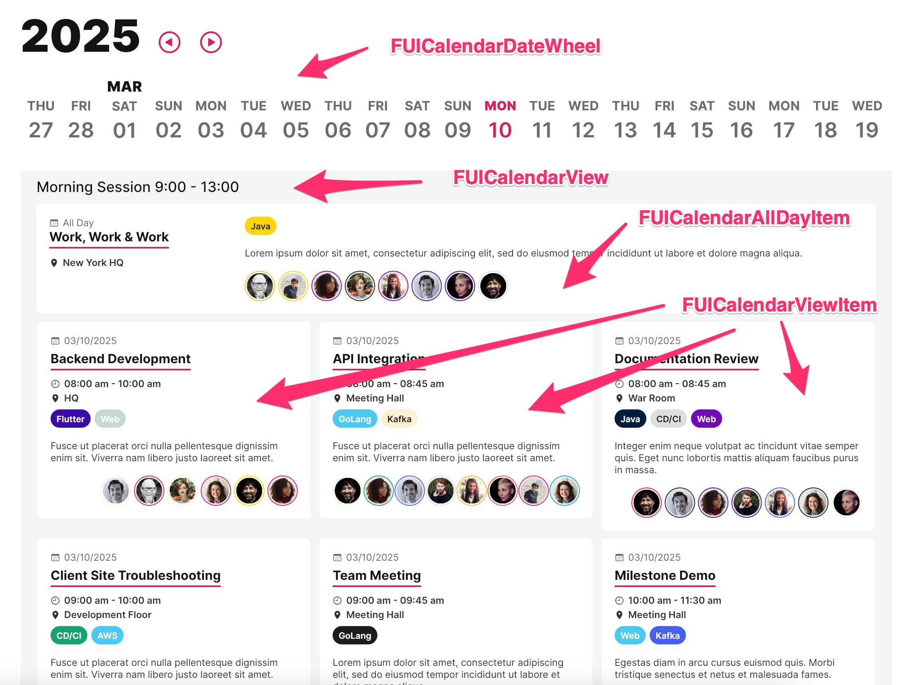
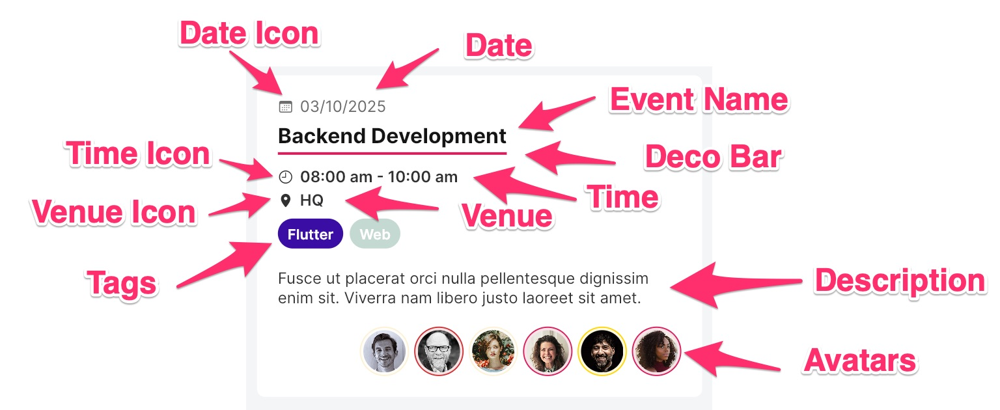

# Calendar View and Items

<figure><figcaption></figcaption></figure>

The `FUICalendarView` widget serves as a pane or container for calendar items. These items can be either

* `FUICalendarItem`, which represents an event with a specific date, time, and other details, typically representing an\
  event that occupied a portion of the calendar;
* or `FUICalendarAllDayItem`, which represents an event that occupied the entire day.

> Note: It is not necessary to utilize both the Calendar View and the Items widget in conjunction with the Date Wheel. These widgets are not mutually exclusive and can be employed independently.

### Widget Class Location

The `FUICalendarView`, `FUICalendarItem` and `FUICalendarAllDayItem` widget classes could be found in:

```
lib/focus_ui_kit/components/calendar/
```

### Widget Theme Location

The `FUICalendarTheme` class is the theme class holds the default theme variables/values.

#### Accessing the theme

To access the theme class object, do the following:

```dart
@override
Widget build(BuildContext context) {
    FUICalendarTheme calendarTheme = context.theme.fuiCalendar;
    
    // ...
}
```

### FUICalendarItem - Anatomy

The `FUICalendarItem` is a straightforward widget designed to display pertinent event details (not all information is necessary).

<figure><figcaption></figcaption></figure>

### FUICalendarItem - Usage

Here's an example in building a `FUICalendarItem`:

```dart
FUICalendarItem(
  dateIcon: Icon(CupertinoIcons.calendar),
  date: Text('18 Mar 2025'),
  eventName: Text('Some Event Name'),
  timeIcon: Icon(CupertinoIcons.clock),
  time: Text('02:00 pm - 02:30 pm'),
  venueIcon: Icon(CupertinoIcons.location_solid),
  venue: Text('Some Location'),
  tags: [
    FUITextPill(
      fuiColorScheme: FUIColorScheme.banana,
      text: Text('Some Tag'),
    ),
  ],
  description: Text('Some description of the event'),
  avatars: FUICalendarItemAvatarStack(
    avatars: [
      FUITooltip(
        tooltip: Text('Person 1'),
        child: FUIAvatar(
          fuiColorScheme: FUIColorScheme.berry,
          avatar: AssetImage('demo-avatar/avatar-man-02.jpg'),
        ),
      ),
      FUITooltip(
        tooltip: Text('Person 2'),
        child: FUIAvatar(
          fuiColorScheme: FUIColorScheme.error,
          avatar: AssetImage('demo-avatar/avatar-woman-03.jpg'),
        ),
      ),
    ],
  ),
  sidePopupMenuIconButton: FUIPopupMenuIconButton(
    fuiPopupMenuItemList: [
      FUIPopupMenuItem(
        icon: Icon(CupertinoIcons.pencil),
        label: Text('Update'),
        onTap: () {
          // Do something...
        },
      ),
      FUIPopupMenuItem(
        icon: Icon(CupertinoIcons.trash),
        label: Text('Delete'),
        onTap: () {
          // Do something...
        },
      ),
    ],
  ),
);
```

### FUICalendarAllDayItem - Usage

The `FUICalendarAllDayItem` is analogous to the `FUICalendarItem`, with the notable distinction that it lacks the `time` and `timeIcon` parameters.

### FUICalendarView - Usage

Once the `FUICalendarItem` and/or the `FUICalendarAllDayItem` are defined, assign them to the `FUICalendarView` as follows:

```dart
FUICalendarView(
  title: Text('Morning Session 8:30 AM - 1:00 PM'),
  allDayItems: [
    FUICalendarAllDayItem(...),
  ],
  items: [
    FUICalendarItem(...),
    FUICalendarItem(...),
    FUICalendarItem(...),
    FUICalendarItem(...),
  ],
  noItemsMessage: Text('No calendar events'),
);
```

### FUICalendarView Parameters

| Parameters                                | Description                                                                          |
| ----------------------------------------- | ------------------------------------------------------------------------------------ |
| Widget? title                             | The title of the calendar view. It can be of a Text widget or other display widgets. |
| List\<FUICalendarAllDayItem>? allDayItems | The list of all day event items.                                                     |
| List\<FUICalendarItem>? items             | The list of event items with a specific time range.                                  |
| Widget? noItemsMessage                    | The message when no item is detected.                                                |

### FUICalendarItem Parameters

| Parameters                                      | Description                                                                                          |
| ----------------------------------------------- | ---------------------------------------------------------------------------------------------------- |
| Widget? dateIcon                                | The date icon (if any).                                                                              |
| Widget date                                     | The date display widget (or other widget).                                                           |
| Widget? eventNameIcon                           | The event icon (if any).                                                                             |
| Widget eventName                                | The event name.                                                                                      |
| bool eventNameDecoBarShow                       | Toggle event name deco bar.                                                                          |
| Color? eventNameDecoBarColor                    | Color of event name deco bar.                                                                        |
| double? eventNameDecoBarThickness               | Event name deco bar thickness.                                                                       |
| Widget? timeIcon                                | The time icon (if any).                                                                              |
| Widget time                                     | The time display widget (or other widget).                                                           |
| Widget? venueIcon                               | The venue/location icon (if any).                                                                    |
| Widget? venue                                   | The venue display widget (or other widget).                                                          |
| List\<Widget>? tags                             | The tag widget list (usually `FUITextPill`).                                                         |
| double? tagsSpacing                             | The tag spacing.                                                                                     |
| Widget? description                             | The event description.                                                                               |
| Widget? avatars                                 | The avatar section - use a convenient widget `FUICalendarItemAvatarStack` (or other desired widget). |
| FUIPopupMenuIconButton? sidePopupMenuIconButton | Side menu popup button to list options for the event.                                                |
| bool sidePopupMenuIconButtonShowOnHover         | Toggle hovering capability of side menu button.                                                      |
| EdgeInsets? padding                             | Content padding.                                                                                     |
| double? width                                   | Specific a custom width.                                                                             |
| double? height                                  | Specific a custom height.                                                                            |
| BoxDecoration? borderDecoration                 | Specific the custom decoration of the event item container.                                          |

### FUICalendarAllDayItem Parameters

| Parameters                                      | Description                                                                                          |
| ----------------------------------------------- | ---------------------------------------------------------------------------------------------------- |
| Widget? dateIcon                                | The date icon (if any).                                                                              |
| Widget date                                     | The date display widget (or other widget).                                                           |
| Widget? eventNameIcon                           | The event icon (if any).                                                                             |
| Widget eventName                                | The event name.                                                                                      |
| bool eventNameDecoBarShow                       | Toggle event name deco bar.                                                                          |
| Color? eventNameDecoBarColor                    | Color of event name deco bar.                                                                        |
| double? eventNameDecoBarThickness               | Event name deco bar thickness.                                                                       |
| Widget? venueIcon                               | The venue/location icon (if any).                                                                    |
| Widget? venue                                   | The venue display widget (or other widget).                                                          |
| List\<Widget>? tags                             | The tag widget list (usually `FUITextPill`).                                                         |
| double? tagsSpacing                             | The tag spacing.                                                                                     |
| Widget? description                             | The event description.                                                                               |
| Widget? avatars                                 | The avatar section - use a convenient widget `FUICalendarItemAvatarStack` (or other desired widget). |
| FUIPopupMenuIconButton? sidePopupMenuIconButton | Side menu popup button to list options for the event.                                                |
| bool sidePopupMenuIconButtonShowOnHover         | Toggle hovering capability of side menu button.                                                      |
| EdgeInsets? padding                             | Content padding.                                                                                     |
| double? width                                   | Specific a custom width.                                                                             |
| double? height                                  | Specific a custom height.                                                                            |
| BoxDecoration? borderDecoration                 | Specific the custom decoration of the event item container.                                          |
