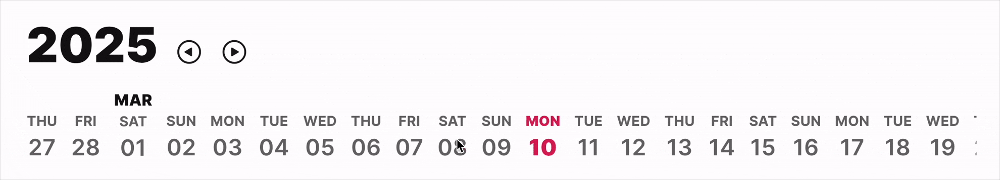

# Date Wheel - FUICalendarDateWheel

<figure><figcaption></figcaption></figure>

The `FUICalendarDateWheel` is a widget that enables users to select a desired date. It features a pagable year and scrollable/selectable dates.

> The `FUICalendarDateWheel` leverages the `scrollable_positioned_list` package\
> from [https://pub.dev/packages/scrollable\_positioned\_list](https://pub.dev/packages/scrollable_positioned_list).
>
> Please refer to this for more info.

### Widget Class Location

The `FUICalendarDateWheel` widget class could be found in:

```dart
lib/focus_ui_kit/components/calendar/fui_calendar_date_wheel.dart
```

The `FUICalendarTheme` class is the theme class holds the default theme variables/values.

#### Accessing the theme

To access the theme class object, do the following:

```dart
@override
Widget build(BuildContext context) {
    FUICalendarTheme calendarTheme = context.theme.fuiCalendar;
    
    // ...
}
```

### Usage

Here is a typical usage example:

```dart
FUICalendarDateWheel(
  onDateChanged: (changedDate) {
    // Do something...
  },
);
```

#### To set the initial date

```dart
FUICalendarDateWheel(
  initialSelectedDate: DateTime(2011, DateTime.october, 10),
);
```

#### Using the controllers

The `FUICalendarDateWheel` utilizes several controllers, including:

* The year pager (`FUICalendarDateWheelYearController`) - responsible for programmatically selecting the year
* The date controller (`FUICalendarDateWheelDateController`) - responsible for programmatically assigning the date

**To select or navigate the year**

> Suggest implementing this functionality within a Stateful widget.

```dart
// Set the initial selected year
FUICalendarDateWheelYearController yearPagerCtrl = FUICalendarDateWheelYearController(selectedYear: 2025);

// Assign the controller
FUICalendarDateWheel(
  yearPager: yearPagerCtrl,
);

// Navigate Previous
yearPagerCtrl.prevYear();

// Navigate Next
yearPagerCtrl.nextYear();

// Select a different year
yearPagerCtrl.gotoYear(2023);
```

**To select a specific date**

```dart
FUICalendarDateWheelDateController dateCtrl = FUICalendarDateWheelDateController(
  selectedDate: DateTime(2011, DateTime.october, 10),
);

// Assign the controller
FUICalendarDateWheel(
  dateController: dateCtrl,
);

// Select a specific date
dateCtrl.selectDate(DateTime.now());
```

### Parameters

| Parameters                                         | Description                                           |
| -------------------------------------------------- | ----------------------------------------------------- |
| FUIColorScheme fuiColorScheme                      | The color scheme for the `FUICalendarDateWheel`.      |
| DateTime? initialSelectedDate                      | Assign the initial selected date.                     |
| FUICalendarDateWheelYearController? yearPager      | Assign the year pager controller.                     |
| FUICalendarDateWheelDateController? dateController | Assign the date controller.                           |
| ValueChanged\<DateTime>? onDateChanged             | Callback function when the selected date has changed. |
| Icon? prevYearBtnIcon                              | The icon for the previous year pager button.          |
| Icon? nextYearBtnIcon                              | The icon for the next year pager button.              |
| TextStyle? yearTextStyle                           | The text style for the year display.                  |
| TextStyle? monthTextStyle                          | The text style for the month display.                 |
| TextStyle? monthSelectedTextStyle                  | The text style for the selected month display.        |
| TextStyle? dayTextStyle                            | The text style for the day display.                   |
| TextStyle? daySelectedTextStyle                    | The text style for the selected day display.          |
| TextStyle? dateTextStyle                           | The text style for the date display.                  |
| TextStyle? dateSelectedTextStyle                   | The text style for the selected date display.         |

### Other Parameters

For other parameters, please refer to the documentation found\
in [https://pub.dev/packages/scrollable\_positioned\_list](https://pub.dev/packages/scrollable_positioned_list).
