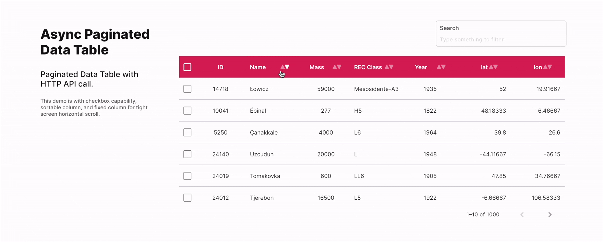

# FUIAsyncPaginatedDataTable2 - Network/Dynamic/API Data (With Pagination)

<figure><figcaption></figcaption></figure>

The `FUIAsyncPaginatedDataTable2` is the most suitable data table if data is fetched via HTTP/API.

> **Note:** The concept of `FUIAsyncPaginatedDataTable2` and its data source are similar to `FUIPaginatedDataTable2`, with the exception that instead of utilizing a subclass of `DataTableSource` as the data source, it employs`AsyncDataTableSource`.

> Recommend to have a comprehensive understanding of `FUIPaginatedDataTable2` before delving into`FUIAsyncPaginatedDataTable2`.

### Widget Class Location

The `FUIAsyncPaginatedDataTable2` widget class could be found in:

```dart
lib/focus_ui_kit/components/datatable2/fui_datatable2.dart
```

The `FUIDataTable2Theme` class is the theme class holds the default theme variables/values.

#### Accessing the theme

To access the theme class object, do the following:

```dart
@override
Widget build(BuildContext context) {
    FUIDataTable2Theme dtTheme =  context.theme.fuiDataTable2;
    
    // ...
}
```

> **Important Note:** The `FUIAsyncPaginatedDataTable2` will have a default height of `400` (it is not advisable to have the height unrestrained).

### Example

A comprehensive demonstration of the `FUIAsyncPaginatedDataTable2`, utilizing a network/API data source (specifically\
meteoroid landings), is available in the `demo` folder. Kindly review these files for further insights:

* `lib/demo/others/datatable/demo_datatable_data.dart`
* `lib/demo/others/datatable/demo_datatable_async_paginated_table.dart`

### Other Parameters

Many of the parameters in `FUIAsyncPaginatedDataTable2` corresponds to the `data_table_2` package from [https://pub.dev/packages/data\_table\_2](https://pub.dev/packages/data_table_2). Please refer to this for more info.
