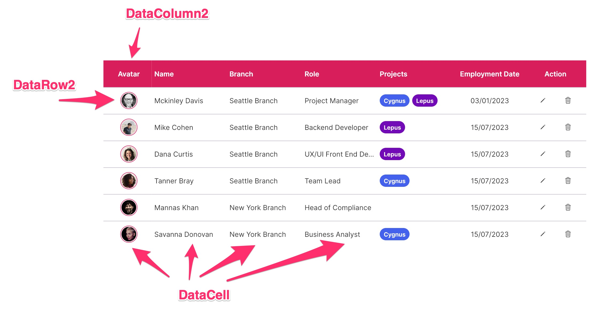

# FUIDataTable2 :: Static Data (Without Pagination)

If you require a table with static data and do not necessitate pagination functionality, the `FUIDataTable2` is the appropriate widget.

> The `FUIDataTable2` leverages the `data_table_2` package\
> from [https://pub.dev/packages/data\_table\_2](https://pub.dev/packages/data_table_2). Please refer to\
> this for more info.

### Anatomy

<figure><figcaption></figcaption></figure>

Many of the details are documented in the [data\_table\_2](https://pub.dev/packages/data_table_2) documentation. For the\
sake of simplicity, a basic `FUIDataTable2` would anticipate the following:

* `DataColumn2`: The widget class responsible for defining the table header column.
* `DataRow2`: The widget class responsible for defining the table content row.
* `DataCell`: The widget class responsible for defining the content cell for each `DataRow2`.

> Note: For ease of development, kindly utilize the `FUIDataTableColumnHelper` and the`FUIDataTableCellHelper`, which facilitate the generation of both the column and the cell.

### Widget Class Location

The `FUIDataTable2` widget class could be found in:

```dart
lib/focus_ui_kit/components/datatable2/fui_datatable2.dart
```

The `FUIDataTable2Theme` class is the theme class holds the default theme variables/values.

#### Accessing the theme

To access the theme class object, do the following:

```dart
@override
Widget build(BuildContext context) {
    FUIDataTable2Theme dtTheme =  context.theme.fuiDataTable2;
    
    // ...
}
```

> Important Note: The `FUIDataTable2` will have a default height of `400` (it is not advisable to have the height unrestrained).

### Usage

Here’s a simple guide on how to define a `FUIDataTable2` with static data using the `FUIDataTableColumnHelper` and`FUIDataTableCellHelper` classes.

```dart
// Define the color scheme (optional)
FUIColorScheme fuiColorScheme = FUIColorScheme.primary;
FUIDataTableColumnHelper dtColumnHelper = FUIDataTableColumnHelper(context, fuiColorScheme: fuiColorScheme);
FUIDataTableCellHelper dtCellHelper = FUIDataTableCellHelper(context);

FUIDataTable2(
  fuiColorScheme: fuiColorScheme,
  columns: [
    DataColumn2(
      label: dtColumnHelper.genLabel(text: 'Column 1 (Center Aligned)', alignment: FUIDataTable2Alignment.center),
    ),
    DataColumn2(
      fixedWidth: 400,
      label: dtColumnHelper.genLabel(text: 'Column 2 (Left Aligned Fixed Width)'),
    ),
    DataColumn2(
      label: dtColumnHelper.genLabel(text: 'Column 3 (Right Aligned)', alignment: FUIDataTable2Alignment.right),
    ),
  ],
  rows: [
    DataRow2(
      cells: [
        DataCell(dtCellHelper.genData(text: '01/01/2023', alignment: FUIDataTable2Alignment.center)),
        DataCell(dtCellHelper.genData(text: 'Some Text...')),
        DataCell(dtCellHelper.genData(text: 'Some Text...', alignment: FUIDataTable2Alignment.right)),
      ],
    ),
    DataRow2(
      cells: [
        DataCell(dtCellHelper.genData(text: '01/01/2024', alignment: FUIDataTable2Alignment.center)),
        DataCell(dtCellHelper.genData(text: 'Some Text...')),
        DataCell(dtCellHelper.genData(text: 'Some Text...', alignment: FUIDataTable2Alignment.right)),
      ],
    ),
    DataRow2(
      cells: [
        DataCell(dtCellHelper.genData(text: '01/01/2025', alignment: FUIDataTable2Alignment.center)),
        DataCell(dtCellHelper.genData(text: 'Some Text...')),
        DataCell(dtCellHelper.genData(text: 'Some Text...', alignment: FUIDataTable2Alignment.right)),
      ],
    ),
  ],
);
```

#### Adjusting the height and width

> IMPORTANT: not advisable to have height unrestrained.

```dart
FUIDataTable2(
    height: 600,
    width: 600,
    ...
);
```

#### Displaying the vertical/horizontal scroll bar

In the data display section, the vertical or horizontal bar display can be toggled.

```dart
FUIDataTable2(
    isHorizontalScrollBarVisible: true,
    isVerticalScrollBarVisible: true,
    ...
);
```

#### Empty row message

To configure a distinct message to be displayed when no rows (an empty `DataRow2` list) are detected.

```dart
FUIDataTable2(
    emptyMsg: 'No data available for now.',
    ...
);
```

or have a custom widget for the message:

```dart
FUIDataTable2(
    empty: Align(
    alignment: Alignment.center,
        child: Icon(
          CupertinoIcons.exclamationmark_triangle,
          size: 40,
        ),
    ),
    ...
);
```

### Other Parameters

Many of the `FUIDataTable2` parameters correspond to the ones in `data_table_2`.

Please explore [https://pub.dev/packages/data\_table\_2](https://pub.dev/packages/data_table_2) for more info.
