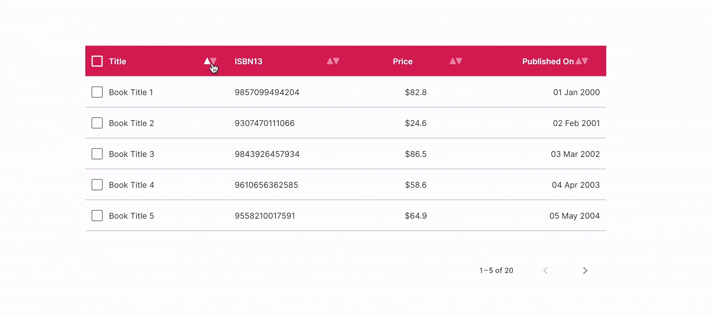

# FUIPaginatedDataTable2 - Short Tutorial :: Static Data (With Pagination)

<figure><figcaption></figcaption></figure>

If you require a table with static data and pagination functionality, please consider utilizing the`FUIPaginatedDataTable2` widget.

> The `FUIPaginatedDataTable2` leverages the `data_table_2` package\
> from [https://pub.dev/packages/data\_table\_2](https://pub.dev/packages/data_table_2). Please refer to this for more info.

### Widget Class Location

The `FUIPaginatedDataTable2` widget class could be found in:

```dart
lib/focus_ui_kit/components/datatable2/fui_datatable2.dart
```

The `FUIDataTable2Theme` class is the theme class holds the default theme variables/values.

#### Accessing the theme

To access the theme class object, do the following:

```dart
@override
Widget build(BuildContext context) {
    FUIDataTable2Theme dtTheme =  context.theme.fuiDataTable2;
    
    // ...
}
```

> **Important Note:** The `FUIPaginatedDataTable2` will have a default height of `400` (it is not advisable to have the\
> height unrestrained).

### Usage (short tutorial)

The fundamental usage of the `FUIPaginatedDataTable2` is analogous to that of the `FUIDataTable2`. For further details, please refer to the preceding section on FUIDataTable2 :: Static Data (Without Pagination).

This concise tutorial demonstrates the construction of a book data table, incorporating static data and functionalities for sorting and pagination. This functionality closely resembles the one depicted in the introductory GIF.

#### Paginated Data Source

When utilizing the `FUIPaginatedDataTable2` component, a data source must be defined. Typically, this involves creating a class that extends Flutter’s `DataTableSource`.

This concise tutorial provides a step-by-step guide to creating a table for books for sale.

**Step 1 - Create a model class**

Let us define a class named `BookModel` to represent the model structure of a book.

```dart
class BookModel {
  final String title;
  final String isbn13;
  final double price;
  final DateTime publishedDate;
  bool selected;

  BookModel({
    required this.title,
    required this.isbn13,
    required this.price,
    required this.publishedDate,
    this.selected = false,
  });
}
```

The `selected` field serves to indicate whether a row is currently selected.

#### Step 2 - Create the Event Object and Sort Controller (Bloc involved)

For sorting purposes, it is essential to provide a mechanism for the containing widget to receive notifications when a sort event occurs. In this section, we will utilize Bloc for state management. However, you are welcome to implement your preferred state management mechanism.

```dart
/// The sort event
class BookDataTableSortEvent {
  final int sortColumnIndex;    // 1st column is 0
  final bool sortAscending;     // true - asc, false - desc

  BookDataTableSortEvent(this.sortColumnIndex, this.sortAscending);
}

/// The sort controller
class BookDataTableSortController extends Cubit<BookDataTableSortEvent> {
  BookDataTableSortEvent event;

  BookDataTableSortController({
    required this.event,
  }) : super(event);

  trigger(BookDataTableSortEvent event) {
    this.event = event;
    emit(this.event);
  }
}
```

#### Step 3 - Build the data list (DemoBooksWidget)

Let’s create a static data list of `BookModel`. We’ll initialize the `BookDataTableSortController`. All these elements will be contained within a Stateful widget named `DemoBooksWidget`.

```dart
class DemoBooksWidget extends StatefulWidget {
  const DemoBooksWidget({super.key});

  @override
  State<DemoBooksWidget> createState() => _DemoBooksWidgetState();
}

class _DemoBooksWidgetState extends State<DemoBooksWidget> {
  late BookDataTableSortController sortCtrl;

  List<BookModel> dataList = [
    BookModel(title: 'Book Title 1', isbn13: '9857099494204', price: 82.8, publishedDate: DateTime.parse('2000-01-01T00:00:00')),
    BookModel(title: 'Book Title 2', isbn13: '9307470111066', price: 24.6, publishedDate: DateTime.parse('2001-02-02T00:00:00')),
    BookModel(title: 'Book Title 3', isbn13: '9843926457934', price: 86.5, publishedDate: DateTime.parse('2002-03-03T00:00:00')),
    BookModel(title: 'Book Title 4', isbn13: '9610656362585', price: 58.6, publishedDate: DateTime.parse('2003-04-04T00:00:00')),
    BookModel(title: 'Book Title 5', isbn13: '9558210017591', price: 64.9, publishedDate: DateTime.parse('2004-05-05T00:00:00')),
    BookModel(title: 'Book Title 6', isbn13: '9969446885567', price: 57.1, publishedDate: DateTime.parse('2005-06-06T00:00:00')),
    BookModel(title: 'Book Title 7', isbn13: '9861109689385', price: 66.8, publishedDate: DateTime.parse('2006-07-07T00:00:00')),
    BookModel(title: 'Book Title 8', isbn13: '9943342569524', price: 109.2, publishedDate: DateTime.parse('2007-08-08T00:00:00')),
    BookModel(title: 'Book Title 9', isbn13: '9026229815455', price: 192.5, publishedDate: DateTime.parse('2008-09-09T00:00:00')),
    BookModel(title: 'Book Title 10', isbn13: '9970127570369', price: 14.6, publishedDate: DateTime.parse('2009-10-10T00:00:00')),
    BookModel(title: 'Book Title 11', isbn13: '9084839798883', price: 26.3, publishedDate: DateTime.parse('2010-11-11T00:00:00')),
    BookModel(title: 'Book Title 12', isbn13: '9988729711130', price: 20.3, publishedDate: DateTime.parse('2011-12-12T00:00:00')),
    BookModel(title: 'Book Title 13', isbn13: '9406233784001', price: 132.2, publishedDate: DateTime.parse('2013-01-13T00:00:00')),
    BookModel(title: 'Book Title 14', isbn13: '9801659424226', price: 45.8, publishedDate: DateTime.parse('2014-02-14T00:00:00')),
    BookModel(title: 'Book Title 15', isbn13: '9677099332732', price: 154.0, publishedDate: DateTime.parse('2015-03-15T00:00:00')),
    BookModel(title: 'Book Title 16', isbn13: '9156872575347', price: 38.8, publishedDate: DateTime.parse('2016-04-16T00:00:00')),
    BookModel(title: 'Book Title 17', isbn13: '9644961613816', price: 98.8, publishedDate: DateTime.parse('2017-05-17T00:00:00')),
    BookModel(title: 'Book Title 18', isbn13: '9616134016166', price: 73.7, publishedDate: DateTime.parse('2018-06-18T00:00:00')),
    BookModel(title: 'Book Title 19', isbn13: '9506645409865', price: 42.3, publishedDate: DateTime.parse('2019-07-19T00:00:00')),
    BookModel(title: 'Book Title 20', isbn13: '9205461342985', price: 79.5, publishedDate: DateTime.parse('2020-08-20T00:00:00')),
  ];

  @override
  void initState() {
    super.initState();

    sortCtrl = BookDataTableSortController(event: BookDataTableSortEvent(0, true));
  }

  @override
  void dispose() {
    sortCtrl.close();

    super.dispose();
  }

  @override
  Widget build(BuildContext context) {
    return const Placeholder(); // Will be implemented later.
  }
}
```

#### Step 4 - Define the DataTableSource class (BookPaginatedDataTableSource)

Let us now define the data source class. The data source class must extend Flutter's `DataTableSource`. Let us name it`BookPaginatedDataTableSource`.

> It is highly recommended to gain a comprehensive understanding of the Flutter's DataTableSource class, which can be found at [https://api.flutter.dev/flutter/material/DataTableSource-class.html](https://api.flutter.dev/flutter/material/DataTableSource-class.html).

```dart
class BookPaginatedDataTableSource extends DataTableSource {
  List<BookModel> dataList; // Pass in the data list
  BuildContext context;     // Refers to the context in the build method of the widget 
  late FUIDataTableCellHelper dtCellHelper; // For convenience of cell generation 
  int _selectedCount = 0;   // the selected row count

  BookPaginatedDataTableSource(this.context, this.dataList) {
    dtCellHelper = FUIDataTableCellHelper(context); // Initialize the dtCellHelper
  }
}
```

#### Step 5 - Implement `getRow` method

Let’s override the `getRow` method in `BookPaginatedDataTableSource`. This method returns the structure of a table row.

```dart
class BookPaginatedDataTableSource extends DataTableSource {

  // ...
    
  @override
  DataRow? getRow(int index) {
    BookModel model = dataList[index];  // Get the model object
    FUIDataTable2Theme dt2Theme = context.theme.fuiDataTable2;  // Access the theme for certain pre-defined row colors
    FUIThemeCommonColors fuiColors = context.theme.fuiColors;

    return DataRow2.byIndex(
      index: index,
      selected: model.selected,
      color: WidgetStateProperty.all(model.selected ? dt2Theme.rowSelectedColor : fuiColors.bg0),   // Switch color
      onSelectChanged: (checked) {
        
        // ***
        // If the row is checked, update the model's selected field and the _selectedCount variable.
        // ***
        
        if (checked != null && model.selected != checked) {
          _selectedCount += checked ? 1 : -1;
          assert(_selectedCount >= 0);

          model.selected = checked;
          
          // Calling notifyListeners is necessary. Please refer to the Flutter's DataTableSource documentation. 
          notifyListeners();
        }
      },
      /// How the row data should be displayed in the table cell.
      cells: [
        DataCell(dtCellHelper.genData(text: model.title)),
        DataCell(dtCellHelper.genData(text: model.isbn13)),
        DataCell(dtCellHelper.genData(text: '\$${model.price}', alignment: FUIDataTable2Alignment.center)),
        DataCell(dtCellHelper.genData(text: DateFormat('dd MMM yyyy').format(model.publishedDate), alignment: FUIDataTable2Alignment.right)),
      ],
    );
  }
    
  // ...
}
```

#### Step 6 - Implement a `selectAll` method (BookPaginatedDataTableSource)

Let’s implement the `selectAll` method. This is the method that is called when the "Check All" box is toggled. This method will be utilized in the`FUIPaginatedDataTable2` later.

```dart
void selectAll(bool? checked) {
    if (checked != null) {
      for (final model in dataList) {
        model.selected = checked;
      }
    
      _selectedCount = (checked) ? dataList.length : 0;
    }

    notifyListeners();
}
```

#### Step 7 - Implement the `sort` method for sorting comparison (BookPaginatedDataTableSource)

When the sort event is triggered for a specific column, this method comes to play.

```dart
void sort<T>(Comparable<T> Function(BookModel model) getField, bool ascending) {
    dataList.sort((a, b) {
      final aValue = getField(a);
      final bValue = getField(b);
      return ascending ? Comparable.compare(aValue, bValue) : Comparable.compare(bValue, aValue);
    });
    
    notifyListeners();
}
```

#### Step 8 - Implement the rest of the methods (BookPaginatedDataTableSource)

In addition to the methods already mentioned, the `DataTableSource` class contains several other important methods that must be implemented.

```dart
/// More like the total row count
@override
int get rowCount => dataList.length;

/// The selected row count
@override
int get selectedRowCount => _selectedCount;

/// Just set this to false (no approximate)
@override
bool get isRowCountApproximate => false;
```

#### Step 9 - Implement the `build` method

Combining all the above, let's proceed with implementing the build method.

```dart
@override
Widget build(BuildContext context) {
FUIDataTableColumnHelper dtColumnHelper = FUIDataTableColumnHelper(context);
BookPaginatedDataTableSource dataSource = BookPaginatedDataTableSource(context, dataList);

return FUISectionPlain(
  horizontalSpace: FUISectionHorizontalSpace.tight,
  child: FUISectionContainer(
    child: BlocBuilder(
      bloc: sortCtrl,
      builder: (BuildContext context, BookDataTableSortEvent event) {
        
        // For every time when a sort even triggers, the sortColumnIndex and the sortAscending has to be re-evaluated.
        int sortColumnIndex = event.sortColumnIndex;
        bool sortAscending = event.sortAscending;

        return FUIPaginatedDataTable2(
          sortColumnIndex: sortColumnIndex,
          sortAscending: sortAscending,
          source: dataSource,   // Assign the static data source
          showCheckboxColumn: true, // Show the checkbox for the rows.
          rowsPerPage: 5,   // Set the rows per page limit to 5
          columns: [    // Column definitions
            DataColumn2(
              label: dtColumnHelper.genLabel(text: 'Title'),
              onSort: (idx, asc) {
                dataSource.sort<String>((model) => model.title, asc);
                sortCtrl.trigger(BookDataTableSortEvent(0, asc));
              },
            ),
            DataColumn2(
              label: dtColumnHelper.genLabel(text: 'ISBN13'),
              onSort: (idx, asc) {
                dataSource.sort<String>((model) => model.title, asc);
                sortCtrl.trigger(BookDataTableSortEvent(1, asc));
              },
            ),
            DataColumn2(
              label: dtColumnHelper.genLabel(text: 'Price', alignment: FUIDataTable2Alignment.center),
              onSort: (idx, asc) {
                dataSource.sort<num>((model) => model.price, asc);
                sortCtrl.trigger(BookDataTableSortEvent(2, asc));
              },
            ),
            DataColumn2(
              label: dtColumnHelper.genLabel(text: 'Published On', alignment: FUIDataTable2Alignment.right),
              onSort: (idx, asc) {
                dataSource.sort<DateTime>((model) => model.publishedDate, asc);
                sortCtrl.trigger(BookDataTableSortEvent(3, asc));
              },
            ),
          ],
          // What is the select all check box is clicked, this will be the function...
          onSelectAll: (checked) => dataSource.selectAll(checked),
        );
      },
    ),
  ),
);
}
```

### Other Parameters

Many of the parameters in `FUIPaginatedDataTable2` corresponds to the `data_table_2` package\
from [https://pub.dev/packages/data\_table\_2](https://pub.dev/packages/data_table_2). Please refer to this for more info.
