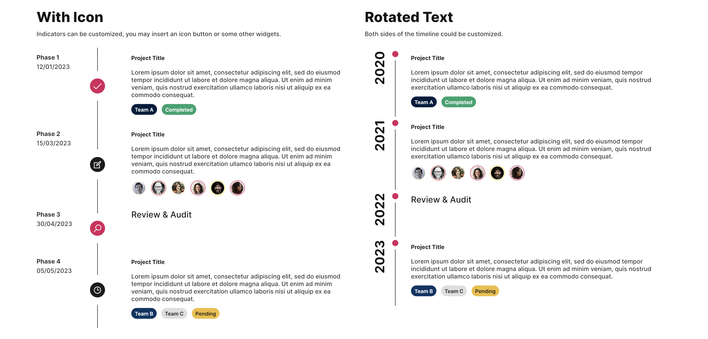
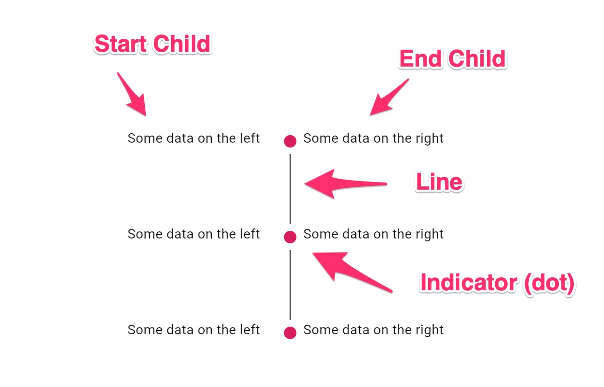

# Timeline - FUITimelineTile

<figure><figcaption></figcaption></figure>

The `FUITimelineTile`, a stylistic element within the Focus UI Kit, serves as a visual representation of chronological data.

> The `FUITimelineTile` leverages the `timeline_tile` package\
> from [https://pub.dev/packages/timeline\_tile](https://pub.dev/packages/timeline_tile).\
> Please refer to this for more info.

### Widget Class Location

The `FUITimelineTile` widget class could be found in:

```dart
lib/focus_ui_kit/components/timeline/fui_timeline_tile.dart
```

### Usage

<figure><figcaption></figcaption></figure>

Here is a simple example to construct a basic vertical timeline using the `Column` component, which displays a list of`FUITimelineTile` objects:

```dart
Column(
  mainAxisAlignment: MainAxisAlignment.start,
  children: [
    FUITimelineTile(
      alignment: TimelineAlign.manual,
      lineXY: 0.2,  // The horizontal position of the line (0 - most left, 1 - most right)
      isFirst: true,
      hasIndicator: true,
      indicatorXY: 0, // The vertical position of the line (0 - most top, 1 - most bottom)
      startChild: SizedBox(height: 100, child: Text('Some data on the left')),
      endChild: SizedBox(height: 100, child: Text('Some data on the right')),
    ),
    FUITimelineTile(
      alignment: TimelineAlign.manual,
      lineXY: 0.2,
      indicatorXY: 0,
      hasIndicator: true,
      startChild: SizedBox(height: 100, child: Text('Some data on the left')),
      endChild: SizedBox(height: 100, child: Text('Some data on the right')),
    ),
    FUITimelineTile(
      alignment: TimelineAlign.manual,
      lineXY: 0.2,
      indicatorXY: 0,
      hasIndicator: true,
      isLast: true,
      startChild: SizedBox(height: 100, child: Text('Some data on the left')),
      endChild: SizedBox(height: 100, child: Text('Some data on the right')),
    ),
  ],
);
```

Please observe that the `alignment` property is set to `TimelineAlign.manual`, which grants us greater flexibility in the `lineXY` parameter.

#### What is `lineXY`?

The `lineXY` parameter determines the position bias of the indicator and the line.

Consider a vertical timeline as an example.

If the indicator and line are to be positioned to the leftmost, the value should be set to `0`.

If they are to be positioned to the rightmost, the value should be set to `1`.

For the center position, the value should be assigned to `0.5`.

You may explore any fractional values between `0` and `1` to determine the optimal position.

#### What is `indicatorXY`?

Once again, let’s consider a vertical timeline as an example. The `indicatorXY` parameter determines the position of the indicator, whether it should be placed at the top or bottom.

If the `indicatorXY` value is set to `0`, the indicator will be positioned at the top.

Conversely, if the `indicatorXY` value is set to `1`, the indicator will be positioned at the bottom.

For a middle position, you can simply set the `indicatorXY` value to `0.5`.

You can further explore fractional values between `0` and `1` to determine the optimal position for your indicator.

#### First `FUITimelineTile`

If the `FUITimelineTile` is the first to appear, setting the `isFirst` parameter to `true` will remove the line at the beginning.

#### Last `FUITimelineTile`

If the `FUITimelineTile` is the final element to be displayed, setting the `isLast` parameter to `true` will eliminate the trailing line.

#### Different Indicator

The default indicator is a dot-styled indicator. If a custom indicator is desired (e.g., an icon or a widget), it can be achieved by defining the `indicatorStyle` widget, as follows:

```dart
FUITimelineTile(
    ...
    hasIndicator: true,
    indicatorStyle: IndicatorStyle(
      indicator: Center(
          child: FUIButtonBlockCircleIcon(
        fuiButtonSize: FUIButtonSize.small,
        icon: const Icon(LineAwesome.check_solid),
        onPressed: () {},
      )),
      padding: <some padding>,
      height: <some height>,
      width: <some width>,
    ),
    ...
);
```

### Other Parameters

Most parameters corresponds to the `TimelineTile` from\
the [https://pub.dev/packages/timeline\_tile](https://pub.dev/packages/timeline_tile) package. Please refer to it for\
more info.
