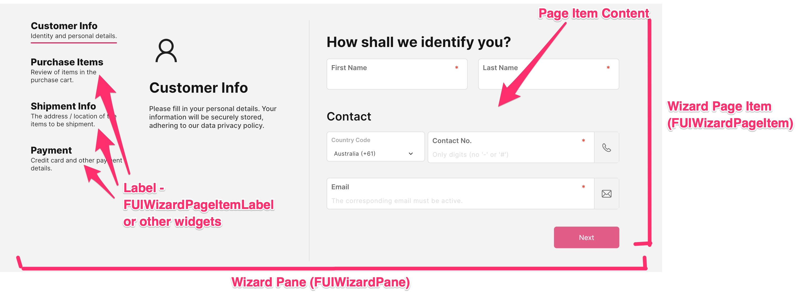
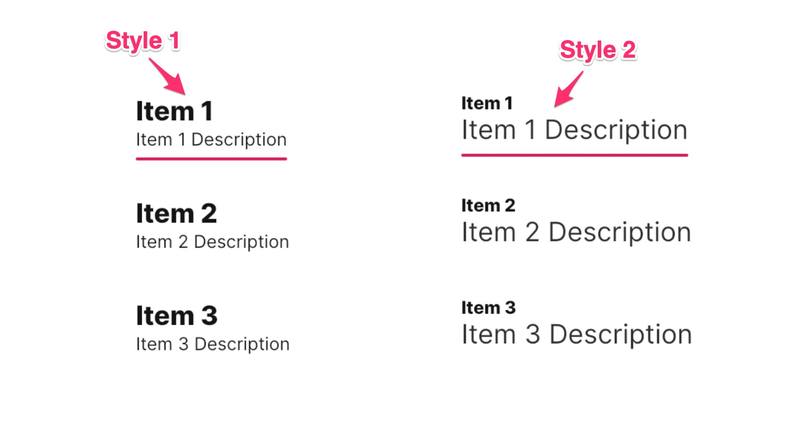

# Wizard

<figure><figcaption></figcaption></figure>

Inspired by the wizard component of HTML/Javascript Bootstrap, the Focus UI Kit offers a comprehensive form wizard implementation.

> Please note that the positioning of the page item labels may be adjusted. For further details, kindly refer to the demo application.

### Widget Class Location

The wizard widget classes could be found in the directory of:

```
lib/focus_ui_kit/components/wizard/
```

#### Class Details

| Class Name                | Dart File                    | Description                                                                     |
| ------------------------- | ---------------------------- | ------------------------------------------------------------------------------- |
| `FUIWizardPane`           | fui\_wizard\_pane.dart       | The wizard pane which consists of all the page items and labels for the wizard. |
| `FUIWizardPageItem`       | fui\_wizard\_page\_item.dart | The widget which encapsulates the page item and the label.                      |
| `FUIWizardPageItemLabel`  | fui\_wizard\_page\_item.dart | The label display widget for the wizard (optional).                             |
| `FUIWizardPaneController` | fui\_wizard\_events.dart     | The controller for the wizard pane and paging.                                  |

### Widget Theme Location

The `FUIWizardTheme` class is the theme class holds the default theme variables/values.

#### Accessing the theme

To access the theme class object, do the following:

```dart
@override
Widget build(BuildContext context) {
    FUIWizardTheme fuiWizardTheme = context.theme.fuiWizard;
    
    // ...
}
```

### Usage (simple tutorial)

To comprehend the functionality of the Wizard pane and its components, kindly refer to the provided tutorial for a comprehensive understanding of how these elements interact.

> It is recommended to implement this on a Stateful widget.

#### Define the wizard pane controller

The UI Kit’s wizard pane is ineffective without a wizard pane controller. Let us define a `FUIWizardPaneController`:

```
FUIWizardPaneController wCtrl = FUIWizardPaneController();  
```

> Do be sure to `close` the wCtrl in the dispose method.

#### Define the item content widgets

Let’s incorporate “Next” and “Previous” buttons into the page item contents.

```dart

/// Item 1
Widget item1Content = SizedBox(
  height: 400,
  child: Column(
    mainAxisAlignment: MainAxisAlignment.center,
    crossAxisAlignment: CrossAxisAlignment.center,
    children: [
      Text('Item 1 content'),
      Row(
        spacing: 20,
        mainAxisAlignment: MainAxisAlignment.center,
        crossAxisAlignment: CrossAxisAlignment.center,
        children: [
          FUIButtonBlockTextIcon(
              text: Text('Next'),
              onPressed: () {
                wCtrl.nextPage();   // Use the wizard pane controlller to go to next page.
              }),
        ],
      )
    ],
  ),
);

/// Item 2
Widget item2Content = SizedBox(
  height: 400,
  child: Column(
    mainAxisAlignment: MainAxisAlignment.center,
    crossAxisAlignment: CrossAxisAlignment.center,
    children: [
      Text('Item 2 content'),
      Row(
        spacing: 20,
        mainAxisAlignment: MainAxisAlignment.center,
        crossAxisAlignment: CrossAxisAlignment.center,
        children: [
          FUIButtonBlockTextIcon(
              text: Text('Prev'),
              onPressed: () {
                wCtrl.prevPage(); // Use the wizard pane controlller to go to previous page.
              }),
          FUIButtonBlockTextIcon(
              text: Text('Next'),
              onPressed: () {
                wCtrl.nextPage(); // Use the wizard pane controlller to go to next page.
              }),
        ],
      )
    ],
  ),
);

/// Item 3
Widget item3Content = SizedBox(
  height: 400,
  child: Column(
    mainAxisAlignment: MainAxisAlignment.center,
    crossAxisAlignment: CrossAxisAlignment.center,
    children: [
      Text('Item 3 content'),
      Row(
        spacing: 20,
        mainAxisAlignment: MainAxisAlignment.center,
        crossAxisAlignment: CrossAxisAlignment.center,
        children: [
          FUIButtonBlockTextIcon(
              text: Text('Prev'),
              onPressed: () {
                wCtrl.prevPage(); // Use the wizard pane controlller to go to previous page.
              }),
          FUIButtonBlockTextIcon(
              text: Text('Done!'),
              onPressed: () {
                print('and submit form...');
              }),
        ],
      )
    ],
  ),
);
```

#### Define the wizard pane and the items

Compile all the above in the wizard pane.

```dart
FUIWizardPane(
  fuiWizardPaneController: wCtrl, // Assign the wizard pane controller
  pageItemList: [
    FUIWizardPageItem(
      label: FUIWizardPageItemLabel(
        tabLine1: Text('Item 1'),
        tabLine2: Text('Item 1 Description'),
      ),
      content: item1Content,
    ),
    FUIWizardPageItem(
      label: FUIWizardPageItemLabel(
        tabLine1: Text('Item 2'),
        tabLine2: Text('Item 2 Description'),
      ),
      content: item2Content,
    ),
    FUIWizardPageItem(
      label: FUIWizardPageItemLabel(
        tabLine1: Text('Item 3'),
        tabLine2: Text('Item 3 Description'),
      ),
      content: item3Content,
    ),
  ],
);
```

#### FUIWizardPageItemLabel with different style

<figure><figcaption></figcaption></figure>

The `FUIWizardPageItemLabel` component offers two distinct styles, which are defined within the`FUIWizardPageItemLabelStyleOption` enum:

* `FUIWizardPageItemLabelStyleOption.style1`: This style sets the item name font size to be larger than the description font size.
* `FUIWizardPageItemLabelStyleOption.style2`: This style sets the item name font size to be smaller than the description font size.

To configure the styles of the `FUIWizardPageItemLabel`, simply assign the desired style via the `styleOption` parameter.

```dart
FUIWizardPageItem(
  label: FUIWizardPageItemLabel(
    styleOption: FUIWizardPageItemLabelStyleOption.style1,  // Set to style1 or style2
    tabLine1: Text('Item 1'),
    tabLine2: Text('Item 1 Description'),
  ),
  ...
);
```

#### Positioning the item label tabs

The positioning of the item label tabs could be altered. This can be accomplished by assigning the `pageItemsPosition` parameter with values from the `FUIWizardPageItemsPosition` enum within the `FUIWizardPane`.

```dart
FUIWizardPane(
  pageItemsPosition: FUIWizardPageItemsPosition.topCenter,  // Have the item label tabs to be at the top center.
  ...
);
```

#### Switching to a specific page

To navigate to a specific page item, you can utilize the wizard pane controller as follows:

```dart
wCtrl.gotoPage(0);  // Go to the first page (index begins with 0); 
```

Alternatively, if the `FUIWizardPageItem` is assigned with a key, the controller can access the page item by specifying the key.

```dart
ValueKey key1 = ValueKey('page1');

// Assign the key to the FUIWizardPageItem 
FUIWizardPageItem(
  key: key1,
  ...
);

// goto the specific page item with the key 
wCtrl.gotoPageItemKey(key1);
```

### Parameters - FUIWizardPageItem

| Parameters                         | Description                                                                   |
| ---------------------------------- | ----------------------------------------------------------------------------- |
| FUIColorScheme fuiColorScheme      | The color scheme for the item (usually seen on the item tab).                 |
| EdgeInsets? itemTabPadding         | The padding (if any) between the item tabs.                                   |
| bool selectable                    | Toggle the item to be directly selected via a tap/click (default to `false`). |
| ValueGetter\<bool>? selectableWhen | The toggle function to enable/disable item tab selection.                     |
| VoidCallback? onSelected           | The callback function when the item is selected.                              |
| bool decoBarShow                   | Toggle display of deco bar on the item label.                                 |
| Color? decoBarActiveColor          | Customize the active color of the item label deco bar.                        |
| double decoBarHeight               | Customize the height of the item label deco bar.                              |
| BorderRadius decoBarBorderRadius   | Customize the border radius of the item label deco bar.                       |
| Duration decoBarAniDuration        | Customize the animation duration of the item label deco bar.                  |
| Curve decoBarAniCurve              | Customize the animation curve of the item label deco bar.                     |

### Parameters - FUIWizardPageItemLabel

| Parameters                                    | Description                            |
| --------------------------------------------- | -------------------------------------- |
| Widget tabLine1                               | The first line of the item tab label.  |
| Widget tabLine2                               | The second line of the item tab label. |
| FUIWizardPageItemLabelAlignment alignment     | The alignment options for the label.   |
| FUIWizardPageItemLabelStyleOption styleOption | The style options for the label.       |

### Parameters - FUIWizardPane

| Parameters                                       | Description                                                                                                                |
| ------------------------------------------------ | -------------------------------------------------------------------------------------------------------------------------- |
| FUIWizardPaneController? fuiWizardPaneController | Assign the pane wizard controller.                                                                                         |
| List\<FUIWizardPageItem> pageItemList            | The list of page items.                                                                                                    |
| FUIWizardPageItemsPosition pageItemsPosition     | Configure the items tab position.                                                                                          |
| double contentViewHeight                         | Customize the view height of the item content pane (default to 450).                                                       |
| double pageItemsSectionLeftRightWidth            | If the item tabs are position on the left or right, the space between the tabs and the content region could be customized. |
| int initialPageIndex                             | The first page item in the list to be displayed. Index starts with `0`.                                                    |
| bool showPageItems                               | Toggle the show of the item tabs/labels.                                                                                   |
