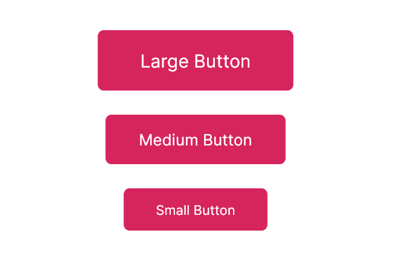

# Widget Sizes

In the UI Kit, the dimensions of several selected widgets are configurable.

### Different Sizes

<figure><figcaption></figcaption></figure>

Some FUI widgets offer configurable sizes. For instance, the `FUIButtonBlockTextIcon` has a parameter named `fuiButtonSize` that enables the configuration of predefined sizes. It accepts enum values of:

* `FUIButtonSize.large`
* `FUIButtonSize.medium`
* `FUIButtonSize.small`

These enum values are specifically for the button's size are found in `lib/focus_ui_kit/components/button/fui_button_params.dart`.

Other widgets accept their respective enum values, but their size can generally be configured via the `fuiXXWidgetSize` parameter.
